> 通行密钥比密码更易于使用且更安全。采用通行密钥为用户提供一种简单又安全的方式，让用户无需输入密码就能在各种平台上登录你的App 和网站。——Apple

<!-- more -->


## 传统密码

### 远古时代：明文传密码

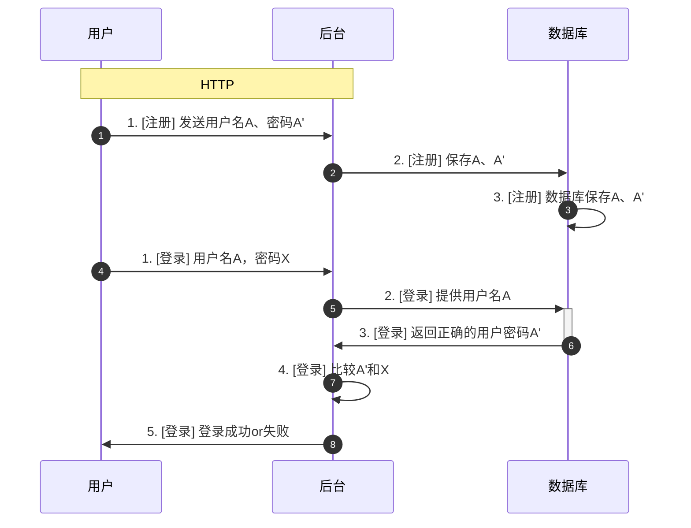
```mermaid
sequenceDiagram
    autonumber
    participant 用户
    participant 后台
    participant 数据库

    Note over 用户,后台: HTTP
    用户 ->> 后台: 1. [注册] 发送用户名A、密码A'
    后台 ->> 数据库: 2. [注册] 保存A、A'
    数据库 ->> 数据库: 3. [注册] 数据库保存A、A'

    用户 ->> 后台: 1. [登录] 用户名A，密码X
    后台 ->>+ 数据库: 2. [登录] 提供用户名A
    数据库 ->>- 后台: 3. [登录] 返回正确的用户密码A'
    后台 ->> 后台: 4. [登录] 比较A'和X
    后台 ->> 用户: 5. [登录] 登录成功or失败
```

优点：

流程直观易懂

风险：

1.  用户$\Leftrightarrow$后台采用明文通信，易遇到中间人攻击
2.  数据库一旦被拖库，所有用户的密码会立刻泄漏
3.  后台能看到用户密码（你以为后台不会打日志吗）

### 文艺复兴：哈希存密码

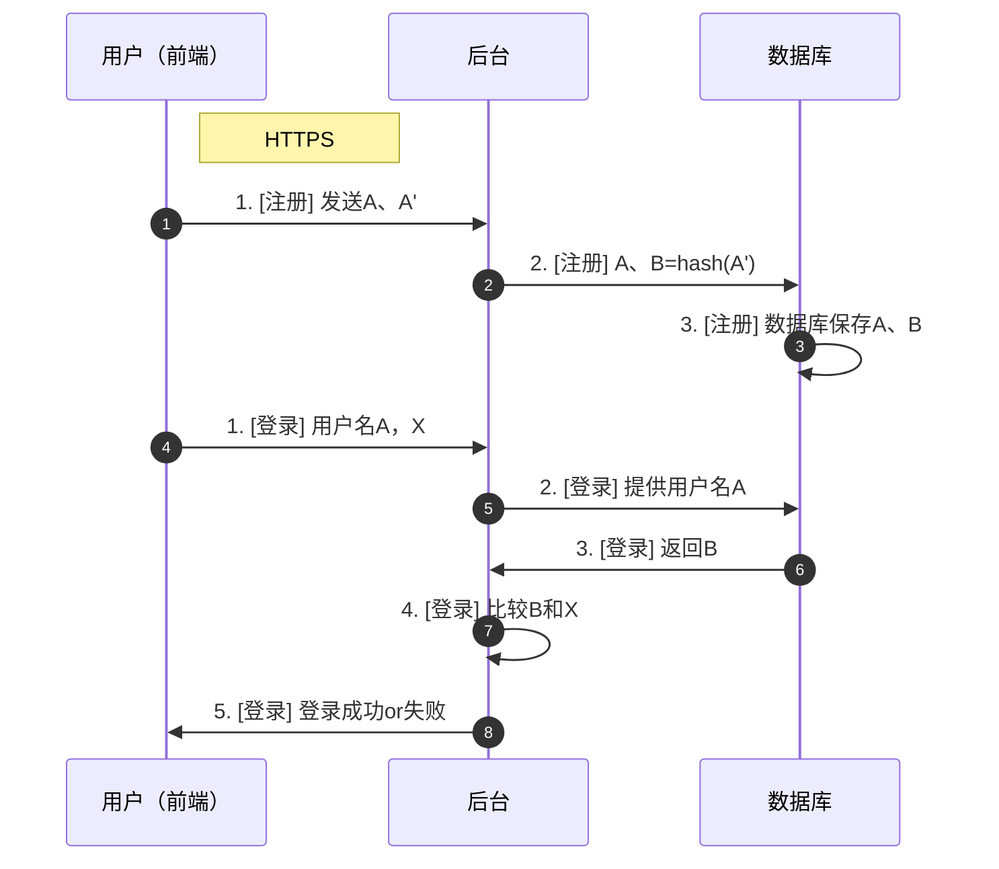
```mermaid
sequenceDiagram
    autonumber
    participant 用户（前端）
    participant 后台
    participant 数据库

    Note right of 用户（前端）: HTTPS
    用户（前端） ->> 后台: 1. [注册] 发送A、A'
    后台 ->> 数据库: 2. [注册] A、B=hash(A')
    数据库 ->> 数据库: 3. [注册] 数据库保存A、B

    用户（前端） ->> 后台: 1. [登录] 用户名A，X
    后台 ->> 数据库: 2. [登录] 提供用户名A
    数据库 ->> 后台: 3. [登录] 返回B
    后台 ->> 后台: 4. [登录] 比较B和X
    后台 ->> 用户（前端）: 5. [登录] 登录成功or失败
```

优点：

1.  用户$\Leftrightarrow$后台用HTTPS协议传输，一定程度缓解了中间人攻击的问题
2.  数据库不明文存用户密码，被拖库后获取用户明文密码存在破解成本，可有效保护用户隐私

风险：

1.  数据库被拖库后，可用彩虹表推测部分用户密码
2.  因为哈希值唯一，如果知道用户在其他系统的明文密码，就可以知道用户在该系统中有没有使用相同的密码

::url-card{url="https://zh.wikipedia.org/wiki/%E5%BD%A9%E8%99%B9%E8%A1%A8"}

### 流行：加盐存密码

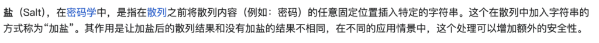

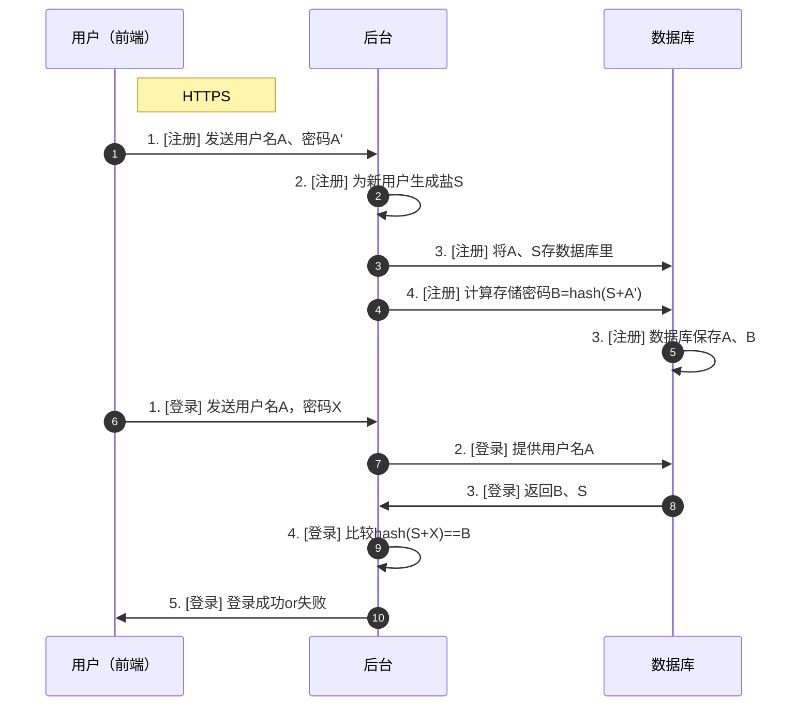
```mermaid
sequenceDiagram
    autonumber
    participant 用户（前端）
    participant 后台
    participant 数据库

    Note right of 用户（前端）: HTTPS
    用户（前端） ->> 后台: 1. [注册] 发送用户名A、密码A'
    后台 ->> 后台: 2. [注册] 为新用户生成盐S
    后台 ->> 数据库: 3. [注册] 将A、S存数据库里
    后台 ->> 数据库: 4. [注册] 计算存储密码B=hash(S+A')
    数据库 ->> 数据库: 3. [注册] 数据库保存A、B

    用户（前端） ->> 后台: 1. [登录] 发送用户名A，密码X
    后台 ->> 数据库: 2. [登录] 提供用户名A
    数据库 ->> 后台: 3. [登录] 返回B、S
    后台 ->> 后台: 4. [登录] 比较hash(S+X)==B
    后台 ->> 用户（前端）: 5. [登录] 登录成功or失败
```

优点：

提高用户密码破解成本

缺点：

盐一旦泄漏，就可用彩虹表推测用户密码

**总结：密码永远不安全**

## 2FA：双因素认证

一般而言，三种因素可以证明用户的身份：

*   秘密信息：例如用户名、密码、口令
*   个人物品：用户手机、身份证、银行卡
*   生理特征：指纹、脸、掌纹、虹膜

双因素认证是指需要两个因素证据才能通过认证

### TOTP（Time-based one-time password）

基于时间的一次性密码，属于“个人物品”因素

#### 应用

*   QQ令牌  
    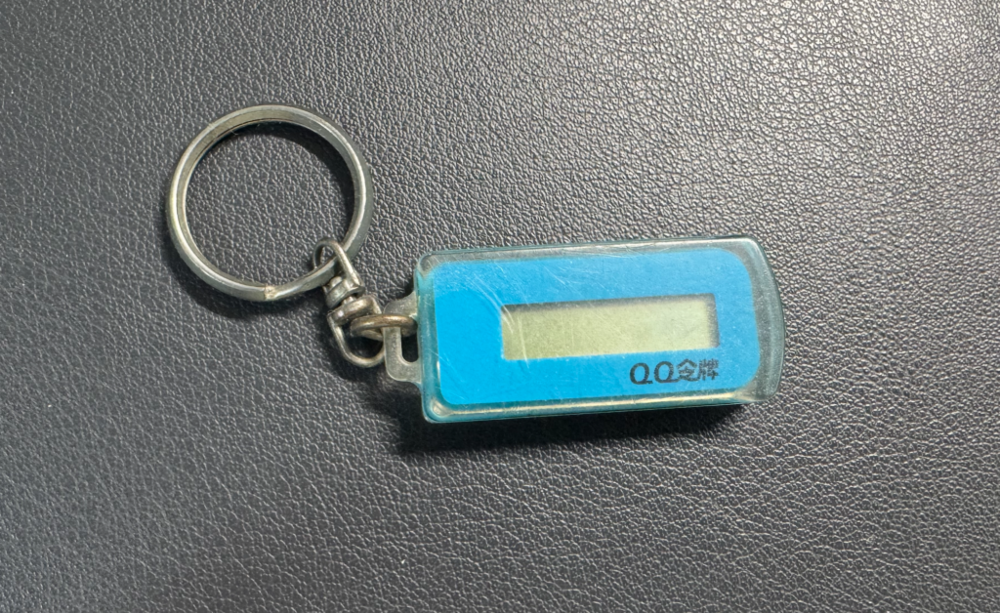

*   银行密码器  
    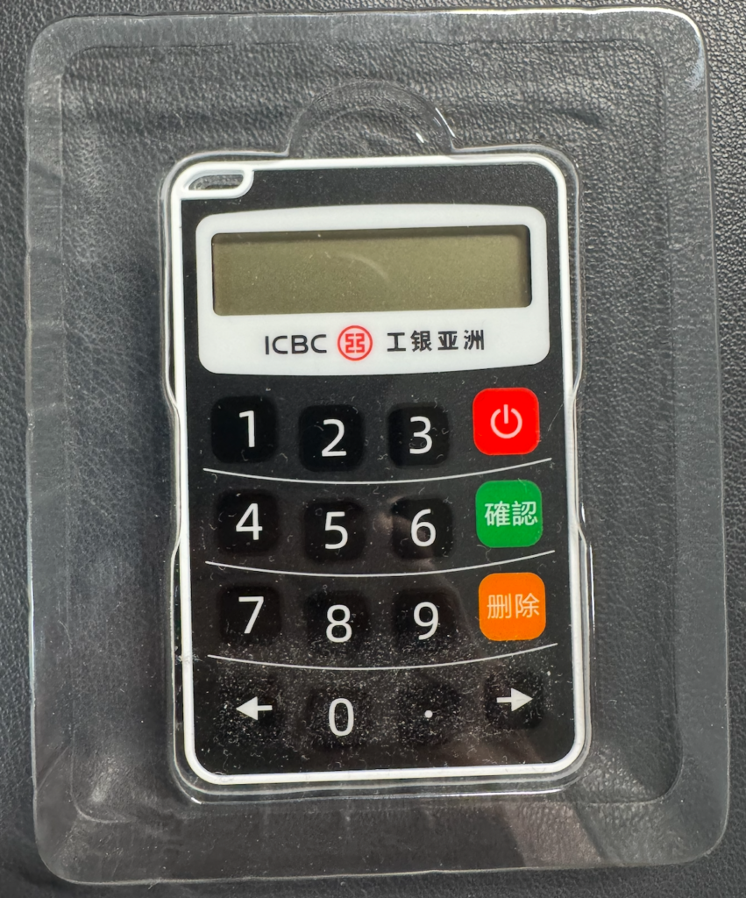

*   身份认证器APP（微软的Authenticator、谷歌的Authenticator、苹果的Password）

#### 认证原理

算法（前端、后台都会用到）：

TC = floor((unixtime(now) − unixtime(T0)) / TS)  
TOTP = HASH(SecretKey, TC)

*   `unixtime(now)` 当前时间（服务器时间）
*   `unixtime(T0)` 约定的起始时间
*   `TS` 验证码有效长度（比如30秒）
*   `TC` 时间计数器
*   `HASH` 约定哈希函数，一般是`SHA-1`

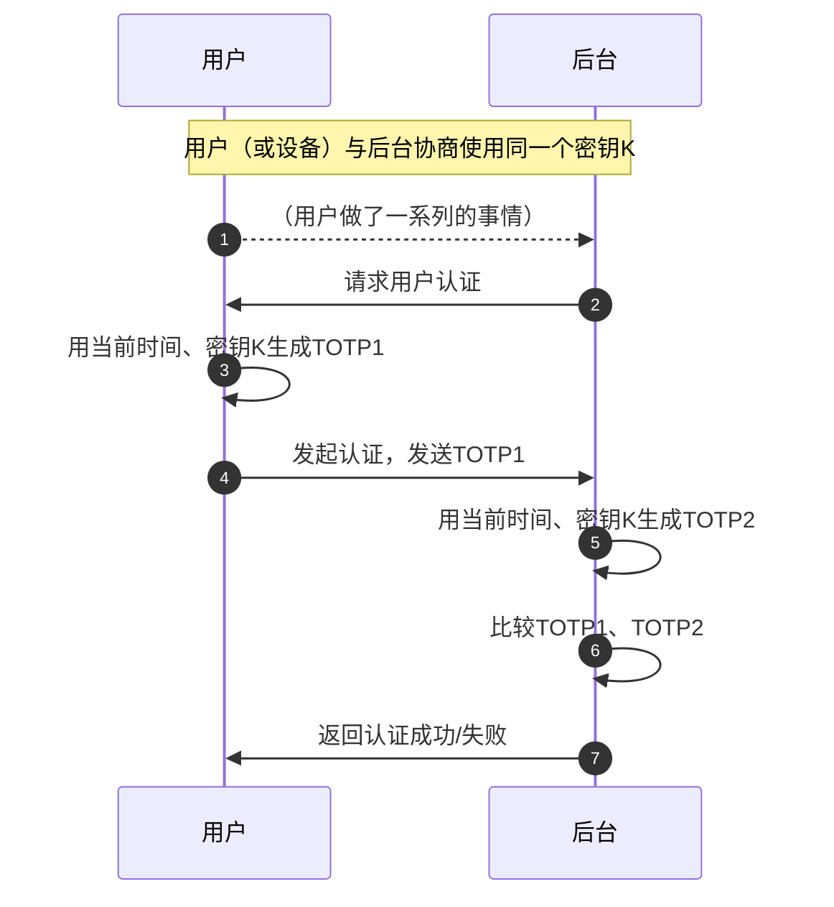
```mermaid
sequenceDiagram
    autonumber
    participant 用户
    participant 后台

    Note over 用户,后台: 用户（或设备）与后台协商使用同一个密钥K
    用户 -->> 后台: （用户做了一系列的事情）
    后台 ->> 用户: 请求用户认证
    用户 ->> 用户: 用当前时间、密钥K生成TOTP1
    用户 ->> 后台: 发起认证，发送TOTP1
    后台 ->> 后台: 用当前时间、密钥K生成TOTP2
    后台 ->> 后台: 比较TOTP1、TOTP2
    后台 ->> 用户: 返回认证成功/失败
```

对于第5、6步，由于客户端时间与服务器时间存在误差，会允许用户使用上n个时间段至下n个时间段的TOTP认证（n由后台决定）

### 邮箱/短信验证码

太经典了，基本天天都能用到

优点：

*   可以以安全的名义获取用户隐私

缺点：

1.  要钱
2.  链路受控（验证码邮件可能会被收件方屏蔽、短信验证码需通过运营商链路发送）
3.  接入麻烦，国内接入还需审核短信签名与短信内容
4.  并非每个人都有可以接收验证码的手机号（比如Github的SMS认证仅限美国用户使用）

## Passkey理论

### 非对称加密

加密和解密使用不同的密钥

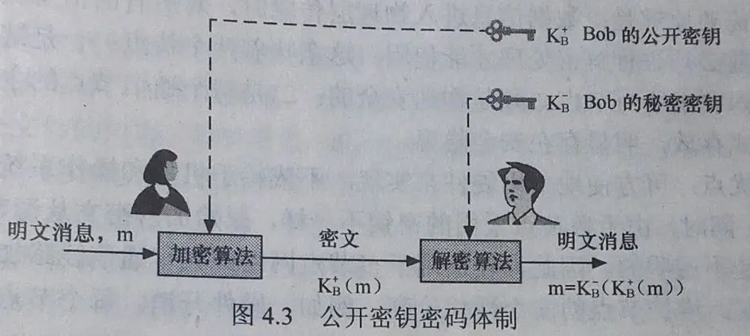

应用：

*   端对端加密（iMessage）
*   Xlog加密
*   数字签名

### 数字签名

数字签名是一种用于验证数字信息完整性、真实性和抗否认性的加密技术，防止信息在传输过程中被篡改。分为签名、验证两步

举例：Alice要告诉Bob，今晚8点开会

不带数字签名：

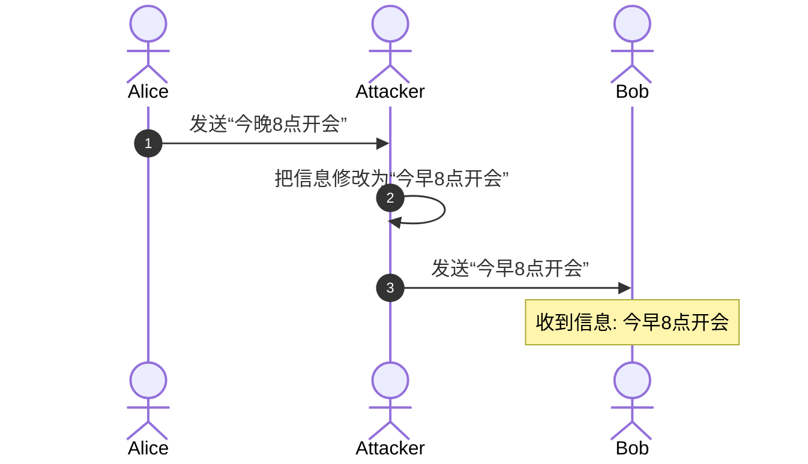
```mermaid
sequenceDiagram
    autonumber
    actor Alice
    actor Attacker
    actor Bob

    Alice ->> Attacker: 发送“今晚8点开会”
    Attacker ->> Attacker: 把信息修改为“今早8点开会”
    Attacker ->> Bob: 发送“今早8点开会”
    Note over Bob: 收到信息: 今早8点开会
```

Attacker的行为称为“中间人攻击”

带数字签名：

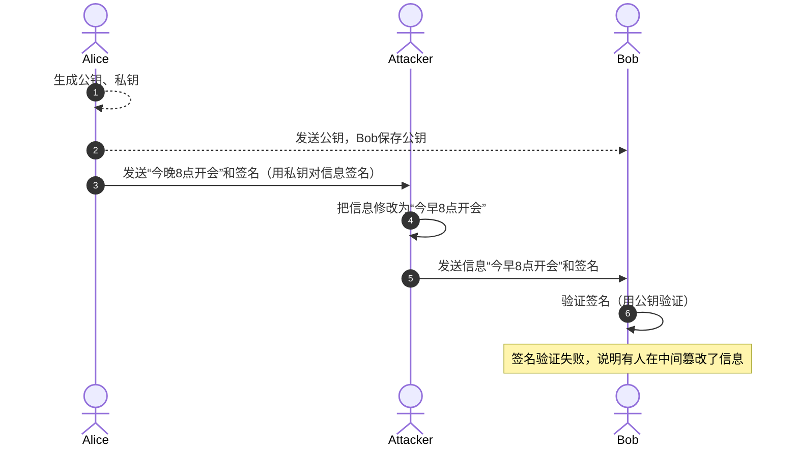
```mermaid
sequenceDiagram
    autonumber
    actor Alice
    actor Attacker
    actor Bob

    Alice -->> Alice: 生成公钥、私钥
    Alice -->> Bob: 发送公钥，Bob保存公钥
    Alice ->> Attacker: 发送“今晚8点开会”和签名（用私钥对信息签名）
    Attacker ->> Attacker: 把信息修改为“今早8点开会”
    Attacker ->> Bob: 发送信息“今早8点开会”和签名
    Bob ->> Bob: 验证签名（用公钥验证）
    Note over Bob: 签名验证失败，说明有人在中间篡改了信息
```

签名算法（以RSA为例）：

$\text{\text{假设公钥}D\text{，私钥}E\text{，信息为}M\text{，则签名}}signature=rsa_encode(E, hash(M))$

$\text{验证签名，}rsa_decode(D, signature) == hash(M)$

### RSA详解

::url-card{url="https://zh.wikipedia.org/wiki/RSA%E5%8A%A0%E5%AF%86%E6%BC%94%E7%AE%97%E6%B3%95"}

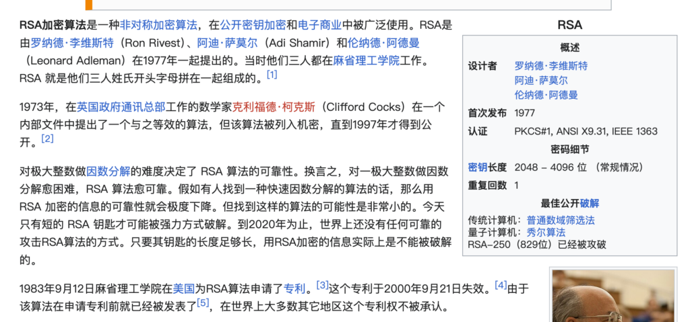

#### 前置知识

##### 同余

::url-card{url="https://zh.wikipedia.org/wiki/%E5%90%8C%E9%A4%98"}

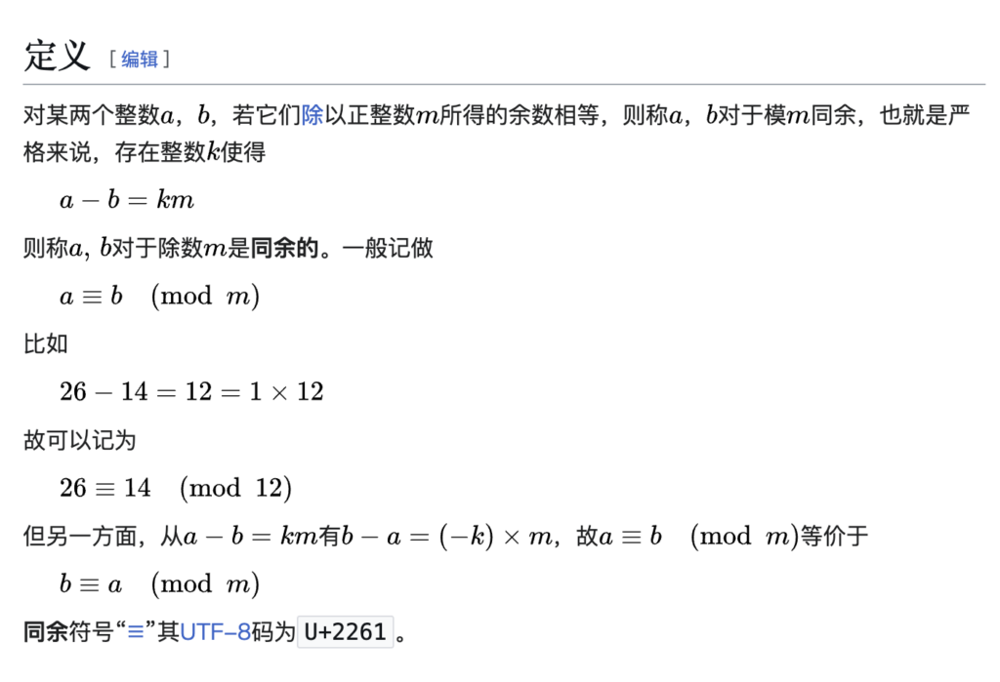

##### 欧拉定理与欧拉函数

::url-card{url="https://oi-wiki.org/math/number-theory/fermat/"}

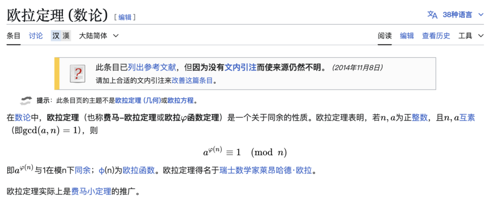

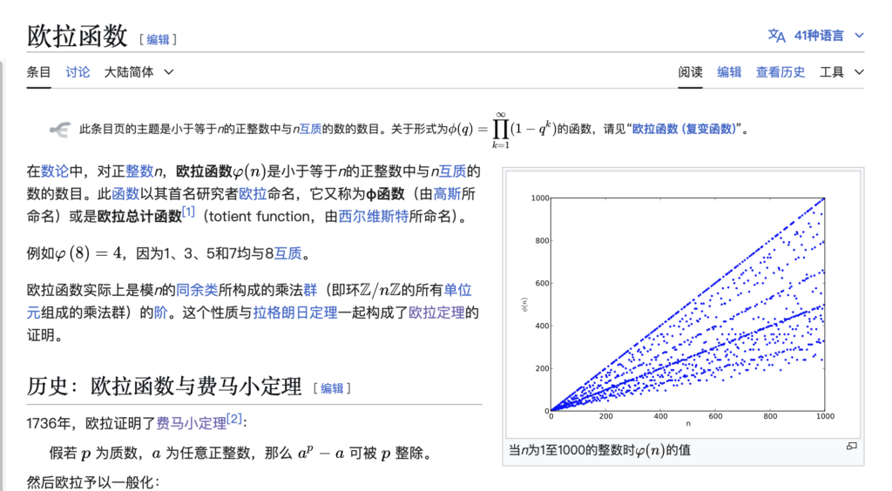

欧拉函数举例：

$\phi(6)=2$ ，因为1, 2, 3, 4, 5里只有1, 5与6互质

$\phi(7)=1$，因为7是质数，1-6与7互质

$\phi(8)=4$，因为1-8里只有1, 3, 5, 7与8互质

##### 欧拉定理推广

1.  若a与b互质，则有

$\phi(n) = \phi(a \cdot b) = \phi(a) \cdot \phi(b)$

2.  若n为质数，则有

$\phi(n) = n - 1$

##### 总结：我们现在有的武器（基础理论）

1.  欧拉定理：

若 $a$ 和 $n$ 为正整数，且 $a$ 和 $n$ 互质，则  
$$  
a^{\varphi(n)}\equiv 1\pmod{n}  
$$

2.  欧拉定理推广1:

若 $a$ 和 $b$ 互质，则  
$$  
\phi(n) = \phi(a \cdot b) = \phi(a) \cdot \phi(b)  
$$

3.  欧拉定理推广2:

若n为质数，则  
$$  
\phi(n) = n - 1  
$$

4.  费马小定理（实际为欧拉定理推导，可结合 $(1)(3)$ 看 ）

若 $a$ 和 $p$ 为正整数，且 $a$ 与 $p$ 互质，$p$ 为质数，则  
$$  
a^{p-1}\equiv 1\pmod{p}  
$$

#### 密钥生成

第一步 - 输出 $p$ 、 $q$ 、 $n$、$\phi(n)$

取一质数 $p$、$q$，结合 $(2)(3)$，有

$n=pq$

$\phi(n)=\phi(p \cdot q)=\phi(p) \cdot \phi(q) =(p-1)(q-1)$

举例：
p=61, q=53
则n=61\*53=3233
\phi(n)=60\*52=3120

第二步 - 输出 $e$

选一整数 $e$，满足 $1 < e < \phi(n)$ ，且 $e$ 与 $\phi(n)$ 互质（计算机里一般取65535）

举例：
e=17

第三步 - 输出 $d$

计算出整数 $d$，使得 $ed \equiv 1 \pmod{\phi(n)}$

怎么计算？

$ed \equiv 1 \pmod{\phi(n)}$

$\iff ed = k\cdot\phi(n)+1\text{，}k\text{为整数且}k>0$

$\iff d = \frac{k\cdot\phi(n)+1}{e}$

举例：
d=2753

第四部 - 汇总

公钥：$(e, n)$

私钥：$(d, n)$

$n$ 的长度：密钥长度（比如RSA1024，1024指的是 $n$ 有1024位）

举例：
上面的公钥：(17, 3233)，私钥：(2753, 3233)

#### 加解密

假设原始数据为 $m$，密文为 $c$，则

公钥加密：$m^{e} \equiv c \pmod{n}$

私钥解密：$c^{d} \equiv m \pmod{n}$

注：$m < n$，否则需分段加密

#### 安全论证

已知公钥，能否知道私钥？

等价于：已知 $n$，$e$，能否知道 $d$？

已知：$ed \equiv 1 \pmod{\phi(n)}$，所以需要知道 $\phi(n)$

已知：$\phi(n)=(p-1)(q-1)$，所以需要知道 $p$，$q$

已知：$n=p \cdot q$，所以需要对 $n$ 做质因数分解

如果 $p$，$q$ 取得比较大（比如1000位），那么 $n$ 至少有 $999+999=1998$位，以人类目前的科学水平不可能对如此大的数做质因数分解。

#### 正确性证明

$\text{已知：}m^{e} \equiv c \pmod{n}……..(a)$

$\text{求证：}c^{d} \equiv m \pmod{n}……..(b)$

$\text{解：}$

$(b)\text{中带入}(a)\text{，有}m \equiv c^{d} \pmod{n} \equiv m ^ {ed} \pmod{n} \equiv m^{k\phi(n) + 1}\pmod{n}$

$\text{即需证} m \equiv m^{k\phi(n) + 1}\pmod{n}$

$case1: m\text{、}n\text{互质}$

$\text{\text{根据欧拉定理}(1)\text{，有}}$

$m^{\varphi(n)}\equiv 1\pmod{n} \iff (m^{\varphi(n)})^k \cdot m \equiv 1^k \cdot m \pmod{n} \iff m \equiv m^{k\phi(n) + 1}\pmod{n}$

$\text{秒了}$

$case2:m\text{、}n\text{不互质}$

$\text{已知，}n=p \cdot q\text{，而}m\text{、}n\text{不互质。则必有整数}\lambda\text{，使得}m= \lambda p\text{或} m = \lambda q\text{。}p\text{、}q\text{可互换，这里先考虑}m=\lambda p$

$\text{由欧拉定理}(1)\text{，有}$

$m^{\phi(q)} \equiv 1 \pmod{q}$

$\iff (m^{k\phi(q)})^{\phi(p)} \equiv (1^{k\phi(q)})^{\phi(p)} \pmod{q} \equiv 1 \pmod{q}$

$\text{注意到左边}(m^{k\phi(q)})^{\phi(p)}=m^{k\phi(n)}\text{，说明有}m^{k\phi(n)}\equiv1\pmod{q}\text{，则总有一个正整数}r\text{，使得}m^{k\phi(n)}=rq+1$

$\text{两边同时乘}m=\lambda p\text{，有}m^{k\phi(n)+1}=\lambda rpq+\lambda p=\lambda rn+\lambda p$

$\text{等价于}m^{k\phi(n)+1}\equiv \lambda p \pmod{n} \equiv m \pmod{n}$

$\text{证毕}$  

#### 大质数的获取

1.  随机生成一个大数 $x$
2.  判断 $x$ 是否为质数，一般选用 $Miller-Rabin\text{素性测试}$ 算法判断

::url-card{url="https://oi-wiki.org/math/number-theory/prime/#millerrabin-%E7%B4%A0%E6%80%A7%E6%B5%8B%E8%AF%95"}

### Passkey怎么验证用户身份

首先，用户创建一对密钥，私钥存本地，公钥发给服务器并存服务器里。

在登录时，后台会给用户发送`挑战（随机字符串）`。用户用自己的私钥对`挑战`做数字签名，并将签名发送给后台。后台再拿存储的用户公钥做验证，判断签名是否有效。

## Passkey实践

检测你的设备是否支持Passkey：

::url-card{url="https://webauthn.io/"}

### 流程：简单版

1.  已注册用户添加Passkey

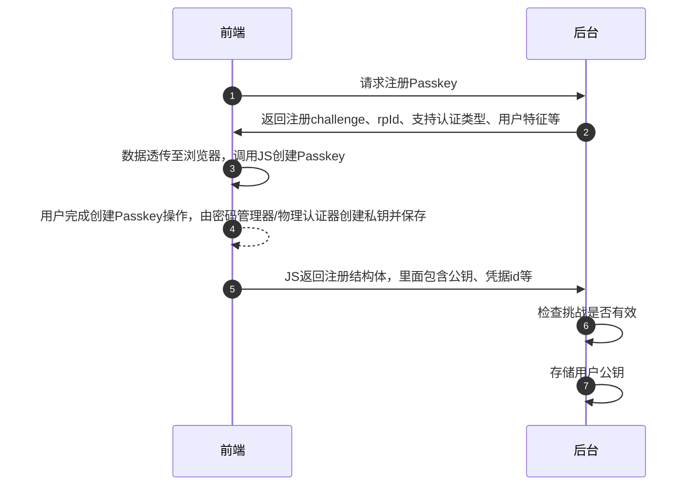
```mermaid
sequenceDiagram
    autonumber
    participant 前端
    participant 后台

    前端 ->> 后台: 请求注册Passkey
    后台 ->> 前端: 返回注册challenge、rpId、支持认证类型、用户特征等
    前端 ->> 前端: 数据透传至浏览器，调用JS创建Passkey
    前端 -->> 前端: 用户完成创建Passkey操作，由密码管理器/物理认证器创建私钥并保存
    前端 ->> 后台: JS返回注册结构体，里面包含公钥、凭据id等
    后台 ->> 后台: 检查挑战是否有效
    后台 ->> 后台: 存储用户公钥
```

2. 用Passkey登录

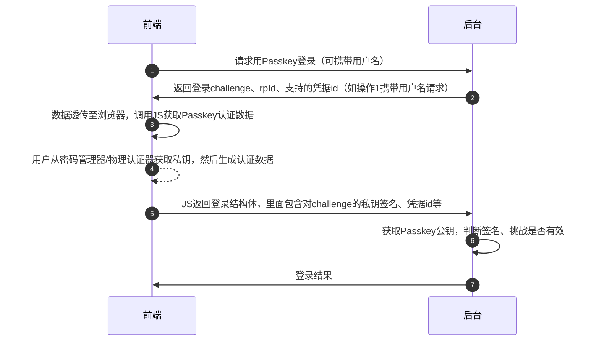
```mermaid
sequenceDiagram
    autonumber
    participant 前端
    participant 后台

    前端 ->> 后台: 请求用Passkey登录（可携带用户名）
    后台 ->> 前端: 返回登录challenge、rpId、支持的凭据id（如操作1携带用户名请求）
    前端 ->> 前端: 数据透传至浏览器，调用JS获取Passkey认证数据
    前端 -->> 前端: 用户从密码管理器/物理认证器获取私钥，然后生成认证数据
    前端 ->> 后台: JS返回登录结构体，里面包含对challenge的私钥签名、凭据id等
    后台 ->> 后台: 获取Passkey公钥，判断签名、挑战是否有效
    后台 ->> 前端: 登录结果
```

### WebAuthN

WebAuthN是W3C标准。客户端很多Passkey的实现也是基于WebAuthN。

::url-card{url="https://developer.mozilla.org/zh-CN/docs/Web/API/Web_Authentication_API"}

### 数据结构与流程分析

#### 注册Passkey

客户端请求注册Passkey（用户已登录）：

客户端 -> 后台：随意

后台->客户端:

```json
{  
  "challenge": "gVQ2n5FCAcksuEefCEgQRKJB_xfMF4rJMinTXSP72E8",  
  "rp": {  
    "name": "Passkey Example",  
    "id": "example.com"  
   },  
  "user": {  
    "id": "GOVsRuhMQWNoScmh_cK02QyQwTolHSUSlX5ciH242Y4",  
    "name": "Michael",  
    "displayName": "Michael"  
   },  
  "pubKeyCredParams": [  
     {  
      "alg": -7,  
      "type": "public-key"  
     }  
   ],  
  "timeout": 60000,  
  "attestation": "none",  
  "excludeCredentials": [  
   ],  
  "authenticatorSelection": {  
    "authenticatorAttachment": "platform",  
    "requireResidentKey": true,  
    "residentKey": "required"  
   },  
  "extensions": {  
    "credProps": true  
   }  
}

```

::url-card{url="https://developer.mozilla.org/en-US/docs/Web/API/PublicKeyCredentialCreationOptions"}

*   rp.name，rp.id：域信息
*   user.id：用户特征
*   user.name，user.displayName：Passkey展示在用户密码器上的信息
*   pubKeyCredParams：支持算法类型
*   timeout：challenge有效期时长
*   excludeCredentials：不允许生成的凭据id，通常为用户已注册的凭据id
*   authenticatorSelection：认证类型，可选物理设备/平台

拿到这些数据可以直接透传给系统/浏览器。系统/浏览器会拉起将这些信息透传给密码管理器，让密码管理器创建Passkey。

密码管理器创建Passkey后，会返回公钥及基础信息给系统，系统再透传给客户端/浏览器。

客户端->后台：

```json
{  
 "id": "base64url-encoded-credential-id",  
 "type": "public-key",  
 "response": {  
  "clientDataJSON": "base64url-encoded-client-data-json",  
  "attestationObject": "base64url-encoded-attestation-object"  
  }  
}
```

::url-card{url="https://developer.mozilla.org/en-US/docs/Web/API/AuthenticatorAttestationResponse"}

*   id：凭据id
*   clientDataJSON：base64编码的json数据，json为：

```json5
{  
"type": "webauthn.create", // 或 "webauthn.get"  
"challenge": "base64url-encoded-challenge",  
"origin": "https://example.com"  
}
```

*   attestationObject：CBOR格式结构体，包含：
    *   authData：凭据信息，CBOR格式的Authenticator data，包含公钥、域信息等
    *   fmt
    *   attStmt

::url-card{url="https://developer.mozilla.org/en-US/docs/Web/API/Web_Authentication_API/Authenticator_data"}

后台 -> 客户端：随意

#### 登录

客户端请求登录：

客户端 -> 后台：(可选)用户特征

后台->客户端:

```json
{  
  "challenge": "x1wRuShyI4k7BqYJi60kVk-clJWsPnBGgh_7z-W9QYk",  
  "allowCredentials": [],  
  "timeout": 60000,  
  "rpId": "example.com"  
}
```

::url-card{url="https://developer.mozilla.org/en-US/docs/Web/API/PublicKeyCredentialRequestOptions"}

*   challenge：后台发的挑战
*   allowCredentials：允许使用的凭证id，为空表示由用户自己选择。（如果客户端->后台有发送用户特征，那么这里的allowCredentials应为用户注册过的Passkey凭证id）
*   timeout：挑战过期时间
*   rpId：域信息

客户端拿到这些数据，应直接透传给系统。系统会透传给密码管理器，让密码管理器通过rpId选择一个Passkey。如果没有Passkey，会弹窗告诉用户没有已注册的Passkey。

客户端拿到Passkey认证数据后：

客户端 -> 后台：

```json
{
  "id": "t2hF9lEjZ-8K5oFIZw1wQA",
  "rawId": "dDJoRjlMamp6LTdLNWhGSVp3MXdRQQ",
  "type": "public-key",
  "response": {
    "clientDataJSON": "eyJjaGFsbGVuZ2UiOiJjaGFsbGVuZ2VleGFtcGxlIiwib3JpZ2luIjoiaHR0cHM6Ly93d3cuZXhhbXBsZS5jb20iLCJ0eXBlIjoid2ViYXV0aG4uZ2V0In0",
    "authenticatorData": "YWdhdXRoZW50aWNhdG9yRGF0YS5leGFtcGxl",
    "signature": "c2lnbmF0dXJlZXhhbXBsZQ",
    "userHandle": "dXNlcklkZXh0cmFhcmVv"
  }
}
```

::url-card{url="https://developer.mozilla.org/en-US/docs/Web/API/AuthenticatorAssertionResponse"}

*   id：凭据id
*   response.clientDataJSON，response.authenticatorData和注册Passkey时类似
*   signature：用Passkey私钥加密的hash(clientDataJSONauthenticatorData)

后台收到数据后，会先对signature解密，得到B，再判断B==hash(clientDataJSONauthenticatorData)

后台 -> 客户端：随意

### iOS实现

::url-card{url="https://developer.apple.com/documentation/authenticationservices/supporting-passkeys"}

前置条件：

配置`associated domains`，`https://{域名}/.well-known/apple-app-site-association`的内容为：

```json
{
  "webcredentials": {  
    "apps": [  
      "{团队ID}.{bundleId}"  
     ]  
   }  
}
```

怎么获取团队id？

1.  打开

::url-card{url="https://developer.apple.com/account"}

2.  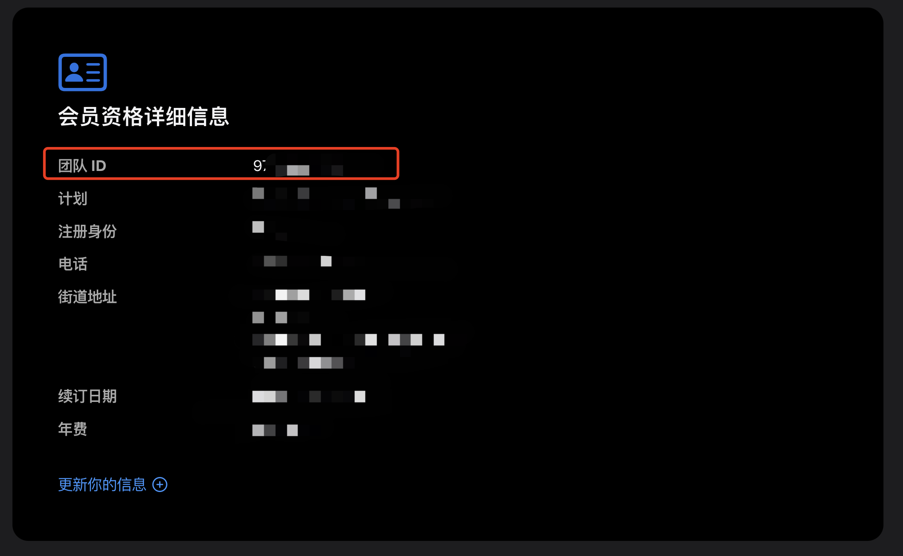

放上去后：

::url-card{url="https://m.v.qq.com/.well-known/apple-app-site-association"}

iPhone启动或安装APP时会去拉一遍数据

需注意的API：

*   ASAuthorizationPlatformPublicKeyCredentialProvider - Passkey注册、认证都要调他
*   ASAuthorizationPlatformPublicKeyCredentialRegistration - Passkey注册结果
*   ASAuthorizationPlatformPublicKeyCredentialAssertion - Passkey认证结果

解析数据：

ASAuthorizationPlatformPublicKeyCredentialRegistration

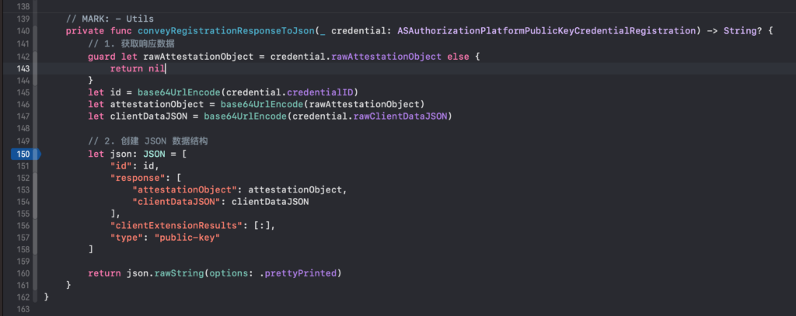

ASAuthorizationPlatformPublicKeyCredentialAssertion

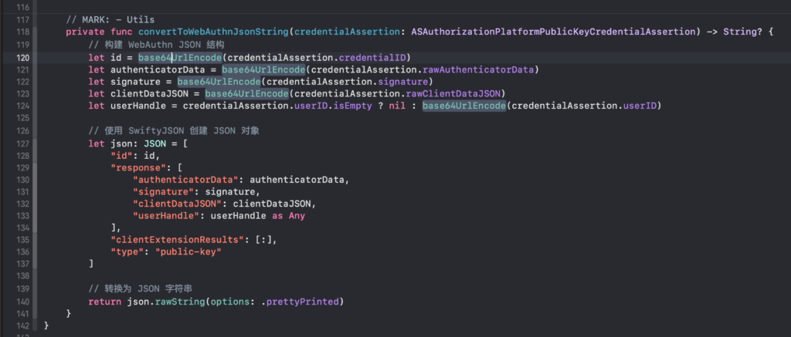

### Android实现

::url-card{url="https://developer.android.com/identity/sign-in/credential-manager"}

Android与Passkey的操作都需用到Credential Manager

在Android14以前，安卓的密码管理器只能用谷歌密码管理，而谷歌密码管理是包含在GMS里的。如果系统不带GMS，系统就不会有密码管理器，因此国行系统需要安装谷歌服务才能使用Passkey。

Android14及以后，用户可以安装并使用其它密码管理器了。用户在设置里选择密码器后，如果密码器支持Passkey操作，就可以使用Passkey。

#### Credential Manager

前置条件：

配置`Digital Asset Links`，`https://{域名}/.well-known/assetlinks.json`的内容为：

```json
[  
   {  
    "relation": [  
      "delegate_permission/common.handle_all_urls",  
    "delegate_permission/common.get_login_creds"  
     ],  
    "target": {  
      "namespace": "android_app",  
      "package_name": "{包名}",  
      "sha256_cert_fingerprints": [  
        "{指纹签名}"  
       ]  
     }  
   }  
]
```

很简单，无论是登录还是注册，将后台传的数据透传给系统即可

#### OPPO设备

OPPO自己搞了个SDK：

::url-card{url="https://open.oppomobile.com/new/developmentDoc/info?id=12759"}

前置条件：

配置`fido2-trusted-facets`，`https://{域名}/.well-known/fido2-trusted-facets.json`的内容为：

```json
[  
   {  
    "relation": [  
      "delegate_permission/common.get_login_creds"  
     ],  
    "target": {  
      "namespace": "android_app",  
      "package_name": "{包名}",  
      "sha256_cert_fingerprints": [  
        "{指纹签名}"  
       ]  
     }  
   }  
]
```

OPPO Passkey API和Credential Manager差不多。

咨询OPPO工程师，该API可能很快会被废除：

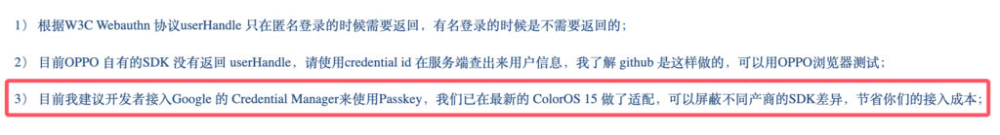

### 鸿蒙

不支持，别想了

### 后台实现

::url-card{url="https://developers.yubico.com/java-webauthn-server/"}

::github{repo="go-webauthn/webauthn"}

代码略

遇到的坑点：

*   iOS clientDataJSON.origin为`https://{associated domains}`
*   安卓 clientDataJSON.origin为 `android:apk-key-hash:{包签名base64}`
*   OPPO clientDataJSON.origin为 `android:apk-key-hash:{包签名base64并做urlEncode}`

所以，如果要支持iOS、安卓和OPPO设备的Passkey登录注册，后台需要设置3个origin
