# **设备/系统介绍**

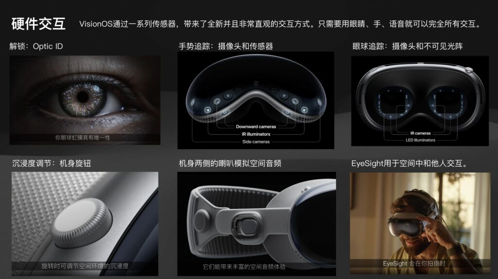

### **硬件**

*   Optic - 生物认证
*   很多摄像头和传感器 - 手部动作识别
*   眼球追踪 - 改变焦点
*   机身旋钮 - 开启/关闭沉浸度
*   机身两侧喇叭 - 放声音，支持空间音频；机身前方显示屏 - 装饰用。。。

性能：M2 + R1

### **交互方式**

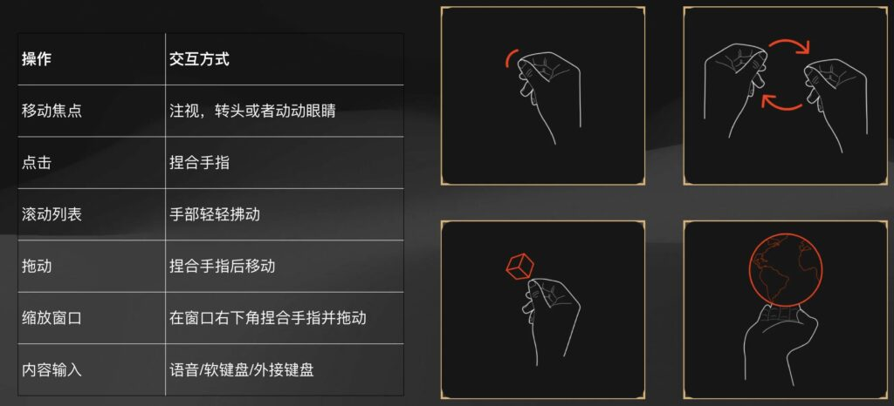

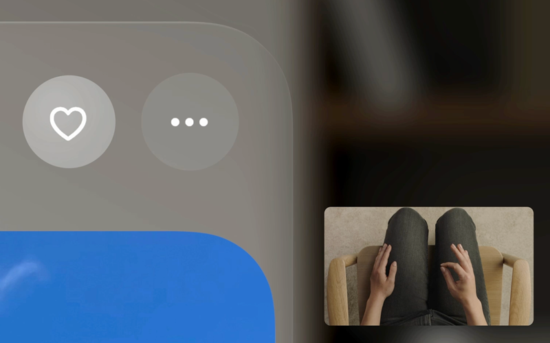

#### **窗口/控件/物体**

要操控窗口/控件/物体，交互方式是：**看着一个物体/控件，然后做手势**

SwiftUI默认支持的动作类型：

*   手指捏合一下（点击）
*   双手捏合并旋转（旋转）
*   手指捏合然后移动（拖拽）

其他的动作，需要使用ARKit去自定义手部动作识别。

#### **输入**

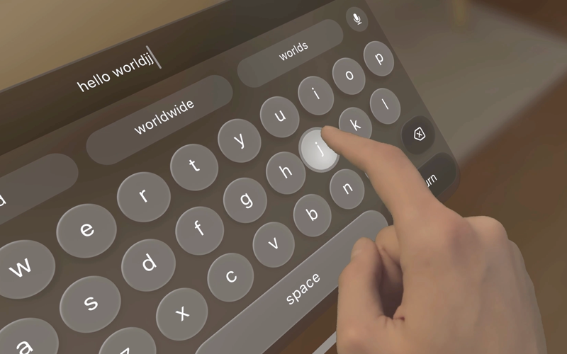

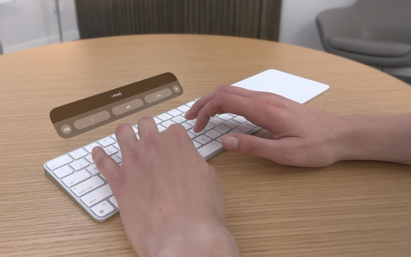

*   虚拟键盘

（手指点在虚拟按键上完成输入？还是用上面跟控件的交互方式？目前不清楚）

*   接入苹果支持的键盘使用。候选框在实体键盘附近展示。
*   手柄

### **系统**

VisionOS

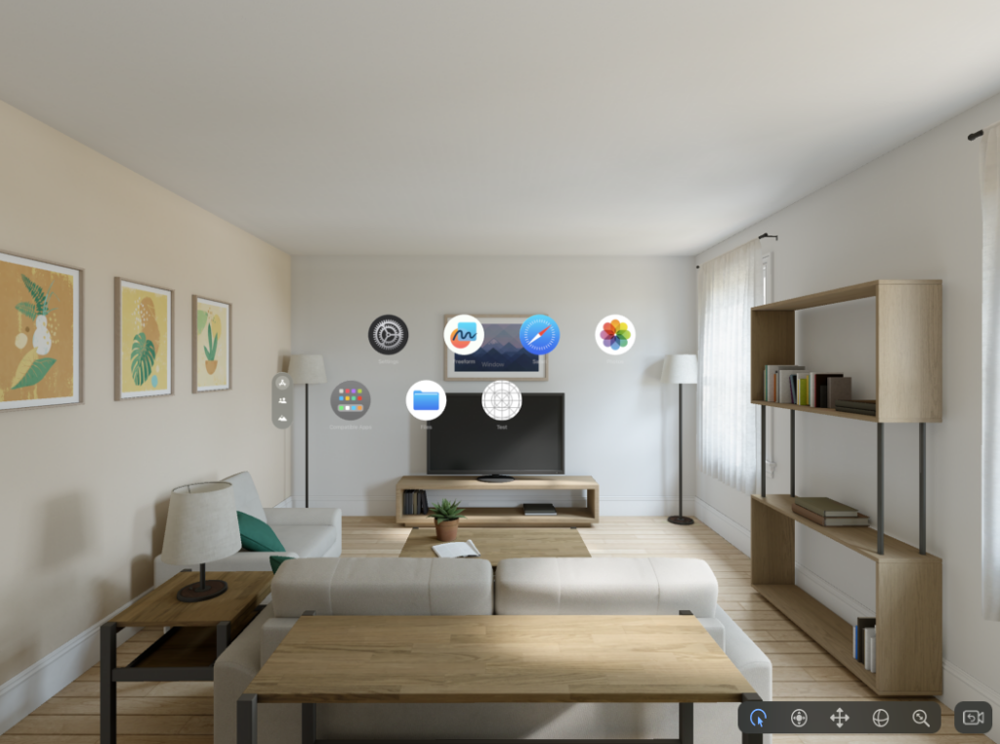

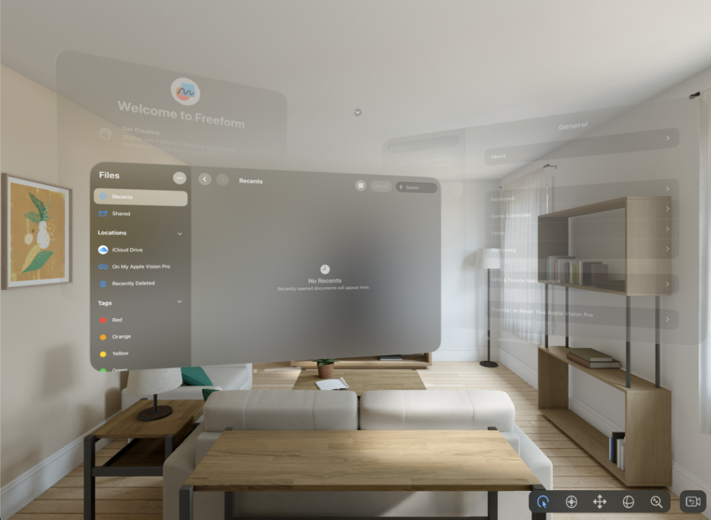

*   VisionPro**能感知人体的移动**，虚拟的物体/窗体像是被固定在现实世界一样
*   VisionPro会给房间建模、获取房间的光照信息，以显示虚拟窗体的阴影效果
*   同一个视角，可以同时显示多个窗口（当然也可以同时显示多个APP）。

# **构建一个Vision APP**

## **Scene**

iOS APP里的View是2D的。为了让View做到3D显示，苹果在View上加了一层Scene的概念，用于定义View的展示效果。

从展示效果上区分：

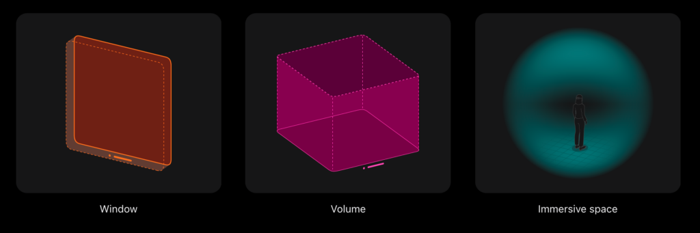

*   Window：主要用于展示平面元素、2D窗体
*   Volume：用于展示三维物体
*   Immersive Space：沉浸空间，啥都可以展示

## **Window**

平面窗体类型，展示2D元素为主。

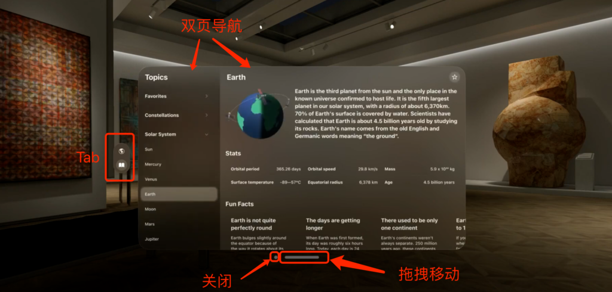


方向轴（假设用户面朝一个窗体）：

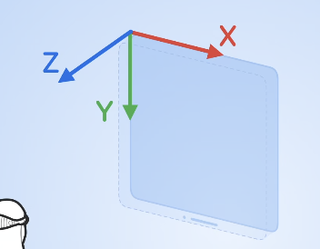

往右：X轴

往下：Y轴

往用户方向：Z轴

*   Window有一定的Z轴空间，但不能人为调整Z轴的大小
*   Window的大小可随用户调整（可以设置最大/最小的大小）

## **Volume**


*   Z轴指向用户
*   独立的3D窗口，主要用于呈现3D模型，可以同时打开多个
*   开发人员可以调整大小
*   用户不可以调整大小，只能调整位置

## **Immersion Space**

沉浸式空间。可以放Volume或Window。

同一时间只能打开一个Immersive Space。打开Immservice Space时，其他APP的内容会被隐藏。

可以改变的沉浸类型：

*   full - 纯VR展示，用户看到的全是虚拟的内容
*   mix - 纯MR展示
*   progressive - 半MR半VR，通过旋钮调整程度

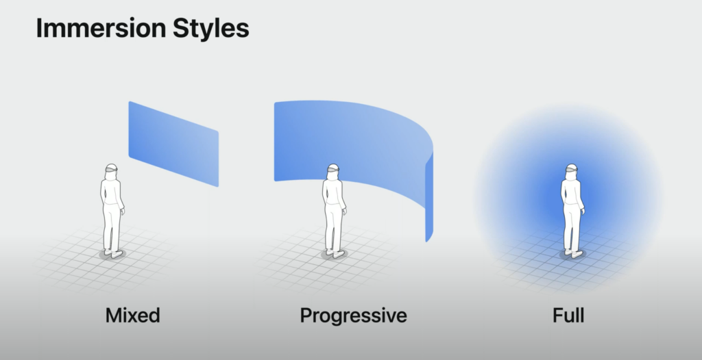

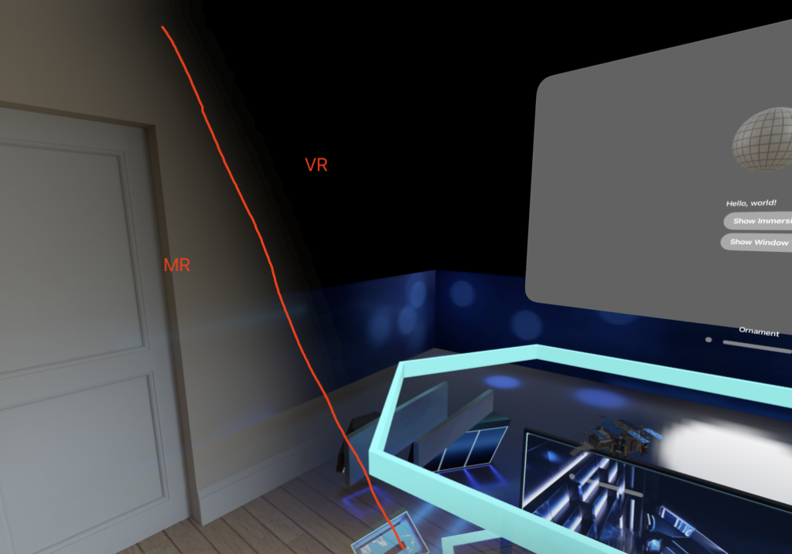

*   原点在用户的脚上。
*   每个物体有自身的坐标轴。Swift提供了transform方法，将两种坐标轴统一放在ImmserviceSpace中做转换，解决Window和Volume坐标轴不同的问题

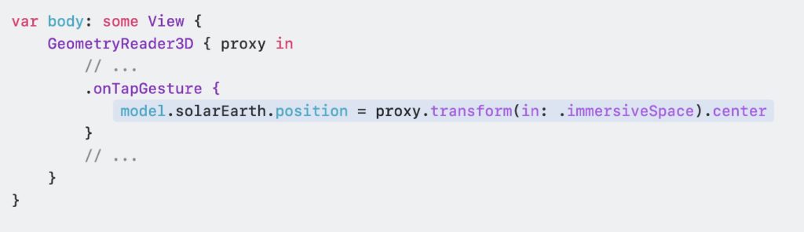

## **相关代码**

### **定义Scene**

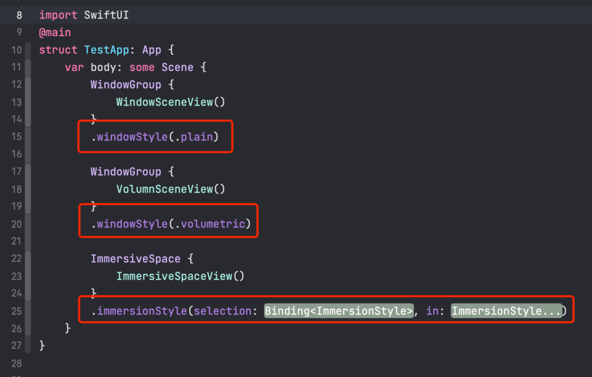

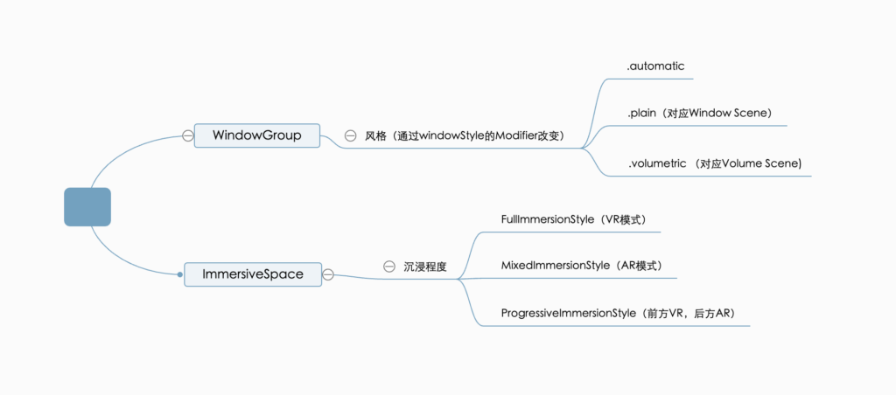

在API上，苹果偷偷改了immersionStyle的modifier，现在不再以枚举变量区分沉浸类型，改为类似密封类的形式做区分。

### **控制Scene**

引入相关环境变量

```
@Environment(\.openWindow) var openWindow // 根据id打开窗口
@Environment(\.dismissWindow) var dismissWindow // 根据id关闭窗口
@Environment(\.openImmersiveSpace) var openImmersiveSpace // 根据id打开沉浸空间
@Environment(\.dismissImmersiveSpace) var dismissImmersiveSpace // 关闭当前打开的沉浸空间
```

上面所有的方法都是异步的。

## **Ornaments**

一个modifier，用于在**窗体**附近显示View

可用于：播放器进度条、快捷开关、快捷tab切换

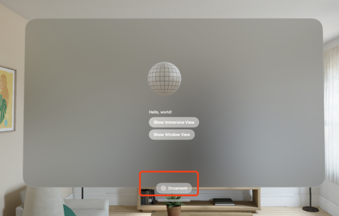

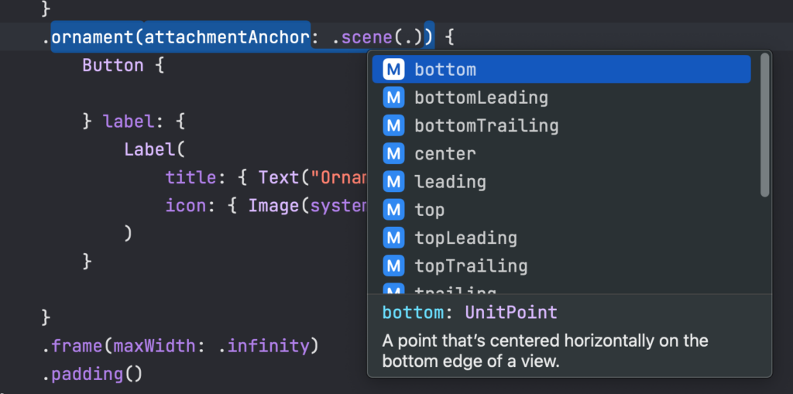

跟overlay的区别：

*   overlay作用在view上，ornament作用在window上（view的大小可能会和window不一致）

## **一些有用的Modifier**

作用在WindowGroup:

*   .windowResizability - 设置窗体被调整时的大小范围
    *   contentSize - 由View的frame属性确定大小最大值、最小值
    *   contentMinSize - 由View的frame属性确定大小最小值，不设置最大值
    *   automatic - 系统默认，settings view用\`contentSize\`，其他用\`contentMinSize\`
*   .windowStyle - scene类型，上面有
*   .defaultSize - 窗体默认大小，支持调整长、宽、高、单位

作用在View：

*   .padding3D - 支持三维的.padding
*   .frame(depth) - 支持三维的frame，设置z轴长度

作用在ImmsersiveSpace:

*   .immersionStyle - 沉浸程度
*   .defaultSize - 默认大小

# **RealityView**

## **基本使用**

*   **E** Entity - 一个载入的模型
*   **C** Component - 给Entity添加不同的能力
    *   InputTargetComponent - 接受输入
    *   CollisionComponent - 计算碰撞体积
*   **S** System - 整个系统，包含多个Entity，在每一帧显示前会通知外界（外界从这里动态调整Entity的属性）

Entity的初始化在make闭包中完成，每一帧的更新会回掉update闭包。

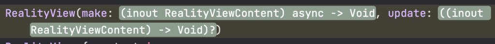

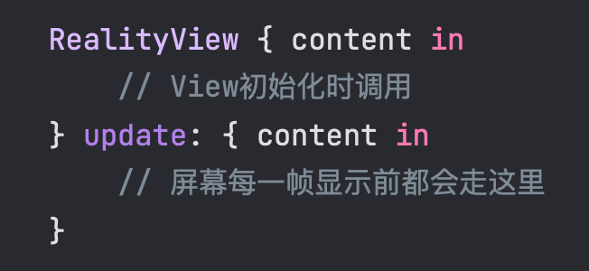

**举个例子**

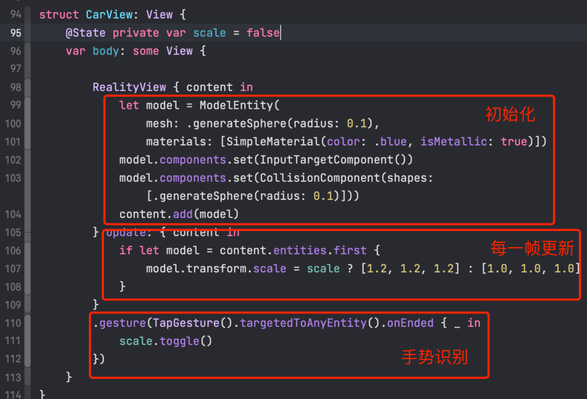

## **加载模型**

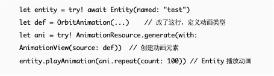

```swift
let entity = try? await Entity(named: "test")
let entity2 = try? await Entity(named: "test2", in: realityKitContentBundle)
```

## **播放动画**

流程：定义动画类型 => 创建动画元素 => Entity播放动画

播放模型动画：

下面Demo为了直观，直接用强制非空取代空判断；实际开发中必须要做判空。

```swift
let entity = try! await Entity(named: "test")
let def = entity.availableAnimations[0].definition  // 定义动画类型
let ani = try! AnimationResource.generate(with: AnimationView(source: def))  // 创建动画元素
entity.playAnimation(ani.repeat(count: 100))  // Entity播放动画
```

播放内置动画：

内置动画默认有FromToBy、Orbit、Sampled三种

*   FromToBy => CABasicAnimation
*   Sampled => CAKeyframeAnimation
*   Orbit => 环绕动画

```swift
let entity = try! await Entity(named: "test")
let def = OrbitAnimation(...)    // 改了这行，定义动画类型
let ani = try! AnimationResource.generate(with: AnimationView(source: def))  // 创建动画元素
entity.playAnimation(ani.repeat(count: 100)) // Entity播放动画
```

## **手势**


用法：.onGesture(...)

与2D的SwiftUI相比，这里多了个targetedAnyEntity方法，意思是System内的所有Entity都能被这个gesture响应。

*   targetedAnyEntity - System内任意Entity都响应该手势
*   targetedToEntity(_ entity: Entity) - 指定Entity响应该手势
*   targetedToEntity(where query: QueryPredicate<Entity>) - 指定某些Entity进行

# **移植**

## **APP直接在VisionOS上使用**

iOS上的APP可直接在VisionOS上使用，但无法表现VisionOS特有的UI效果，只能展示成一个普通的平面

## **移植公共逻辑类**

视图只能用SwiftUI写（是否能用OC，有待探究）

## **不可用的API**

*   Core Motion services
*   Barometer and magnetometer data
*   All location services except the standard service
*   HealthKit data
*   Video or still-photo capture
*   Camera features like auto-focus or flash
*   Rear-facing (selfie) cameras
