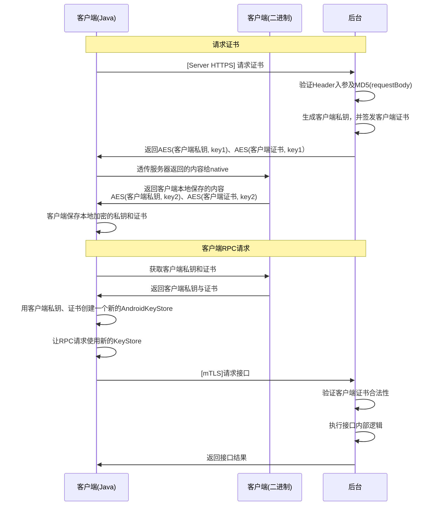
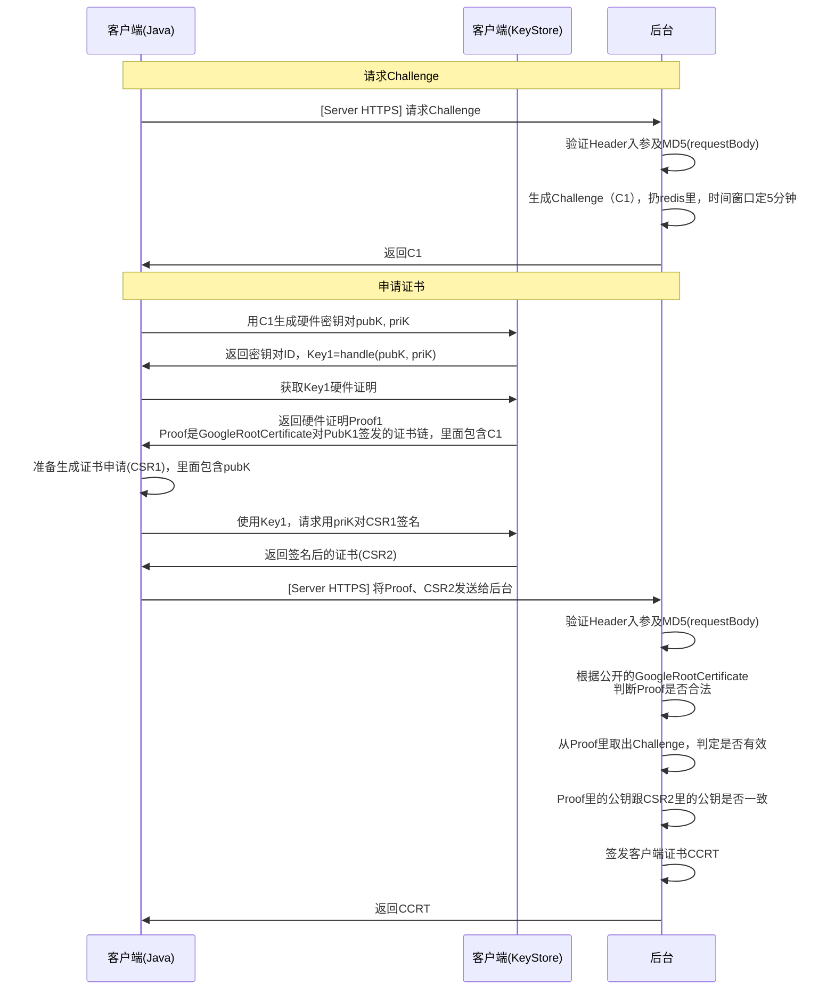
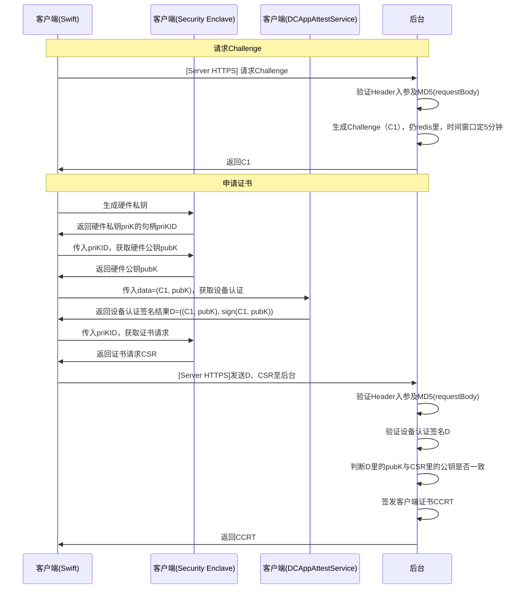

# 一次 mTLS 认证被攻破的故事

曾经我开发了一个客户端接口，为了防止被爬虫，加上了mTLS认证：

::url-card{url="https://en.wikipedia.org/wiki/Mutual_authentication"}



我本来以为这个认证流程已经相对安全了，直到最近这个接口的访问量触发了告警，并且是同一个用户的行为，说明接口又被非预期访问了。问题出在哪呢？

# 问题分析

好在，这名用户非常勇敢，把破解流程放在了Github上：

1.  攻陷手机设备，使用Frida接管
2.  使用Frida去hook Android KeyStore有关接口。
3.  在客户端发送mTLS RPC请求前，需要从Android KeyStore获取私钥去签名。而因为Android KeyStore的接口都已被接管，输入和输出的内容可被用户截获。
4.  结果：客户端证书私钥泄漏。

所以问题就在，私钥就不应该出现在**用户态的内存上，甚至最好都不要出现在内核态里**。而mTLS的加密通信的核心是客户端私钥签名，又必须用到客户端私钥。有没有什么办法，让这个签名的过程与用户态隔离开来呢？

有的兄弟，有的。

# 硬件密钥

设备上有一个单独的元器件，负责私钥存储，对外提供签名、加密功能。一般而言，除非硬件设备因存在漏洞被攻陷，硬件私钥无法被提取。

对于iOS来说，整个元器件被称为 

::url-card{url="https://support.apple.com/guide/security/secure-enclave-sec59b0b31ff/web"}

::url-card{url="https://support.apple.com/guide/security/secure-enclave-sec59b0b31ff/web"}

Security Enclave（SEP）是单独的元器件，有自己的SoC、内存，甚至有自己的操作系统。iOS内核跟SEP只能通过Mailbox通信，iOS内核无法直接操作SEP。并且在与内核的通信过程，还有很多验证方法防止各种攻击，确保SEP内存空间是可信的。

对于安卓，现代的安卓设备，一般会有TEE或StrongBox。实现原理和iOS的SEP可能不相同，但大体原理是一致的。

::url-card{url="https://source.android.com/docs/security/best-practices/hardware"}

那为什么需要硬件密钥呢？硬件密钥是一切生物识别支付的基石。以FaceID支付为例，简单来说，以下是支付过程：

1.  后台下发支付信息与Challenge（随机值）。
2.  客户端调用系统FaceID API，传入Challenge。
3.  系统开启FaceID硬件，对用户进行生物识别。
4.  如果识别成功，FaceID API返回Challenge对应的**硬件公钥证书链签名**。
5.  客户端将Challenge证书签名传给后台。
6.  后台检测Challenge的签名、证书链是否有效。如果有效，则支付成功。

上面过程的**硬件公钥证书链签名**，是由SEP完成的。如果没有SEP，用户设备被攻陷后，攻击者很容易就拿到私钥去伪造签名。正是因为硬件密钥足够安全，生物识别支付技术才在全球流行起来。不然，我们现在要手动输入密码才能完成支付。

# 修改流程

既然硬件密钥这么安全，那我们mTLS证书的私钥能不能存在硬件密钥里呢？给攻击者一点颜色瞧瞧！

## Android



缺陷：Android有的硬件证书链已泄漏，后台需及时更新证书列表。

## iOS



缺陷：SEP并不提供设备认证签名（但是，FaceID API提供），后台无法确保客户端传入的公钥是SE生成的。为了弥补这个缺陷，上述流程用到了AppAttestService，因为AppAttestService提供设备认证签名。

# 回顾区块链

::url-card{url="https://liaoxuefeng.com/books/blockchain/introduction/index.html"}

假如，Bob要给Alice转账1BTC，那么需要什么呢？

首先，Bob需要生成**钱包**，并且需要知道Alice的**地址**。

## 数学基础

::url-card{url="https://en.wikipedia.org/wiki/Elliptic_curve"}

::url-card{url="https://en.wikipedia.org/wiki/Elliptic-curve_cryptography"}

已知，椭圆曲线方程：

$y^2=x^3+ax+b$

### 加法

已知，椭圆曲线是一条连续光滑的曲线。现在有三个点P、Q、R，P、Q在曲线上，有P+Q=R，则定义以下规则：

1.  若P ≠ Q，则画一条直线连接P、Q，交曲线于第三点R‘，取R’关于X轴轴对称的点，该点定义为R。
2.  若P = Q，则过P点画一条椭圆曲线的切线，交曲线于第三点R’。R‘关于X轴轴对称的点定义为R。

### 应用在密码学里

x, y的值域是实数域，无法应用在计算机上。为了转换到有限域上，方程改为：

$y^2=x^3+ax+b \pmod p$

曲线上找一点G，定义为**基点**

因为曲线后面带modp，则必有一点n，使得nG = 0。该点称为**阶**。

### 公钥与私钥

取一正整数d，该整数为**私钥**

计算Q=dG，Q点为**公钥**

椭圆曲线的加法必须使用累加法计算。已知d和G，计算公钥时，可以使用**倍点加法**计算节约计算时间。而只知道Q和G，必须要穷举才能知道私钥d。

### 签名

已知消息哈希z：

1. 取随机正整数k，1≤k<n

2. 计算R=kG

3. 计算R=kG

4. 取r=Rx mod n

5. 计算签名：

$s=k^{-1}(z+r⋅d)\mod n$

6. 签名为r、s、v。恢复的公钥包含多个可能值，v指定某个公钥的值。

怎么从签名获得公钥Q？

$$ s=k^{-1}(z+r⋅d)\mod n\ => sk=z+r·d\ <=> skG=zG+rQ\ <=> Q=r^{-1}(sR-zG) $$

而

$$ r=R_{x}\mod n\ => x_{r}=r \text{或} x_{r}=r+n $$

带入恢复公式验算，公钥的点必在曲线上，得到准确的xr

而y有两个解（参考椭圆曲线方程）。后面加了modp，所以有y1+y2=p。因为p是奇质数，会根据v的奇偶性，确定取y1还是y2。

验证签名：

1. 计算：

$$ w=s^{-1}\mod n\ u1=z⋅w\mod n\ u2=r⋅w\mod n $$

2. 取曲线点：

$$ (X,Y)=u1G+u2Q $$

3. 取

$$ v=X\mod n $$

4. 比较

$$ v == r $$

为什么成立？

$$ s=k^{-1}(z+r⋅d)\mod n\ => ks=z+r·d \ <=> k=s^{-1}(z+rd) $$

则

$$ u1G+u2Q=(zs^{-1})G+(rs^{-1})(dG)=(kG) $$

## 钱包与地址

::url-card{url="https://en.wikipedia.org/wiki/Cryptocurrency_wallet"}

钱包：由ECDSA（椭圆曲线数字签名算法）生成的私钥集合，每一条链对应一把私钥。在链上交易时，需要用你的私钥签名交易信息。

Hierarchal Deterministic (HD) Wallet：钱包里只存一个**根私钥**，由此根私钥可以派生出其它私钥。**助记词**是**种子**的一种表现形式，种子可以生成根私钥，并派生其它私钥。

::url-card{url="https://en.bitcoin.it/wiki/Seed_phrase"}

地址：公钥的哈希再哈希。

在一个链里，椭圆曲线的参数（p、n、G）是公开的。例如在比特币主链，用的是`secp256k1` 曲线，其参数为：

$$ y^2≡x^3+7\mod p $$

```
p=FFFFFFFFFFFFFFFFFFFFFFFFFFFFFFFFFFFFFFFFFFFFFFFFFFFFFFFEFFFFFC2F
Gx=79BE667EF9DCBBAC55A06295CE870B07029BFCDB2DCE28D959F2815B16F81798
Gy=483ADA7726A3C4655DA4FBFC0E1108A8FD17B448A68554199C47D08FFB10D4B8
n=FFFFFFFFFFFFFFFFFFFFFFFFFFFFFFFEBAAEDCE6AF48A03BBFD25E8CD0364141
```

## 区块与区块链

区块链上有若干区块，因为每个区块都记录着上一个区块的哈希，每个区块就像被系在一起，因此称为“区块链”。

区块记录交易信息，而不同的链有不同的交易信息记录方式。比特币用的是UTXO模型，而以太坊用的是账户余额模型。

::url-card{url="https://en.wikipedia.org/wiki/Unspent_transaction_output"}

比如，Bob之前收到Tom的1BTC，Mary的1BTC，交易记录分别记录不同的区块，那么现在Bob给Alice转账1BTC，区块的交易信息记录：

*   输入：Tom→Bob的区块哈希、Mary→Bob的区块哈希、Tom私钥对该交易信息的签名
*   输出：Alice的地址、交易金额

## 记账

区块链是去中心化的，换言而之没有一个固定的记账对象，记账对象是一个自由加入的**计算机集群**。

在Bob与Alice的交易发生时，会发生：

1.  该交易被发送至未处理池里（内存池）。
2.  由链的算法在集群里选择一台机器进行记账。在比特币主链，用的是**工作量证明**法。
3.  被选中的机器构造新的区块，并广播给其它所有机器，获得奖励（挖矿）。
4.  其它机器收到新的区块，验证无误后将这个区块加入到自己的本地区块链里。
5.  交易完成。

# 安全性

区块链本身安全吗？安全。

1.  单个区块需要验证发送者签名才会被加到链上，而签名在公私钥理论上就是安全的，无法被伪造。
2.  每个区块都记录着上一个区块的哈希值。要想改变链上某个区块的信息，就必须要改变这个区块后面所有的区块。

但是，安全分为两种：密码学安全和结构安全，区块链只能保证前者。如果私钥泄漏了，那么就算区块链本身再安全也无能为力。而大部分钱包都是在软件层面生成的。这也就意味着，私钥会出现在用户态的内存环境里。按照第1节讲的，在设备被攻陷、或操作系统出现漏洞时（比如某红色三字APP用的提权漏洞）都会导致私钥被直接提取。

那能否使用硬件密钥保存钱包私钥呢？很遗憾，目前并不支持。以Security Enclave为例，并不支持硬件私钥用比特币主链采用的`secp256k1`曲线进行签名。Android 的 StrongBox 也不支持，仅有三星支持该曲线。

::url-card{url="https://developer.samsung.com/blockchain/keystore/understanding-keystore/what-makes-keystore-unique.html"}

既然OS的密钥保护存在天然缺陷，那么安全的答案只能回到硬件层面：冷钱包。

# 回到冷钱包

既然Security Enclave不支持特定`secp256k1`曲线签名，那能不能开发一个外部硬件来解决？这个硬件在内部生成密钥，并只对外界提供`secp256k1`曲线签名功能，通过类似蓝牙、NFC、二维码或者USB等方式把签名发送给设备上完成交易。

没错，这就是冷钱包。冷钱包属于**硬件私钥签名设备**。除了冷钱包，U盾、FIFO2设备都属于这类。

但是，冷钱包就一定能够确保私钥安全了？U盾之所以安全，是因为银行既是U盾的硬件厂商，又是交易场所，本身就有保证交易安全的义务，在U盾上开后门没意义。而对于FIFO2，它仅仅是一个**认证设备**，并不理解用户具体的认证场所，所以硬件厂商不知道私钥的具体含义，在上面做手脚也没意义。

但是对于冷钱包而言，冷钱包厂商知道硬件里的私钥是钱包。并且它也没义务去确保交易的安全，因为这是区块链本身该做的。所以冷钱包里是否存在厂商添加的后门，全凭厂商道德自觉。更可怕的是，一般的冷钱包只能连接硬件厂商提供的APP，那么冷钱包有没有可能把私钥传输到APP里，APP再把私钥传到后台呢？用户不得而知。
