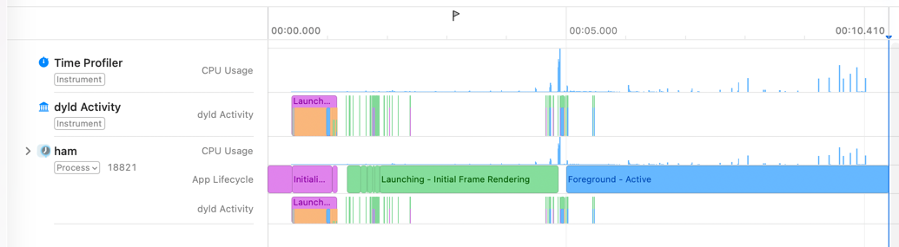
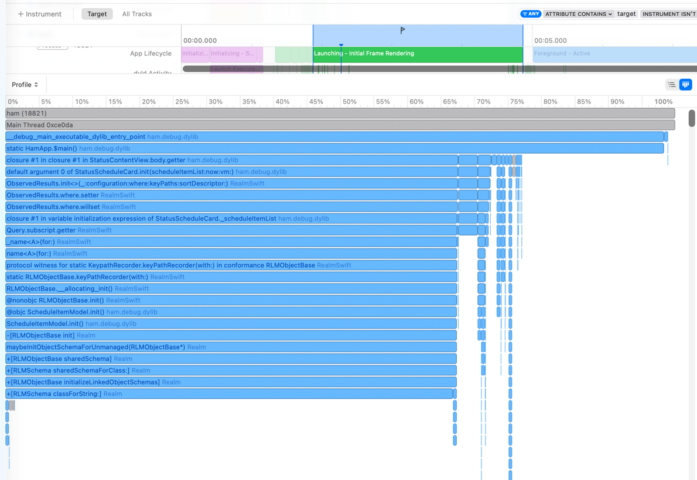
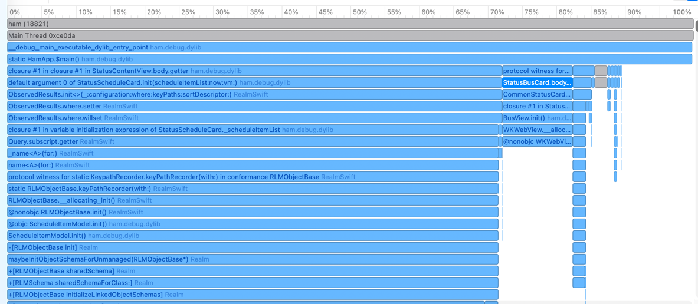

最近Ham的冷启动速度真的是越来越慢了，慢到令人发指。从手指点击APP Icon到首个页面出现，居然需要3.5秒，是时候要好好优化下了！

## 工具

Xcode贴心地为我们准备好了耗时排查工具**App Launch**


我们选择好要测量的APP和超时时间后，就可以点击左上角的按钮开始抓trace啦～


## 测量



细看Progress部分，APP的启动过程可以分为三个部分：

### 初始化阶段T1


包含：
- `Progress Creation` 系统创建进程
- `System Interface Initialization` 系统接口初始化，此时dyld会解析动态符号

### 启动阶段T2


包含：
- `UIKit Initialization` - UIKit初始化，不可规避
- `willFinishLaunchingWithOptions()` -  `AppDelegate`里的委托方法
- `didFinishLaunchingWithOptions()` -  `AppDelegate`里的委托方法
- `sceneWillConnectTo()`
- `sceneWillEnterForeground()`
- `Initial Frame Rendering` - 首帧渲染

### 前台阶段T3


APP初始化完成，用户看到APP第一帧。

---

当然，由系统的特性我们可以知道，因为第一帧是主线程绘制的，要优化冷启动时间，就必须要让主线程干更少的活。于是，我们看trace的时候，可以把目光瞄准在主线程上。

## 分析

通过分析trace，我们可以知道，占APP启动时间大头，并且可优化的是：

- `Initial Frame Rendering` - 2.99s

- `System Interface Initialization` - 757.31 ms
- `willFinishLaunchingWithOptions()` - 115.47ms
- `didFinishLaunchingWithOptions()` - 94.85ms


## Initial Frame Rendering优化

我们观察下这段trace：



😯，居然有View在主线程开Database

### 日程卡优化

先来说下背景。Ham启动成功后，会进入“状态”tab，里面展示很多实时通知的状态卡片，比如天气、课程、校车、日程等：


Ham里带日程功能，日程数据存在Realm数据库里。 `StatusScheduleCard` 是一张状态卡片，用来展示用户的日程情况（见上图）。`StatusScheduleCard`为什么会卡主线程呢？我们看看代码：

```swift
import SwiftUI
import RealmSwift
struct StatusScheduleCard: View {
    @ObservedResults(ScheduleItemModel.self,
            where: {
                let now = Date()
                return ($0.end == nil && $0.begin >= now) ||
                        ($0.end != nil && $0.end >= now)
            },
            sortDescriptor: SortDescriptor(keyPath: "begin", ascending: true)) var scheduleItemList
  
  ...
  var body: some View {
		...
    ForEach(1..<5) { i in
                            if i < scheduleList.count {
                                let scheduleModel = scheduleList[i]
                                scheduleItemView(scheduleItem: scheduleModel)
                            }
                        }
    ...
  }
```

结合trace，这下我们明白了：

APP在渲染第一帧时会创造根View的struct，而因为日程卡要立刻上屏，因此也会初始化`StatusScheduleCard`。`StatusScheduleCard` 里有一个属性`scheduleItemList`，被`ObservedResults`的`Property Wrapper` wrap了。

`StatusScheduleCard`上屏时需要获取前五项日程数据，此时访问`scheduleList[i]`，实际会触发Realm数据库的初始化。在渲染View时初始化数据库，当然会卡啦😭

当然，这个问题不能怪开发者，只能说明是框架本身的缺陷：开发者也不知道这个`@ObservedResults`会导致主线程读取数据库啊😭😭

怎么解决呢：

1. 延时加载日程卡。在T3阶段后再加载+展示
2. 放弃使用`@ObservedResults`，使用传统方式打开Realm获取数据。

```swift
// StatusScheduleCard.swift
struct StatusScheduleCard: View {
    @ObservedObject var vm: StatusScheduleCardViewModel
    
    @ViewBuilder
    var body: some View {
        if vm.inited {
            StatusScheduleCardInner(vm: vm)
        }
    }
}
```

```swift
// StatusScheduleCardViewModel.swift
@MainActor
class StatusScheduleCardViewModel: ObservableObject, StatusCardViewModel {
   @Published var inited = false
  ...
  func onInit() {
        inited = true
        initUpdateTask()
    }
  
  private func initUpdateTask() {
        Task {
            while !Task.isCancelled {
                updateData()
                do {
                    try await Task.sleep(nanoseconds: 10_000_000_000)
                } catch {
                    break
                }
            }
        }
    }
    
    private func updateData() {
        currentTime = Date()
        let currentWeekInfo = getCurrentWeekInfo(date: currentTime)
        Task.detached(priority: .background) { [currentWeekInfo, currentTime] in
            let realm = try! Realm(queue: nil)
            let results = realm.objects(ScheduleItemModel.self)
                .where {
                    ($0.end == nil && $0.begin >= currentTime) ||
                    ($0.end != nil && $0.end >= currentTime)
                }
                .freeze()
                .sorted(byKeyPath: "begin", ascending: true)
            let weekScheduleListResult = results
                .where {
                    return ($0.end == nil && $0.begin <= currentWeekInfo.end) || ($0.end != nil && $0.end <= currentWeekInfo.end)
                }
                .freeze()
            await MainActor.run {
                let snapshot = Array(results)
                let weekScheduleList = Array(weekScheduleListResult)
                withAnimation {
                    self.scheduleList = snapshot
                    self.weekScheduleList = weekScheduleList
                }
            }
        }
    }
  ...
```

### 校巴卡优化

除了日程卡，校巴卡也占据了很多时间。为什么呢？初始化的时候居然在创建WebView！



这里再说下背景。`BusView`是校巴的二级H5页。按道理来说这里不应该直接初始化才对？🤔

真正原因其实在`CommonStatusCard`上：

```swift
// CommonStatusCard.swift
struct CommonStatusCard<Content: View>: View {
    let icon: String
    let title: String
    let color: Color
    let padding: CGFloat
    var navDest: AnyView? = nil
    let content: () -> Content

    init<NavView: View>(icon: String,
                        title: String,
                        color: Color,
                        padding: Int = 12,
                        navDest: () -> NavView,
                        content: @escaping () -> Content) {
        self.icon = icon
        self.title = title
        self.color = color
        self.navDest = AnyView(navDest())
        self.content = content
        self.padding = CGFloat(padding)
    }
```

`CommonStatusView`会在初始化时**直接**执行`navDest`，并保存在`AnyView`里。这里的`navDest`毫无疑问就是`BusView`。所以，在`CommonStatusCard`时会初始化二级页里的所有内容。本质上来说，是`CommonStatusView`编码不合理引起的。

怎么解决呢？最佳的解决方法是，`CommonStatusView`里不应使用`AnyView`，改成存`ViewBuilder`。但是后期因为Ham的导航架构从`NavigationView`迁移至`NavigationStack`，这样`navDest`里就不用真传一个`ViewBuilder`进来，只用传一个Route就好了，也就没有了改造的烦恼。

### ViewModel初始化优化

一般来说，每个Card下面都会有一个`ViewModel`：

```swift
// StatusCourseCard.swift
struct StatusCourseCard: View {

    @ObservedObject let vm: StatusCourseCardViewModel
  ...
```

```swift
// StatusBusCard.swift
struct StatusBusCard: View {
    
    @ObservedObject var vm: StatusBusCardViewModel
  ...
```

这些卡片的`ViewModel`，被外层`StatusView`的`ViewModel`创建并持有。外层的`ViewModel`在初始化时就会去创建这些卡片的`ViewModel`：

```swift
// StatusContentViewModel.swift
@MainActor
class StatusContentViewModel: ObservableObject, @MainActor StatusCardController {
    let weatherCardVM = StatusWeatherCardViewModel()
    let libraryCardVM = StatusLibraryCardViewModel()
    let courseCardVM = StatusCourseCardViewModel()
    let busCardVM = StatusBusCardViewModel()
    let sportCardVM = StatusSportCardVM()
    let scheduleCardVM = StatusScheduleCardViewModel()
    let casAlertCardVM = StatusCasAlertCardViewModel()
  
  	...
    
    init() {
        onInit()
    }
  
  	...
    
    func onInit() {
        getAllVM().forEach { $0.onInit() }
    }
  
  	...
```

这些卡片的`ViewModel`在创建时会做什么呢？

`StatusBusCardViewModel`：初始化数据并开始定位

```swift
// StatusBusCardViewModel.swift
class StatusBusCardViewModel: ObservableObject, StatusCardViewModel, LocationListener {
  ...
  func onInit() {
        LocationManager.shared.registerListener(self)
        update()
        casContext.isLoginFlow.sink { [weak self] _ in
            self?.update()
        }
        .store(in: &cancellables)
        initTimer()
    }
  ...
```

`StatusCourseCardViewModel` 从sqlite数据库拉数据

```swift
class StatusCourseCardViewModel: ObservableObject, StatusCardViewModel {
	...
  func onInit() {
        NotificationCenter.default.addObserver(self, selector: #selector(onCourseListUpdated), name: .byKey(.ham_courseUpdated), object: nil)
        updateCourseList()
    }
  ...
```

这些操作都是需要耗时的，真的有那么需要在T2时刻就要做吗？能否挪到T3再开始做呢？

当然可以！但首先有个问题，我们怎么知道T3是否开始呢？好在，Apple提供了一个通知`willEnterForegroundNotification`。外层的`ViewModel`接收到该通知后，再调用每张卡片的`ViewModel`初始化即可。

```swift
// StatusView.swift
struct StatusView: View {
  var body: some View {
    ...
    .onReceive(NotificationCenter.default.publisher(
            for: UIApplication.didBecomeActiveNotification
        )) { _ in
            vm.contentVM.doInit()
        }
  }
  ...
```

但还有个问题，冷启动后第一帧时，因为没有数据，屏幕上不会展示任何卡片了。这显然不是我们想要的。接下来的**缓存**章节，就是为了解决这一点。

### 缓存

最近在用小红书，发现小红书冷启动时一个很有意思的点：

> APP冷启动时，会先展示上次的数据，再执行刷新步骤。

「执行刷新步骤」其实很好理解，这和我们的优化方案一致，在T3时刻再执行重逻辑。但是，「展示上次的数据」是怎么做到的？

或许可以...直接打开db获取数据？但这不才在**日程卡优化**补的坑嘛，冷启动阶段尽量不能操作重逻辑的IO。那怎么办呢？

答案如下：把要展示的首帧数据，保存在`UserDefault`里。

可能有人会说：

> `UserDefault` 的原理也是读文件做IO啊，首次访问也会非常慢。

但是，**这也总比打开数据库要强**。

以天气卡为例：

```swift
// StatusWeatherCardViewModel.swift

struct StatusWeatherForecastInfo: SmartCodable {
    var day: String = ""
    var weather: String = ""
    var dayTemp: String = ""
    var nightTemp: String = ""
}

struct StatusWeatherDisplayInfo: SmartCodable {
    var temp: String = ""
    var weather: String = ""
    var description: String = ""
    var forecastInfo: [StatusWeatherForecastInfo] = []
}

@MainActor
class StatusWeatherCardViewModel: ObservableObject, LocationListener, StatusCardViewModel {
  
   private let TAG = "StatusWeatherCardViewModel"

    @Published var loadState = LoadStatus.unload
    @Published var weatherInfo: StatusWeatherDisplayInfo?
    @Published var errorMessage: String = ""
    weak var controller: StatusCardController?

    private var lastUpdateWeatherTimestamp: Int64 = 0
    private var placemark: CLPlacemark? = nil
    private var weatherObj: Weather? = nil
    @Published var inited = false

    // MARK: - Init
    
    init() {
      // 初始化时读取数据
        let displayInfo = StatusWeatherDisplayInfo.deserialize(from: LocalStorageHelper.shared.getStringValue(.weatherCache))
        _weatherInfo = .init(initialValue: displayInfo)
    }
  
  	...
  	private func updateWeather(location: CLLocation) {
      ...
      // 天气获取成功时
      storeWeatherInfo(weatherInfo: weatherInfo)
    }
  
  	private func storeWeatherInfo(weatherInfo: StatusWeatherDisplayInfo) {
      // 存数据
        LocalStorageHelper.shared.set(.weatherCache, value: weatherInfo.toJSONString())
    }
  ...
```

这样，就能保证在冷启动第一帧，看到上次的天气数据。

### 其他优化

#### 背景图片

状态卡的背景图片，是需要从网络上拉取的。冷启动时还没有拉取图片时，怎么办？

首先，这里的背景图片使用`SDWebImage` 组件。为什么用它？因为它支持图片**硬盘缓存**。也就意味着，冷启动时只要你传入缓存图片的链接，那么图片会从本地取出并加载。

```swift
// StatusBackgroundView.swift
struct StatusBackgroundView: View {
    @ObservedObject var vm: StatusBackgroundViewModel
    let onGetImage: (UIImage) -> Void
    
    var body: some View {
        Group {
            if let url = URL(string: vm.picURL) {
                WebImage(url: url)
                    .resizable()
                    .onFailure { error in
                        Log.e("StatusBackgroundView", "load pic error", error)
                        vm.loadState = .loadedWithError
                    }
                    .onSuccess { image, data, cacheType in
                        Log.i("StatusBackgroundView", "load pic success")
                        vm.loadState = .loaded
                        vm.savePicCache()
                        onGetImage(image as UIImage)
                    }
                    .scaledToFill()
                    .transition(.fade(duration: 0.5))
            }
        }
        .onReceive(NotificationCenter.default.publisher(
            for: UIApplication.didBecomeActiveNotification
        )) { _ in
            vm.doInit()
        }
    }
}
```

那什么时候更新图片数据呢？在T3时刻。而如果返回的图片url列表里，存在当前图片地址，那么就不需要更新缓存了。

```swift
// StatusBackgroundViewModel.swift
class StatusBackgroundViewModel: ObservableObject {
  ...
  func fetchPicUrl() {
        if !inited {
            return
        }
        
        loadState = .loading
        HamRequestHelper.shared.doRequest(DailyPicRequest()) { [weak self] response in
            if let error = response.error {
                Log.e(TAG, "fetchPicUrl - error", error)
                self?.loadState = .loadedWithError
                return
            }
            
            guard let data = response.data as? DailyPicResponse else {
                self?.loadState = .loadedWithError
                return
            }
            if data.picUrlList.isEmpty {
                Log.i(TAG, "fetchPicUrl - data is empty")
                self?.loadState = .loadedWithError
                return
            }
            
            Task { @MainActor in
                guard let self else { return }
                let firstLoad = self.firstLoad
                self.firstLoad = false
                if firstLoad {
                    if !self.picURL.isEmpty {
                        for picUrlData in data.picUrlList {
                            if picUrlData.url == self.picURL {
                                return
                            }
                        }
                    }
                }
                let url = data.picUrlList[ Int.random(in: data.picUrlList.indices) ].url
                if self.picURL != url {
                    if firstLoad && !self.picURL.isEmpty {
                        try? await Task.sleep(for: .seconds(10))
                    }
                    withAnimation {
                        self.picURL = data.picUrlList[ Int.random(in: data.picUrlList.indices) ].url
                    }
                }
                Log.i(TAG, "fetchPicUrl - success => \(self.picURL)")
            }
        }
    }
  ...
}
```

#### React Native模块初始化

为什么这里为什么会牵涉到React Native？虽然React Native在二级页里才会用到，但是在APP初始化时更新bundle是有必要的。不过，没有必要因为这个占据冷启动时间。

首先，在`ContentView`上overlay一个RNView，老版本如此：

```swift
// ContentView.swift
struct ContentView: View {
  var body: some View {
    ...
    .overlay(alignment: .topLeading) {
            RNCommonView()
                .frame(width: 0.5, height: 0.5)
        }
    ...
```

接着，在T3时刻再加载RNView。

```swift
// RNCommonView.swift

struct RNCommonView: View {
    
    @State var show = false
    
    var body: some View {
        ZStack {
            if show {
                RNContainerAsyncView(moduleName: "RNCommon")
            }
        }
        .onReceive(NotificationCenter.default.publisher(
            for: UIApplication.didBecomeActiveNotification
        )) { _ in
            show = true
        }
    }
}
```

`RNContainerAsyncView`是什么？其实就是跑了个task去初始化RNView，为了不占渲染队列。

为什么不把task放在子线程里呢？因为React Native不支持在子线程初始化。

```swift
struct RNContainerView: UIViewRepresentable {
    
    private let moduleName: String
    
    init(moduleName: String) {
        self.moduleName = moduleName
    }

    func makeUIView(context: Context) -> UIView {
        RNViewManager.shared.getView(moduleName: moduleName)
    }
    
    func updateUIView(_ uiView: UIView, context: Context) {
        
    }
}

struct RNContainerAsyncView: View {
    
    let moduleName: String
    
    @State var rnView: UIView? = nil
    
    var body: some View {
        ZStack {
            if let rnView = rnView {
                RNContainerInnerView(view: rnView)
            }
        }
        .task {
            if rnView != nil {
                return
            }
            let view = RNViewManager.shared.getView(moduleName: moduleName)
            await MainActor.run {
                rnView = view
            }
        }
    }
}
```

React Native的代码，可参考：

::github{repo="whu-ham/ham-rn"}

## System Interface Initialization优化

看看该项的trace，发现有一堆的Map image:


说明APP里有一堆动态库：


那为什么不能把这些动态库打包进APP里，这样不就节省了dyld解析符号的时间吗？🤔

没错，cocoapods提供了一个选项，支持将包以静态库的方式引入：

```diff lang="ruby" title="Podfile"
platform :ios, '15.1'
-use_frameworks!
+use_frameworks! :linkage => :static
```

## 启动队列

其实，之前就做过一版启动队列优化，有效果但是不大：

```swift
// ColdStartManager.swift
class ColdStartManager {
    static let shared = ColdStartManager()

    var privacyAgree: Bool {
        set {
            LocalStorageHelper.shared.set(.app_isReadPrivacy, value: newValue)
        }
        get {
            LocalStorageHelper.shared.getBool(.app_isReadPrivacy) ?? false
        }
    }

    private init() {}

    private weak var appDelegate: AppDelegate? = nil
    
    private let prepareLaunchCodeStartTask = PrepareLaunchCodeStartTask()
    private let primaryColdStartTask = PrimaryColdStartTask()
    private let secondaryAsyncColdStartTask = SecondaryAsyncColdStartTask()

    func onPrepareLaunch(delegate: AppDelegate) {
        logTime("prepareLaunch") { prepareLaunchCodeStartTask.action(delegate: delegate, privacyAgreed: privacyAgree) }
    }
    
    func doColdStart(delegate: AppDelegate) {
        appDelegate = delegate
        logTime("primaryColdStartTask.action") { primaryColdStartTask.action(delegate: delegate, privacyAgreed: privacyAgree) }
        logTime("secondaryAsyncColdStartTask.action") { secondaryAsyncColdStartTask.action(delegate: delegate, privacyAgreed: privacyAgree) }
    }

    func setPrivacyAgree() {
        guard let appDelegate = appDelegate else {
            return
        }
        LocalStorageHelper.shared.set(.app_isReadPrivacy, value: true)
        logTime("primaryColdStartTask.onPrivacyAgree") { primaryColdStartTask.onPrivacyAgree(delegate: appDelegate) }
        logTime("secondaryAsyncColdStartTask.onPrivacyAgree") { secondaryAsyncColdStartTask.onPrivacyAgree(delegate: appDelegate) }
        NotificationCenter.default.post(name: .byKey(.ham_privacyRead), object: nil)
    }
}

protocol ColdStartActionTask {
    func action(delegate: AppDelegate, privacyAgreed: Bool)
    func onPrivacyAgree(delegate: AppDelegate)
}

class PrepareLaunchCodeStartTask: ColdStartActionTask {
    private let actionList: [ColdStartAction] = [...]
    
    func action(delegate: AppDelegate, privacyAgreed: Bool) {
        actionList.forEach { action in
            action.action(delegate: delegate, privacyAgreed: privacyAgreed)
        }
    }
    
    func onPrivacyAgree(delegate: AppDelegate) {
        actionList.forEach { action in
            action.onPrivacyAgree(delegate: delegate)
        }
    }
}

class PrimaryColdStartTask: ColdStartActionTask {
    private let actionList: [ColdStartAction] = [...]
    
    func action(delegate: AppDelegate, privacyAgreed: Bool) {
        actionList.forEach { action in
            action.action(delegate: delegate, privacyAgreed: privacyAgreed)
        }
    }
    
    func onPrivacyAgree(delegate: AppDelegate) {
        actionList.forEach { action in
            action.onPrivacyAgree(delegate: delegate)
        }
    }
}

class SecondaryAsyncColdStartTask: ColdStartActionTask {
    private let actionList: [ColdStartAction] = [...]
    
    func action(delegate: AppDelegate, privacyAgreed: Bool) {
        actionList.forEach { action in
            Task {
                action.action(delegate: delegate, privacyAgreed: privacyAgreed)
            }
        }
    }
    
    func onPrivacyAgree(delegate: AppDelegate) {
        actionList.forEach { action in
            Task {
                action.onPrivacyAgree(delegate: delegate)
            }
        }
    }
}
```

`onPrepareLaunch` 对应 `willFinishLaunchingWithOptions`，而`doColdStart` 对应`didFinishLaunchingWithOptions`。

为什么效果不大呢？因为所有的task几乎都是在主线程上跑的。包括`SecondaryAsyncColdStartTask`，因为在主线程域开的Task，也是由主线程调度。

### 子任务Task改Detach

将任务调度里的

```swift
Task {
 ... 
}
```

改成

```swift
Task.detached(name: "ColdStartTask", priority: .background) {
  ...
}
```

这样可以不继承`MainActor`的上下文，减缓主线程压力。

### 添加idle队列

idle什么时候执行？在APP首帧展示时触发。

```swift
// MainView.swift
struct MainView: View {
    ...
    
    var body: some View {
        ...
        .onReceive(NotificationCenter.default.publisher(
            for: UIApplication.didBecomeActiveNotification
        )) { _ in
            ColdStartManager.shared.onIdle()
        }
    }
}
```

### 完工后的ColdStartManager

```swift
// ColdStartManager.swift
class ColdStartManager {
    static let shared = ColdStartManager()

    var privacyAgree: Bool {
        set {
            LocalStorageHelper.shared.set(.app_isReadPrivacy, value: newValue)
        }
        get {
            LocalStorageHelper.shared.getBool(.app_isReadPrivacy) ?? false
        }
    }

    private init() {}

    private weak var appDelegate: AppDelegate? = nil
    
    private let prepareLaunchCodeStartTask = PrepareLaunchCodeStartTask()
    private let primaryMainColdStartTask = PrimaryMainColdStartTask()
    private let primaryAsyncColdStartTask = PrimaryAsyncColdStartTask()
    private let secondaryAsyncColdStartTask = SecondaryAsyncColdStartTask()
    private let idleMainColdStartTask = IdleMainColdStartTask()
    private let idleAsyncColdStartTask = IdleAsyncColdStartTask()
    
    private var idleInited = false

    func onPrepareLaunch(delegate: AppDelegate) {
        logTime("prepareLaunch") { prepareLaunchCodeStartTask.action(delegate: delegate, privacyAgreed: privacyAgree) }
    }
    
    func onDidFinishLaunching(delegate: AppDelegate) {
        appDelegate = delegate
        logTime("primaryMainColdStartTask.action") {
            primaryMainColdStartTask.action(
                delegate: delegate,
                privacyAgreed: privacyAgree
            )
        }
        Task
            .detached(name: "ColdStartTask", priority: .background) { [
                primaryAsyncColdStartTask,
                secondaryAsyncColdStartTask,
                privacyAgree
            ] in
            logTime("primaryColdStartTask.action") {
                primaryAsyncColdStartTask.action(
                    delegate: delegate,
                    privacyAgreed: privacyAgree
                )
            }
            
            logTime("secondaryAsyncColdStartTask.action") {
                secondaryAsyncColdStartTask.action(
                    delegate: delegate,
                    privacyAgreed: privacyAgree
                )
            }
        }
    }

    func onPrivacyAgreed() {
        guard let appDelegate = appDelegate else {
            return
        }
        LocalStorageHelper.shared.set(.app_isReadPrivacy, value: true)
        NotificationCenter.default.post(name: .byKey(.ham_privacyRead), object: nil)
        logTime("primaryMainColdStartTask.onPrivacyAgree") {
            primaryMainColdStartTask.onPrivacyAgree(delegate: appDelegate)
        }
        Task.detached(name: "ColdStartTask - After privacy read", priority: .background) { [primaryAsyncColdStartTask, secondaryAsyncColdStartTask, appDelegate] in
            logTime("primaryColdStartTask.onPrivacyAgree") {
                primaryAsyncColdStartTask.onPrivacyAgree(delegate: appDelegate)
            }
            
            logTime("secondaryAsyncColdStartTask.onPrivacyAgree") {
                secondaryAsyncColdStartTask.onPrivacyAgree(delegate: appDelegate)
            }
        }
    }
    
    func onIdle() {
        guard let appDelegate = appDelegate, !idleInited else {
            return
        }
        idleInited = true
        Task { @MainActor in
            logTime("idleMainColdStartTask.action") {
                idleMainColdStartTask.action(
                    delegate: appDelegate,
                    privacyAgreed: privacyAgree
                )
            }
        }
        Task.detached(name: "ColdStartTask - onIdle", priority: .background) { [idleAsyncColdStartTask, appDelegate, privacyAgree] in
            logTime("idleAsyncColdStartTask.action") {
                idleAsyncColdStartTask.action(delegate: appDelegate, privacyAgreed: privacyAgree)
            }
        }
    }
}
```

然后，我们把各冷启动Task按照需要放进不同的队列里。

举个例子，像Firebase这种监测崩溃的SDK，需要在启动时就初始化，因此放在`PrimaryMainColdStartTask`里；

而像QQ SDK这种不急于初始化的操作，就可以放在`IdleAsyncColdStartTask` 里。

## 成果

优化后，APP的启动时间骤降至平均500ms，最快仅需300ms。
