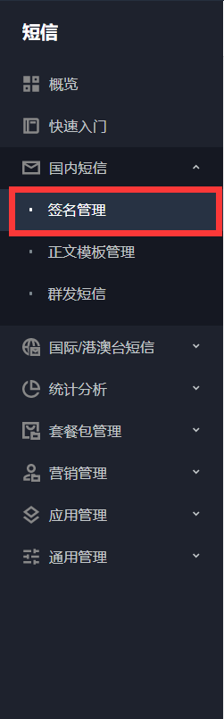
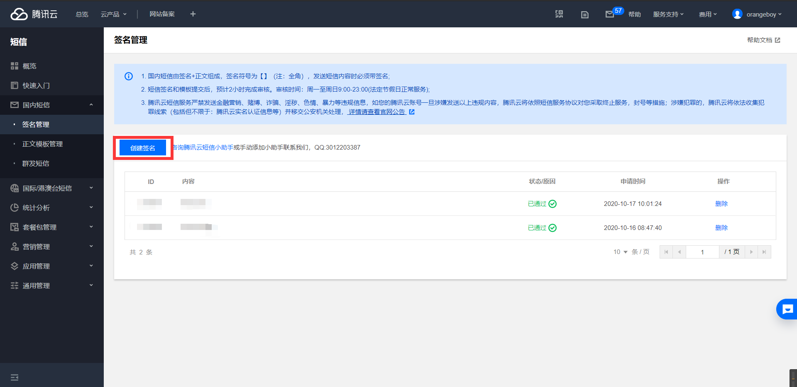
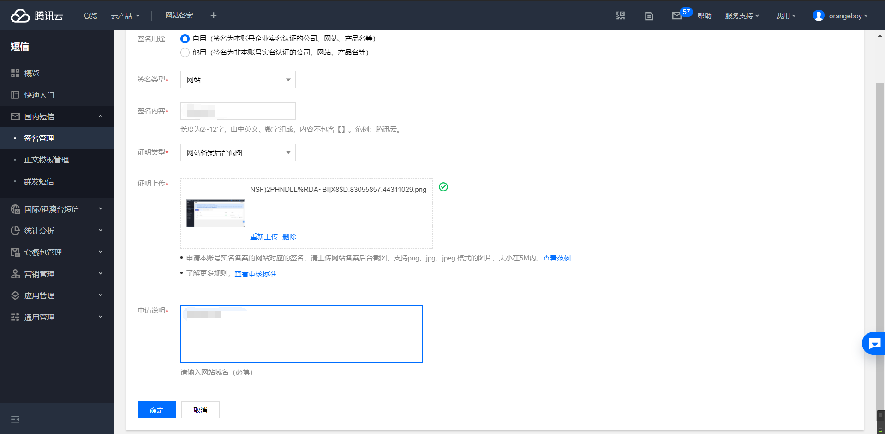
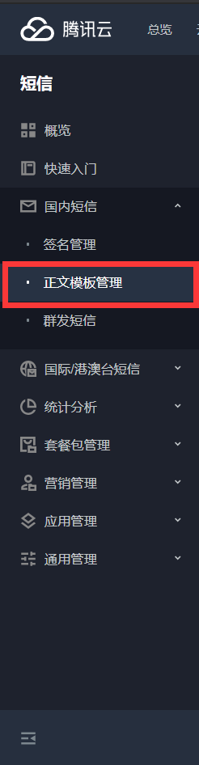
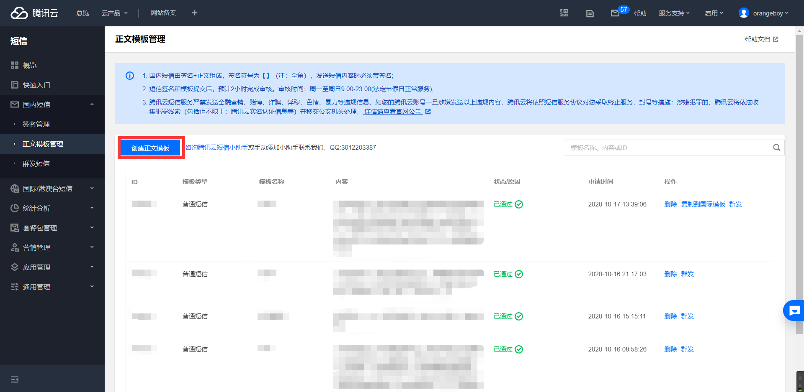
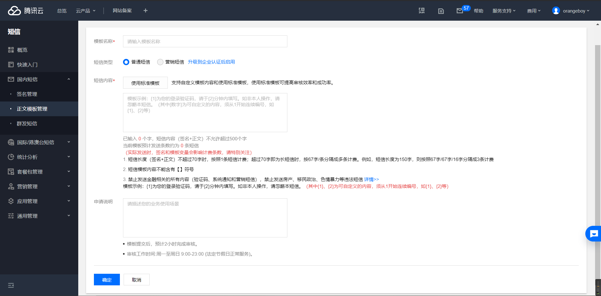
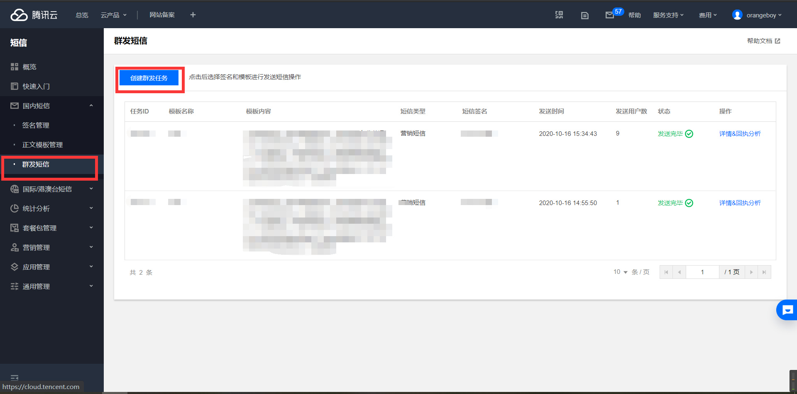
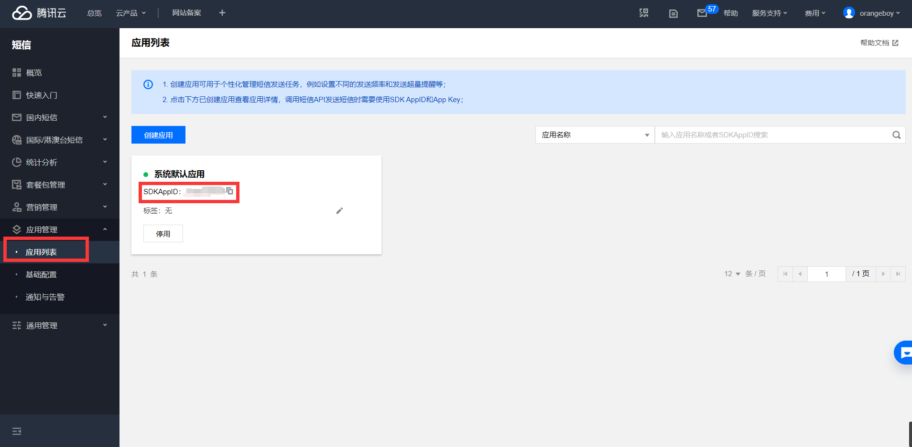

首先你需要开通

::url-card{url="https://console.cloud.tencent.com/smsv2"}

开通后，默认会每个月送100条短信。 

开通后，点击

::url-card{url="https://console.cloud.tencent.com/smsv2/guide"}

按照教程里进行操作。好的，教程到此结束，谢谢大家的观看（逃

<!-- more -->

## 1.创建签名

点击侧边栏**xx短信->签名管理**  然后点击**创建签名**  然后填写认证信息。可选择类型有网站、APP、公众号、小程序，然后对类型进行认证。审核在2小时内处理完毕。 

## 2. 创建模板

点击侧边栏**xx短信->正文模板管理**  点击**创建正文模板**  然后按照要求进行填写即可。这里审核较签名宽松，只要不违法，基本都是通过。审核在2小时内处理完毕。 

## 3.测试群发

点击侧边栏**xx短信->群发短信**，然后点击**创建群发任务**  选择签名、模板、发送时间，按照不同类型填写发送对象。 如果你的短信模板是带变量的，发送对象只能填上传接收号码，然后上传一个excel文件。  点击**文件**下

::url-card{url="https://upload-dianshi-1255598498.file.myqcloud.com/smsv2-tpl-zh-20200924-75d09111b4834ee1ff8a60b9414f8a5046b5c0bc.xlsx"}

下载官方excel模板，然后按照自己的模板变量进行更改。 最后点击**确定**，创建群发任务。注意，群发任务审核后才能进行。

## 4.通过Java SDK群发短信

::url-card{url="https://cloud.tencent.com/document/product/382"} 

首先在**应用管理->应用列表**找到你创建短信签名、模板的应用，记下SDKAppID。 在

::url-card{url="https://console.cloud.tencent.com/cam/capi"}

创建、获取你的SecretId与SecretKey。 创建项目，并添加Maven依赖

```xml
<dependency>
     <groupId>com.tencentcloudapi</groupId>
     <artifactId>tencentcloud-sdk-java</artifactId>
     <version>3.1.62</version><!-- 注：这里只是示例版本号，请获取并替换为 最新的版本号 -->
</dependency>
```

参照腾讯云文档，添加如下代码发送短信

```java
import com.tencentcloudapi.common.Credential;
import com.tencentcloudapi.common.exception.TencentCloudSDKException;
import com.tencentcloudapi.common.profile.ClientProfile;
import com.tencentcloudapi.common.profile.HttpProfile;
import com.tencentcloudapi.sms.v20190711.SmsClient;
import com.tencentcloudapi.sms.v20190711.models.SendSmsRequest;
import com.tencentcloudapi.sms.v20190711.models.SendSmsResponse;


public class Demo
{
    public static void main( String[] args )
    {
        try {
            Credential cred = new Credential("刚刚获取的secretId", "刚刚获取的secretKey");

            HttpProfile httpProfile = new HttpProfile();
            httpProfile.setReqMethod("POST");
            httpProfile.setConnTimeout(60);
            httpProfile.setEndpoint("sms.tencentcloudapi.com");

            ClientProfile clientProfile = new ClientProfile();
            clientProfile.setSignMethod("HmacSHA256");
            clientProfile.setHttpProfile(httpProfile);
            SmsClient client = new SmsClient(cred, "",clientProfile);
            SendSmsRequest req = new SendSmsRequest();

            String appid = "刚刚获取的SDKAppID";
            req.setSmsSdkAppid(appid);

            String sign = "你刚刚申请的签名";
            req.setSign(sign);

            /* 国际/港澳台短信 senderid: 国内短信填空，默认未开通，如需开通请联系 [sms helper] */
            String senderid = "";
            req.setSenderId(senderid);

            /* 用户的 session 内容: 可以携带用户侧 ID 等上下文信息，server 会原样返回 */
            String session = "";
            req.setSessionContext(session);

            /* 短信码号扩展号: 默认未开通，如需开通请联系 [sms helper] */
            String extendcode = "";
            req.setExtendCode(extendcode);

            String templateID = "你刚刚申请的模板ID";
            req.setTemplateID(templateID);

            /* 下发手机号码，采用 e.164 标准，+[国家或地区码][手机号]
             * 例如+8613711112222， 其中前面有一个+号 ，86为国家码，13711112222为手机号，最多不要超过200个手机号*/
            String[] phoneNumbers = {"+8621212313123", "+8612345678902", "+8612345678903"};
            req.setPhoneNumberSet(phoneNumbers);

            /* 模板参数: 若无模板参数，则设置为空*/
            String[] templateParams = {"5678"};
            req.setTemplateParamSet(templateParams);

            /* 通过 client 对象调用 SendSms 方法发起请求。注意请求方法名与请求对象是对应的
             * 返回的 res 是一个 SendSmsResponse 类的实例，与请求对象对应 */
            SendSmsResponse res = client.SendSms(req);

            // 输出 JSON 格式的字符串回包
            System.out.println(SendSmsResponse.toJsonString(res));

        } catch (TencentCloudSDKException e) {
            e.printStackTrace();
        }
    }
}
```

注意，模板参数对应的是一条短信。如果你需要对不同的手机号码发送不同的短信，你需要多次调用这个发送短信的方法。 然后，运行程序。如果参数正确，接受端立刻可以收到短信。
