正好年底了，有点闲钱整个NAS玩玩。我之前有折腾过轻度服务器，所以选NAS的时候特别注重稳定性，选择了极空间的Z2Pro。但是到手后发现它的操作对新手非常友好，对老手不友好。比如有些事情明明可以打几行命令解决，它非要你在GUI上完成。包括这次配HTTPS也是，特此写篇文章记录下。

<!-- more -->

## 为什么要上HTTPS？

我有在公网直连WebDAV的需求，基于安全性的考量，是一定要上HTTPS的。

### HTTP与HTTPS的区别

首先得了解什么是HTTP/HTTPS。

*   HTTP：明文传输。在传输过程有被中间人攻击的可能，即你传输的东西，可能会被别人看到
*   HTTPS：密文传输。在连接建立前通过多次握手确定密钥，后面进行加密传输。

[HTTP与HTTPS的区别](https://www.runoob.com/w3cnote/http-vs-https.html)

### WebDAV

WebDAV是基于HTTP1.1的通信协议，通过暴露HTTP restful API让你完成对文件的操作。

WebDAV在连接的时候会让你输入用户名和密码。这个用户名和密码是怎么传到服务器的呢？其实用的是HTTP的Basic Authorization进行鉴权。

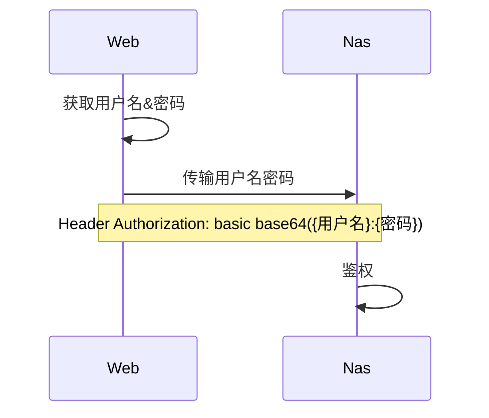

你想操作NAS，向NAS发起一个请求，浏览器要求你输入用户名和密码。在你输入密码后，浏览器会构造一个字符串：

`basic base64(${用户名}:${密码})`

这个字符串会带在HTTP请求Header的Authorization里。NAS在收到请求后，会对Header的Authorization进行解析。如果用户名密码正确，则进行下一步操作，否则返回403错误码。

如果用HTTP请求，会有什么问题呢？

你发的请求是明文的，被人看到后自然可以拿到里面的Header。因为Authorization的构造方式是固定的，而Base64不是加密算法，那就可以推断出请求里的用户名和密码。如果别有用心的人在你请求NAS的路径中“截胡”，将你要发送的包内容记录下来，然后再原封不动地发给NAS，你的用户名和密码就泄漏了。（中间人攻击：重放）

HTTPS就可以暂时解决这个问题。中间“截胡”的人，截到的内容都是经加密的，因此可有效避免中间人攻击。当然你肯定想问，如果“截胡”的人知道你的加密密钥呢？emm...，这里可能性不大，涉及“鸡生蛋”的问题，有感兴趣的可以看看《计算机网络》这本书。

## 技术实现

已知：

*   极空间会暴露5005端口来提供WebDAV服务

所以，我这里的方案是，路由器在公网暴露5006端口，并转发至内网极空间5006端口；内网极空间5006端口反向代理至自身5005端口。

所以，我这里的方案是：

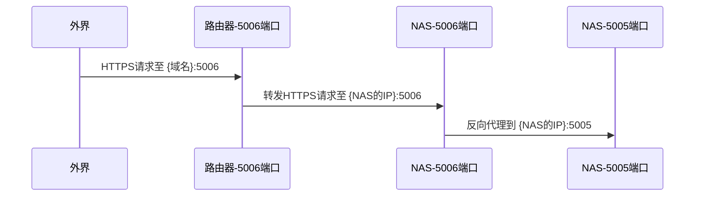

### Nginx Proxy Manager

Nginx是一个很好的反向代理工具，但在代理WebDAV时有个坑：

1.  它在反向代理时，会删掉一些没用的HTTP Header
2.  如果Header中带路径，它会自动忽略最后一个"/"

经实践，就有一点点小问题了：

1.  无法对文件重命名
2.  无法移动文件

怎么解决呢？如果你用的是普通服务器，只需要：

1.  给nginx添加`headers-more-nginx-module`模块
2.  重新编译Nginx
3.  在Nginx配置文件补齐这些缺失的header
4.  打开Nginx

但不幸的是，极空间并不能直接编译nginx（呜呜

Nginx Proxy Manager其实是Nginx + CertBot + UI，所以Nginx有的问题，它肯定有解决方法。方法也很简单嘛，就是重新构建一个带模块的Nginx Proxy Manager镜像

查看[jc21/nginx-proxy-manager的Dockerfile](https://github.com/NginxProxyManager/nginx-proxy-manager/blob/develop/docker/Dockerfile)，会发现Nginx是从jc21/nginx-full:certbot-node镜像获取的，因此我们也要构建带模块的jc21/nginx-full:certbot-node

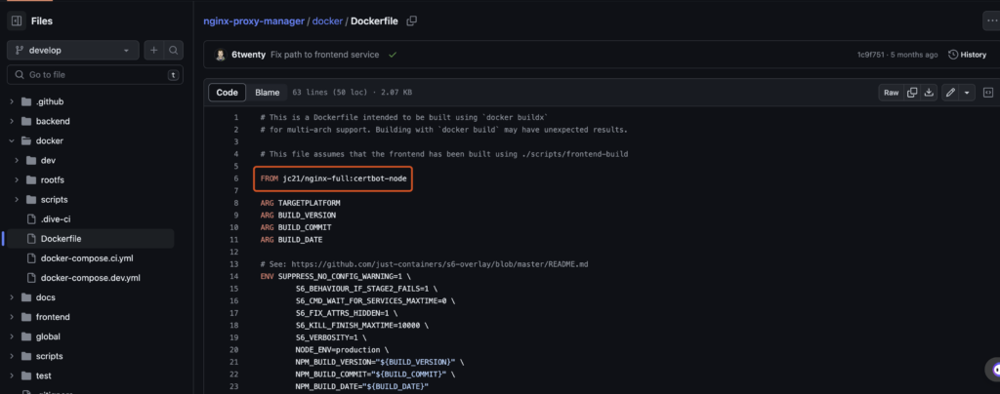

看看[jc21/nginx-full:certbot-node的Dockerfile](https://github.com/NginxProxyManager/docker-nginx-full/blob/master/docker/Dockerfile)，会通过./scripts/build-openrestry脚本去编译nginx

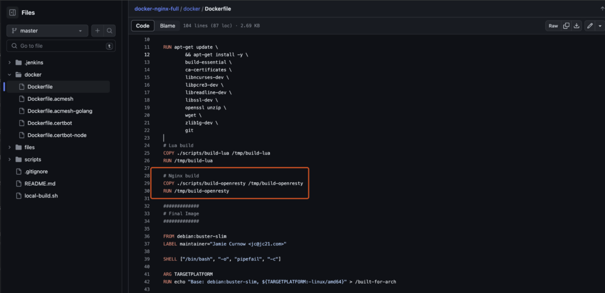

再看看这个脚本，豁然开朗。可以在这里加我们想要的插件了！

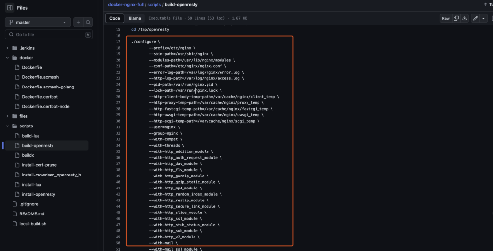

所以：

1.  在build-openresty里，加入`headers-more-nginx-module`模块。
2.  重新构建jc21/nginx-full:certbot-node
3.  以jc21/nginx-full:certbot-node为父镜像，重新构建jc21/nginx-proxy-manager
4.  发到公有docker仓库上（比如阿里云），让极空间下载镜像，然后跑起来！

这里有点繁琐，而且我在第一步就失败了，总是提示ubuntu缺少一些组件。

### Apache

没用过，欢迎补充

### Traefik

[Traefik官网](https://doc.traefik.io/traefik/)

因为最近玩云原生比较多，想着既然用Nginx太复杂，那就试试Traefik？

从官网可以看到，Traefik是建议通过Docker Compose部署的，但极空间不支持嘛，所以用Docker CLI也行。。

从官网可以看到，Traefik推荐给每个Docker容器配动态参数，然后Traefik会去读这些参数，自动给这些Docker容器做反向代理。但极空间不支持嘛，所以用文件配置也行。。

所以怎么做呢？

#### 拉取镜像

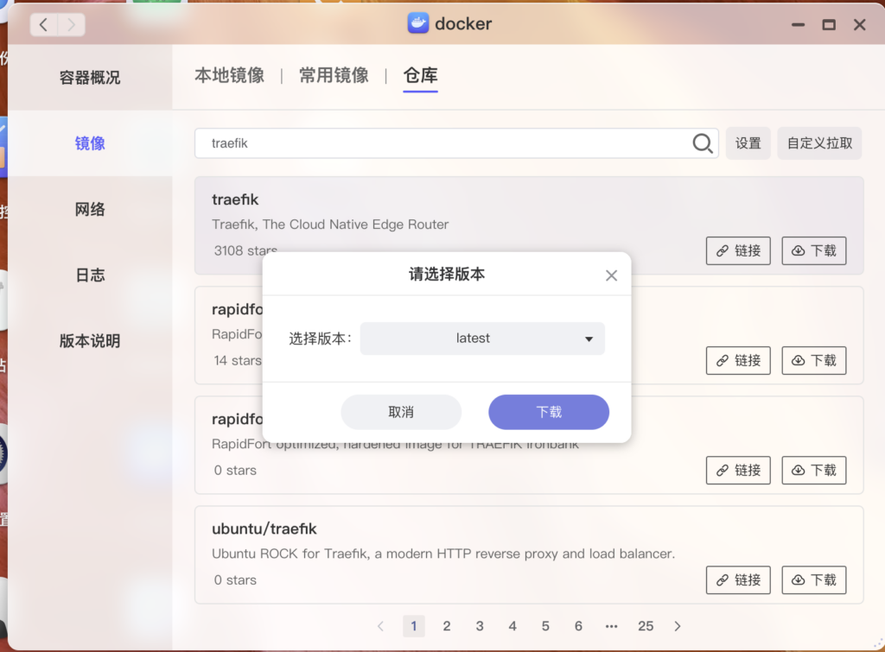

```shell
# 对应Docker命令
docker pull traefik:latest
```

#### 创建/配置容器

用上面的镜像创建容器：

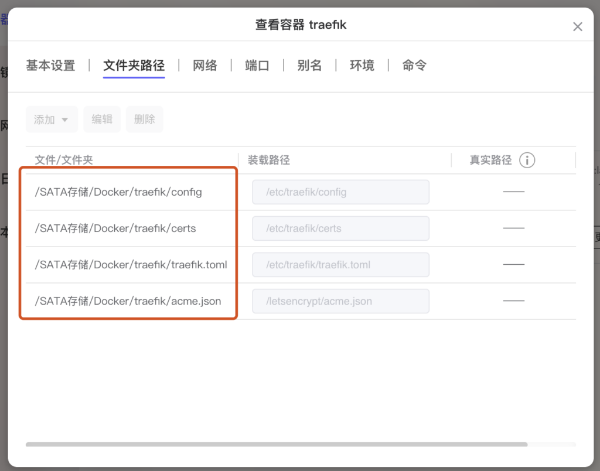

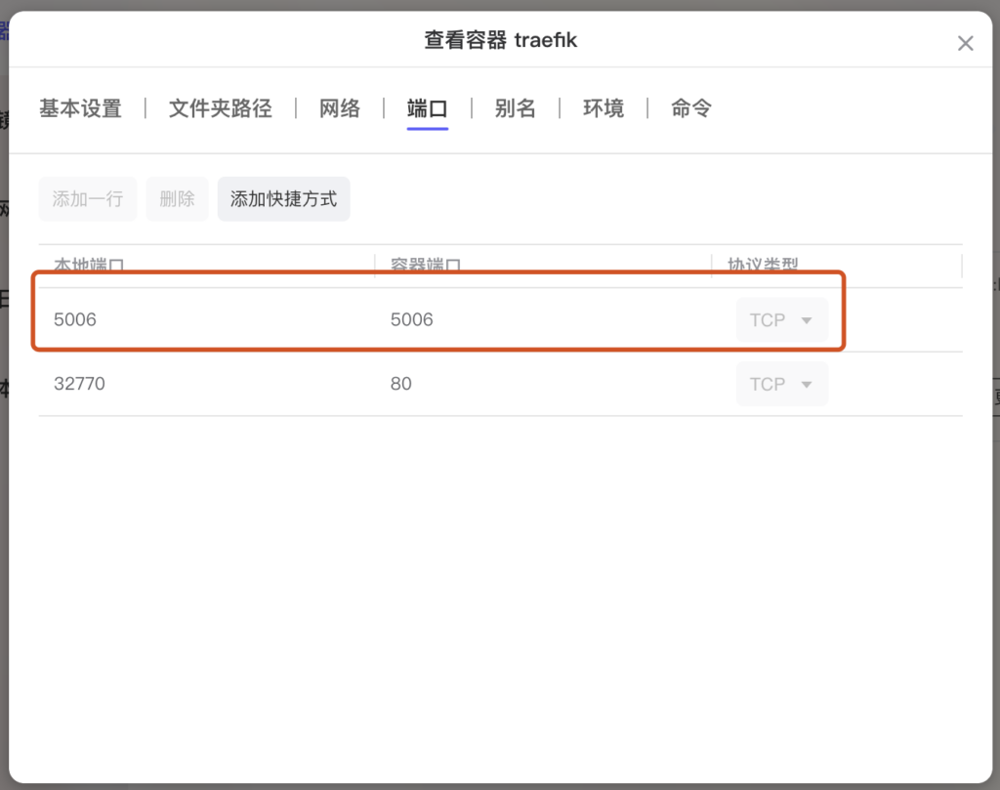

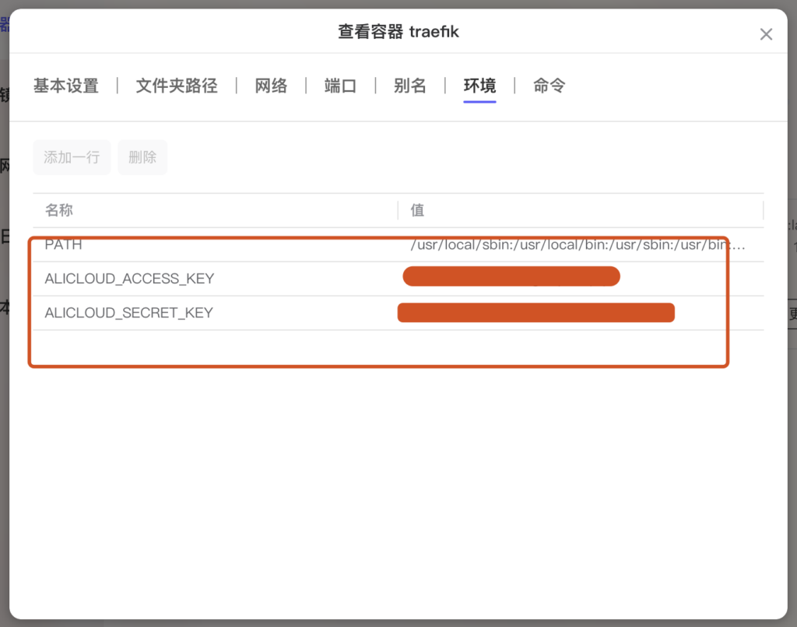

上面的`ALICLOUD_ACCESS_KEY` / `ALICLOUD_SECRET_KEY`填你在阿里云的apiKey信息。这里的apiKey需要带上所有域名权限。因为Traefik在从Let's Encrypt申请SSL证书时，会给你域名的dns里增加一条记录，来确保域名是你的（DNS Challenge）。

如果没有域名，可以去阿里云淘一个便宜的域名，一年也就十几块钱。

```shell
# 对应的Docker命令
docker run traefik -v ... -p ... -e ... -d
```

整理下，这里挂载的Volume为：

*   /Docker/traefik/config (文件夹，放文件动态配置)
*   /Docker/traefik/certs (文件夹，放Traefik自动申请的证书)
*   /Docker/traefik/traefik.toml （文件，Traefik配置）
*   /Docker/traefik/acme.json （文件，证书请求信息）

这里打住，**先不要启动容器**

#### 配置Traefik

1.  在挂在目录下创建traefik.toml文件，内容为

```toml
[global]
  checkNewVersion = true
  sendAnonymousUsage = true

[entryPoints]
  [entryPoints.webdav]
    address = ":5006"

[log]
  level = "DEBUG"

[api]

[ping]

[certificatesresolvers.default.acme]
  email = "你的邮箱"
  storage = "/letsencrypt/acme.json"
  dnschallenge.provider = "alidns"

[providers.file]
  directory = "/etc/traefik/config"
  watch = true
```

上面配置了什么呢？

*   打开版本检查/发送匿名信息（默认的）
*   重点：新加一个入口（entrypoints），监听端口号5006
*   log等级为debug（方便排查错误）
*   打开api访问（默认）
*   打开ping（默认）
*   证书信息（在这里填入你的证书请求信息，包括邮箱，域名服务商）
*   打开文件provider（默认的provider是docker，这里我关了，即监听容器内目录/etc/traefik/config下所有配置文件的变化）

2\. 在挂载目录/Docker/traefik/config中，新建webdav.yml（随意起名），里面填入：

```yaml
http:
  routers:
    webdav:
      entrypoints:
        - webdav
      rule: Host(`你的域名`)
      tls:
        certResolver: default
      service: svc_webdav
  services:
    svc_webdav:
      loadBalancer:
        servers:
          - url: "http://NAS局域网ip:5005"
```

3\. 创建一个空的acme.json，移动到/Docker/traefik/里

4\. 启动Traefik容器

到这里就配置成功了。你以为结束了吗？别急，下面有个小坑

#### 设置acme.json权限

我们ssh到容器内部（小坑：命令用/bin/sh）

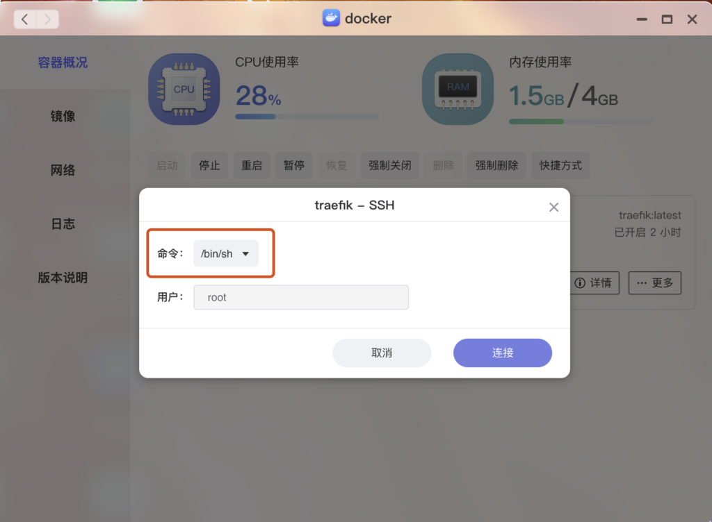

```shell
# 对应Docker命令
docker exec -u root -it traefik sh
```

进入容器内部，找到挂载的acme.json文件，将权限设置为600。因为默认权限是777，Traefik会报错；极空间也不支持改变文件权限，所以只能走弯路啦～

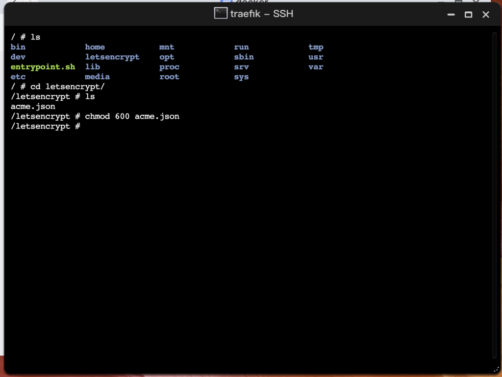

然后关闭窗口，重启容器

#### 验证

在浏览器输入https://{域名}:5006，看看访问是否正常呢？

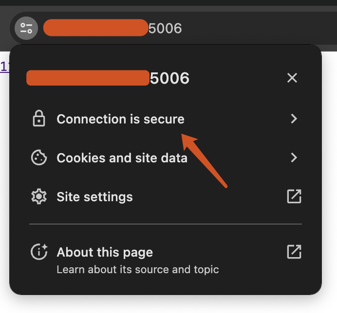

在SSL证书过期前，Traefik会自动更新你的证书，确保你的证书不会过期。从外网访问WebDAV时，创建文件、移动文件、文件重命名都一切正常，说明配置成功啦。

## 总结

Traefik是一个很好用的反向代理工具。
