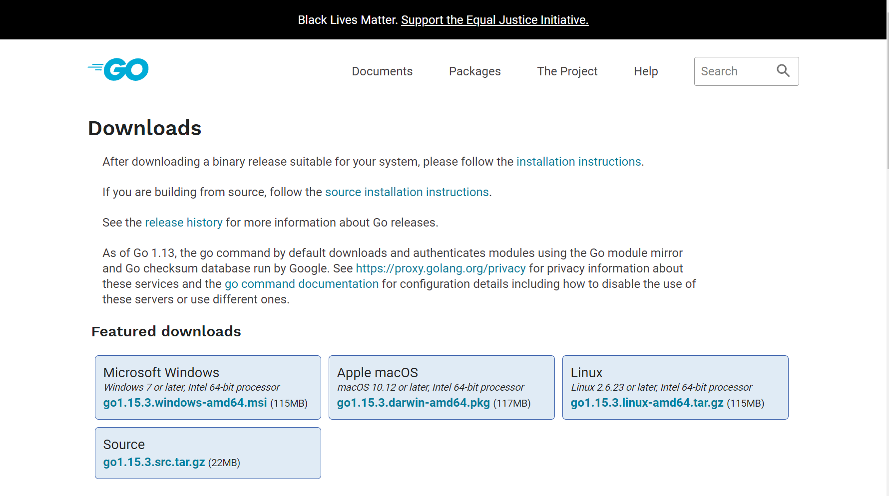
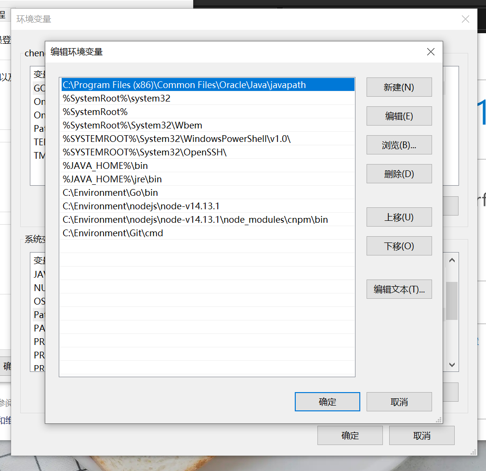
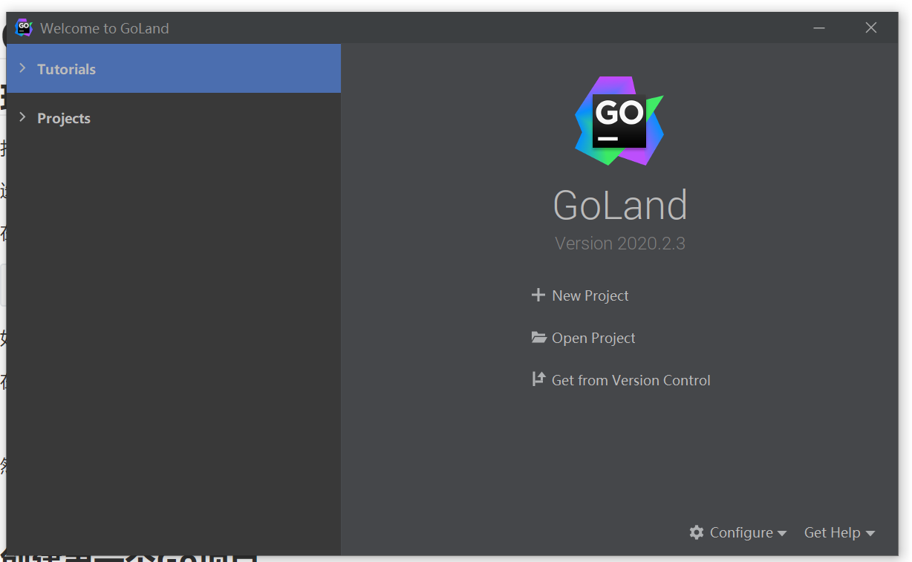
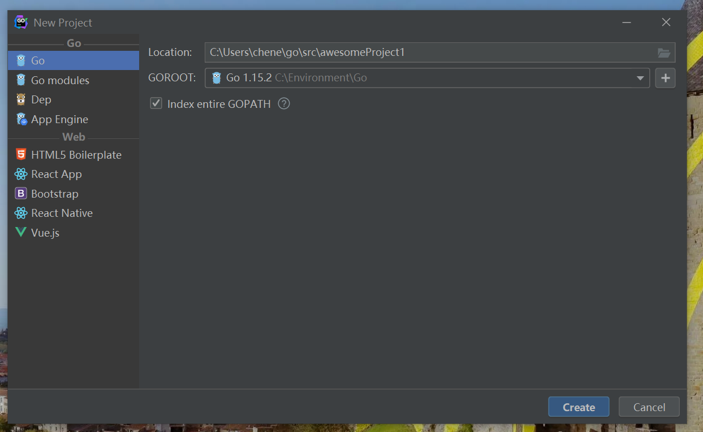
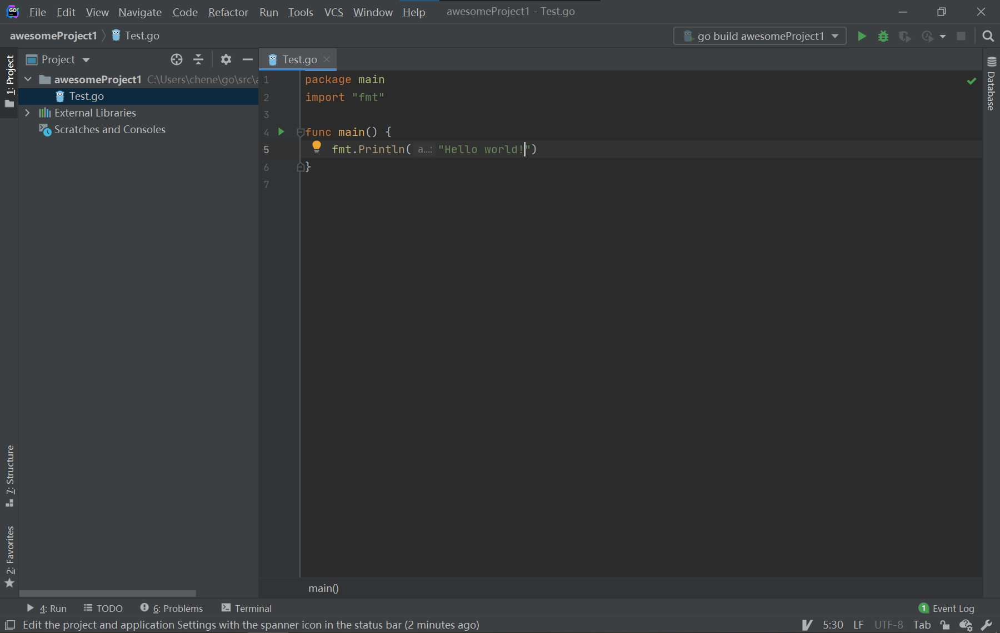
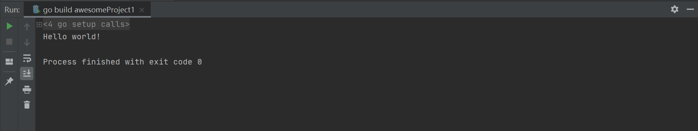

## 环境搭建

<!-- more -->

打开

::url-card{url="https://golang.google.cn/dl/"} 

 选择相应的操作系统版本，下载程序，并进行安装。 在命令行输入

```
go version
```

如果提示 `'go' 不是内部或外部命令，也不是可运行的程序或批处理文件。`，则需要在系统配置环境变量。  在PATH中添加你的go/bin路径。 然后前往

::url-card{url="https://www.jetbrains.com/go/"}

下载Goland。如果你有学生账户，可免费授权，或免费使用30天。

## 创建第一个Go项目

打开Goland，选择New Project  如果不用更改路径名称，直接点击Create  在目录下创建文件Test.go，在Test.go输入以下内容

```go
package main
import "fmt"

func main() {
    fmt.Println("Hello world!")
}
```

 直接点击main方法运行  好的，你的第一个Go程序跑起来了！
