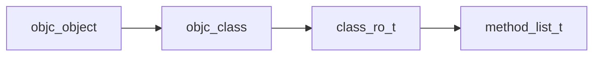
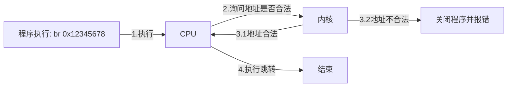

KMP（Kotlin Multiplatform）的前身是KMM（Kotlin Multiplatform Mobile）。该项目的首要目标，是让同一套 Kotlin 代码能够同时运行在 Android 和 iOS 平台上。那么，跨端框架的代码是如何在不同平台上运行的？从使用方式来看，各家的实现大同小异：通常是跨端框架打出一个平台包出来，导入到各自的平台项目中，最后通过平台自带的构建工具（如AGP/Xcode）生成最终产物。

对于Android平台来说这一项相对简单。Android首选开发语言就是Kotlin，原生工程本身就支持导入Kotlin包，KMM只要适配好AGP即可。

但对于iOS平台来说，情况就复杂了：Kotlin 源代码究竟要编译成什么形式，才能被 iOS 工程所引入？正好，Kotlin Native在KMM之前一年立项，JetBrains 提供了巧妙的方案：既然iOS工程需要二进制产物，而Kotlin Native也支持将Kotlin代码编译成二进制库，那么只要把这部分二进制产物“封装”成iOS Framework，不就可以导入到iOS项目里了？

好，这个问题解决了。但还有更多的问题等着解决，比如iOS工程如何调用Kotlin的逻辑？解法也很简单：当时iOS的主流语言是Objective-C，所以JetBrains 为 Kotlin Native 增加了导出 Objective-C 符号的功能，这样iOS项目就能直接调用Kotlin逻辑了。

不过，从性能、安全性和通用性角度来看，还有诸多问题：

*   Kotlin工程怎么引入iOS库，并使用iOS代码？
*   Kotlin Native不依赖JVM了，内存管理如何实现？
*   Objective-C和Kotlin互操作时怎么规避内存泄漏和野指针的问题？

这些都是关键性问题，轻则导致内存泄漏，重则引发应用崩溃。要是不解决好，谁敢在实际工程里用Kotlin Native？所以，目前Kotlin Native项目里充斥着许多跟Objective-C有关的桥接代码。要真正理解这些代码的作用，就要了解Objective-C的运行流程，也就是Objective-C运行时。

## 何为Objective-C运行时？

运行时的概念很广泛，G老师对这个问题也是一头雾水。但通常来说运行时可统称为三个概念：

*   指程序运行的阶段。对应：编译时

_造句：Rust比C++更容易发现运行时的错误_

*   指程序运行的环境。对应：JVM，NodeJS

_造句：Java程序的运行时是JVM_

*   指程序依赖的动态库。对应：libc

_造句：printf需要依赖运行时_

按照上面的概念，Objective-C一般指的是`libObjc`这个动态库，Objective-C的特性都需要这个库发挥作用。但实际上，编译器、链接器、系统库等各个环节也对Objective-C做了大量支持。没有这些支持，编译后的Objective-C程序无法正常运行。

我们先上个程序，very simple：

```objective-c
// test.m
#include <stdio.h>

@implementation MyClass
- (void)sayHello {
    printf("Hello world!");
}
@end

int main() {
    MyClass *obj = [MyClass alloc];
    obj = [obj init];
    [obj sayHello];
}
```

我们直接编译运行试试：

```shell
# clang -x objective-c -o test -w test.m
Undefined symbols for architecture arm64:
  "__objc_empty_cache", referenced from:
      _OBJC_CLASS_$_MyClass in test-5eaf60.o
      _OBJC_METACLASS_$_MyClass in test-5eaf60.o
  "_objc_alloc", referenced from:
      _main in test-5eaf60.o
  "_objc_msgSend", referenced from:
       in objc-stubs-file
ld: symbol(s) not found for architecture arm64
clang: error: linker command failed with exit code 1 (use -v to see invocation)
```

> `-x objective-c` 是告诉编译器，按照Objective-C语法进行编译。

编译果然报错。把libObjc库加入链接，重新编译试试：

```
# clang -x objective-c -o test -lobjc -w test.m
```

编译成功了。说明在整个编译过程里，肯定是clang or 汇编器 or 链接器往我们的程序塞了Objective-C的符号。但这些符号是一用Objective-C方式编译就会偷偷加上吗？我们再看看下面的C程序，very simple

```c
#include <stdio.h>
int main() {
printf("Hello world!");
}
```

尝试用Objective-C的方式编译：

```shell
# clang -x objective-c -o test -w test.m
```

能够编译成功。说明严格来说，Objective-C程序并不一定需要依赖Objective-C运行时，只有我们用到Objective-C的特性时才会依赖到libObjc。但是，这些符号是谁加的呢？

是clang。

怎么确定是clang做的？只要把代码编译成汇编，就能看到这些外部符号已经被加进来了。源码参考：

::url-card{url="https://github.com/llvm/llvm-project/blob/main/clang/lib/CodeGen/CGObjCMac.cpp"}

为什么Objective-C需要完全支持纯C语法呢？因为这是Objective-C的定义：

> Objective-C is the primary programming language you use when writing software for OS X and iOS. **It’s a superset of the C programming language and provides object-oriented capabilities and a dynamic runtime.** Objective-C inherits the syntax, primitive types, and flow control statements of C and adds syntax for defining classes and methods. It also adds language-level support for object graph management and object literals while providing dynamic typing and binding, deferring many responsibilities until runtime.
> ::url-card{url="https://developer.apple.com/library/archive/documentation/Cocoa/Conceptual/ProgrammingWithObjectiveC/Introduction/Introduction.html"}

objc4代码

::github{repo="apple-oss-distributions/objc4"}

Objective-C是C的**超集**。换句话说，Objective-C编译器必须有C编译器所有特性，这样才能够完整编译C程序。

## 静态分析

回到刚刚的Objective-C代码：

```objective-c
// test.m
#include <stdio.h>

@implementation MyClass
- (void)sayHello {
    printf("Hello world!");
}
@end

int main() {
    MyClass *obj = [MyClass alloc];
    obj = [obj init];
    [obj sayHello];
}
```

问题来了，这段代码能正常跑起来吗？

*   如果能正常跑起来，为什么？
*   如果不能跑起来，是编译期报错还是运行时报错？并且是在代码第几行报错？

这时候肯定有同学说了：**你这个MyClass都没继承NSObject，代码怎么可能能编译通过啊**

可是，有谁说过Objective-C里的类必须要依赖NSObject了？

> **NSObject**
> 
> The root class of **most** Objective-C class hierarchies, from which subclasses inherit a basic interface to the runtime system and the ability to behave as Objective-C objects.
> 
> ::url-card{url="https://developer.apple.com/documentation/objectivec/nsobject-swift.class"}

当然，上面的程序确实在运行时会报错，并且是在`[MyClass alloc]` 报的错。

```shell
# clang -x objective-c -lobjc test.m -o test && ./test
objc[80371]: +[MyClass alloc]: unrecognized selector sent to instance 0x1024340a0 (no message forward handler is installed)
[1]    80371 abort      ./test
```

接下来，我们逐步分析该Objective-C程序的运行原理。

### 苹果的黑魔法1

我们把刚才的程序翻译成汇编看看，扒开Objective-C的内幕：

```shell
# clang -x objective-c -S test.m -o test.s && cat test.s
```

```asm
.section__TEXT,__text,regular,pure_instructions
.build_version macos, 15, 0sdk_version 15, 4
.p2align2                               ; -- Begin function -[MyClass sayHello]
"-[MyClass sayHello]":                  ; @"\\01-[MyClass sayHello]"
.cfi_startproc
; %bb.0:
subsp, sp, #32
stpx29, x30, [sp, #16]             ; 16-byte Folded Spill
addx29, sp, #16
.cfi_def_cfa w29, 16
.cfi_offset w30, -8
.cfi_offset w29, -16
strx0, [sp, #8]
strx1, [sp]
adrpx0, l_.str@PAGE
addx0, x0, l_.str@PAGEOFF
bl_printf
ldpx29, x30, [sp, #16]             ; 16-byte Folded Reload
addsp, sp, #32
ret
.cfi_endproc
                                        ; -- End function
.globl_main                           ; -- Begin function main
.p2align2
_main:                                  ; @main
.cfi_startproc
; %bb.0:
subsp, sp, #32
stpx29, x30, [sp, #16]             ; 16-byte Folded Spill
addx29, sp, #16
.cfi_def_cfa w29, 16
.cfi_offset w30, -8
.cfi_offset w29, -16
                                        ; implicit-def: $x8
adrpx8, _OBJC_CLASSLIST_REFERENCES_$_@PAGE
ldrx0, [x8, _OBJC_CLASSLIST_REFERENCES_$_@PAGEOFF]
bl_objc_alloc
ldrx1, [sp]                        ; 8-byte Folded Reload
strx0, [sp, #8]
ldrx0, [sp, #8]
bl_objc_msgSend$init
ldrx1, [sp]                        ; 8-byte Folded Reload
strx0, [sp, #8]
ldrx0, [sp, #8]
bl_objc_msgSend$sayHello
movw0, #0                          ; =0x0
ldpx29, x30, [sp, #16]             ; 16-byte Folded Reload
addsp, sp, #32
ret
.cfi_endproc
                                        ; -- End function
.section__TEXT,__cstring,cstring_literals
l_.str:                                 ; @.str
.asciz"Hello world!"

.section__DATA,__objc_data
.globl_OBJC_CLASS_$_MyClass           ; @"OBJC_CLASS_$_MyClass"
.p2align3, 0x0
_OBJC_CLASS_$_MyClass:
.quad_OBJC_METACLASS_$_MyClass
.quad0
.quad__objc_empty_cache
.quad0
.quad__OBJC_CLASS_RO_$_MyClass

.globl_OBJC_METACLASS_$_MyClass       ; @"OBJC_METACLASS_$_MyClass"
.p2align3, 0x0
_OBJC_METACLASS_$_MyClass:
.quad_OBJC_METACLASS_$_MyClass
.quad_OBJC_CLASS_$_MyClass
.quad__objc_empty_cache
.quad0
.quad__OBJC_METACLASS_RO_$_MyClass

.section__TEXT,__objc_classname,cstring_literals
l_OBJC_CLASS_NAME_:                     ; @OBJC_CLASS_NAME_
.asciz"MyClass"

.section__DATA,__objc_const
.p2align3, 0x0                          ; @"_OBJC_METACLASS_RO_$_MyClass"
__OBJC_METACLASS_RO_$_MyClass:
.long3                               ; 0x3
.long40                              ; 0x28
.long40                              ; 0x28
.space4
.quad0
.quadl_OBJC_CLASS_NAME_
.quad0
.quad0
.quad0
.quad0
.quad0

.section__TEXT,__objc_methname,cstring_literals
l_OBJC_METH_VAR_NAME_:                  ; @OBJC_METH_VAR_NAME_
.asciz"sayHello"

.section__TEXT,__objc_methtype,cstring_literals
l_OBJC_METH_VAR_TYPE_:                  ; @OBJC_METH_VAR_TYPE_
.asciz"v16@0:8"

.section__DATA,__objc_const
.p2align3, 0x0                          ; @"_OBJC_$_INSTANCE_METHODS_MyClass"
__OBJC_$_INSTANCE_METHODS_MyClass:
.long24                              ; 0x18
.long1                               ; 0x1
.quadl_OBJC_METH_VAR_NAME_
.quadl_OBJC_METH_VAR_TYPE_
.quad"-[MyClass sayHello]"

.p2align3, 0x0                          ; @"_OBJC_CLASS_RO_$_MyClass"
__OBJC_CLASS_RO_$_MyClass:
.long2                               ; 0x2
.long0                               ; 0x0
.long0                               ; 0x0
.space4
.quad0
.quadl_OBJC_CLASS_NAME_
.quad__OBJC_$_INSTANCE_METHODS_MyClass
.quad0
.quad0
.quad0
.quad0

.section__DATA,__objc_classrefs,regular,no_dead_strip
.p2align3, 0x0                          ; @"OBJC_CLASSLIST_REFERENCES_$_"
_OBJC_CLASSLIST_REFERENCES_$_:
.quad_OBJC_CLASS_$_MyClass

.section__DATA,__objc_classlist,regular,no_dead_strip
.p2align3, 0x0                          ; @"OBJC_LABEL_CLASS_$"
l_OBJC_LABEL_CLASS_$:
.quad_OBJC_CLASS_$_MyClass

.section__DATA,__objc_imageinfo,regular,no_dead_strip
L_OBJC_IMAGE_INFO:
.long0
.long64

.subsections_via_symbols

```

着重关注下`[MyClass alloc]` 和`[obj init]`的逻辑：

*   [MyClass alloc] ：调用`_objc_alloc` ，参数为`_OBJC_CLASSLIST_REFERENCES` 符号值，实际就是`_OBJC_CLASS_$_MyClass符号`
*   [obj init]：调用`_objc_msgSend$init`，参数为`[MyClass alloc]` 创建的对象地址

这时候有意思的地方就来了：

对于第一个，我们可以直接判断`_objc_alloc` 原型就在objc4里。至于传参具体是什么，我们可以通过objc4的源码分析；

对于第二个，汇编代码里没有`_objc_msgSend$init` 符号，所以最后是怎么通过编译的？并且，我们从前面的编译结果可以得知，`_objc_msgSend$init` 并不是外部符号，那么这个符号是从哪冒出来的？

恭喜你，发现了**Improve app size and runtime performance**

::url-card{url="https://developer.apple.com/videos/play/wwdc2022/110363"}

这个优化具体做了什么？还是以`[objc sayHello]` 为例。在先前的clang版本，这个语句会被直接编译成：

```asm
...
adrp x1, [selector sayHello地址]
ldr x1, [x1, selector sayHello地址]
bl _objc_msgSend
...
```

Apple觉得这个可以优化成：

```asm
...
bl _objc_msgSend$sayHello
...

_objc_msgSend$sayHello:
adrp x1, [selector sayHello地址]
ldr x1, [x1, selector sayHello地址]
bl _objc_msgSend
```

这样如果`[objc sayHello]` 被多次调用，按照原来的方式就需要执行3\*n条指令，而按照新的方式只需执行3+n条指令，获得了3倍的性能提升！当然，这个优化需要前端跟链接器一起做。前端负责把`[objc sayHello]` 编译成`bl _objc_msgSend$sayHello` ，链接器负责生成`_objc_msgSend$sayHello` 的跳板代码。

所以代价是什么？代价是作为coder，我们不能使用类似`_objc_msgSend$xxxx` 这样的符号了。

链接器新增objc_stubs具体代码：

::url-card{url="https://github.com/apple-oss-distributions/ld64/blob/main/src/ld/passes/objc_stubs.cpp"}

那么，`_objc_msgSend$sayHello`实际是什么呢？我们接着往下看：

```shell
# objdump -d test
...
00000001000008c0 <_objc_msgSend$sayHello>:
1000008c0: 90000041    adrpx1, 0x100008000 <__OBJC_METACLASS_RO_$_MyClass>
1000008c4: f9404c21    ldrx1, [x1, #0x98]
1000008c8: 90000030    adrpx16, 0x100004000 <_printf+0x100004000>
1000008cc: f9400610    ldrx16, [x16, #0x8]
1000008d0: d61f0200    brx16
1000008d4: d4200020    brk#0x1
1000008d8: d4200020    brk#0x1
1000008dc: d4200020    brk#0x1
...
# otool -IvV test
test:
Indirect symbols for (__TEXT,__stubs) 2 entries
address            index name
0x0000000100000874    11 _objc_alloc
0x0000000100000880    13 _printf
Indirect symbols for (__DATA_CONST,__got) 3 entries
address            index name
0x0000000100004000    11 _objc_alloc
0x0000000100004008    12 _objc_msgSend
0x0000000100004010    13 _printf

# objdump -d test
...
Contents of section __TEXT,__objc_methname:
 100000911 696e6974 00736179 48656c6c 6f00      init.sayHello.
...
Contents of section __DATA,__objc_selrefs:
 100008090 11090000 00001000 16090000 00001000  ................
```

注意，在`_objc_msgSend` 被调用时，x0为外部传入的对象地址。通过分析数据段可知，x1指向`__objc_selrefs` 节的一段数据，而这个数据刚好是`__objc_methname` 节里sayHello字符串的地址。

### 启动objc4

现在我们打开objc4源代码，看下_objc_msgSend的原型：

```objective-c
// message.h
OBJC_EXPORT id _Nullable
objc_msgSend(id _Nullable self, SEL _Nonnull op, ...)
    OBJC_AVAILABLE(10.0, 2.0, 9.0, 1.0, 2.0);
```

原来，iOS开发里所谓的SEL/方法选择子，实际是方法名指针

接着，我们再来看下_objc_alloc的原型：

```objective-c
// objc-internal.h
OBJC_EXPORT id _Nullable
objc_alloc(Class _Nullable cls)
    OBJC_AVAILABLE(10.9, 7.0, 9.0, 1.0, 2.0);
```

`Class` 和 `id` 是什么呢？

```objective-c
// objc-private.h
typedef struct objc_class *Class;
typedef struct objc_object *id;

// objc-runtime-new.h
struct objc_class : objc_object {
// Class ISA;
Class superclass;
  cache_t cache;             // formerly cache pointer and vtable
  class_data_bits_t bits;    // class_rw_t * plus custom rr/alloc flags
  ...
}

struct objc_object {
private:
    char isa_storage[sizeof(isa_t)];
    ...
}    

union isa_t {
uintptr_t bits;
private:
    // Accessing the class requires custom ptrauth operations, so
    // force clients to go through setClass/getClass by making this
    // private.
    Class cls;
}

struct class_ro_t {
    uint32_t flags;
    uint32_t instanceStart;
    uint32_t instanceSize;
#ifdef __LP64__
    uint32_t reserved;
#endif

    union {
        const uint8_t * ivarLayout;
        Class nonMetaclass;
    };

    explicit_atomic<const char *> name;
    objc::PointerUnion<method_list_t, relative_list_list_t<method_list_t>, method_list_t::Ptrauth, method_list_t::Ptrauth> baseMethods;
    objc::PointerUnion<protocol_list_t, relative_list_list_t<protocol_list_t>, PtrauthRaw, PtrauthRaw> baseProtocols;
    const ivar_list_t * ivars;

    const uint8_t * weakIvarLayout;
    objc::PointerUnion<property_list_t, relative_list_list_t<property_list_t>, PtrauthRaw, PtrauthRaw> baseProperties;

    // This field exists only when RO_HAS_SWIFT_INITIALIZER is set.
    _objc_swiftMetadataInitializer __ptrauth_objc_method_list_imp _swiftMetadataInitializer_NEVER_USE[0];
    ...
}
```

哦，`objc_alloc` 返回的是一个`objc_object`。除此之外，你还可以得到以下结论：

*   `_OBJC_CLASS_$_MyClass/_OBJC_METACLASS_$_MyClass` = `objc_class`
*   `__OBJC_CLASS_RO_$_MyClass/__OBJC_METACLASS_RO_$_MyClass` = `class_ro_t`
*   `__OBJC$_INSTANCE_METHODS_MyClass` = `method_list_t` （方法跳转地址）

并且程序加载后，`objc_class`存在可写区域，而`class_ro_t`存在只读区域。

并且可以确定在文件映像里，这几个结构体存在以下持有关系：



并且，`class_ro_t`里存着：

*   超类
*   类方法表（method_list_t）
*   成员变量偏移表（ivars）
*   实现协议表（protocol_list_t）
*   属性表（property_list_t）

`[obj sayHello]` 只调用了`bl _objc_msgSend$sayHello` 就能跳到`-[MyClass sayHello]` 符号上。所以很大可能，obj_msgSend里会先读取`objc_object`里的`isa`，从`method_list_t` 里找到`sayHello` 方法的实际跳转地址。

`objc_class` 位于可写空间。所以有没有一种可能，在运行时我们把`objc_class`里的`class_ro_t` 整个换掉，这样就可以在运行时调整一个类的方法实现了，并且可以给一个类动态添加属性、实现协议？

恭喜你，发现了**Objective-C动态特性**。

### 苹果的黑魔法2

我们看下`__OBJC$_INSTANCE_METHODS_MyClass` 符号的汇编代码：

```asm
.section__DATA,__objc_const
.p2align3, 0x0                          ; @"_OBJC_$_INSTANCE_METHODS_MyClass"
__OBJC_$_INSTANCE_METHODS_MyClass:
.long24                              ; 0x18
.long1                               ; 0x1
.quadl_OBJC_METH_VAR_NAME_
.quadl_OBJC_METH_VAR_TYPE_
.quad"-[MyClass sayHello]"
```

但是，我们查看下二进制反编译，又发现了神奇的东西：

```shell
Contents of section __TEXT,__objc_methlist:
 1000008e0 0c000080 01000000 b0770000 1d000000  .........w......
 1000008f0 10ffffff                             ....
```

我们的方法表不应该在__objc_const节么，为什么编译后就飞到__objc_methlist节了呢？

并且，原先`__OBJC_$_INSTANCE_METHODS_MyClass` 只有32个字节，而在二进制里怎么就只有20字节了呢？

苹果**又偷偷加魔法**了？还真是。恭喜你，发现了**相对方法表（relative method list）**

::url-card{url="https://developer.apple.com/videos/play/wwdc2020/10163/?time=1054"}

代码：

::url-card{url="https://github.com/apple-oss-distributions/ld64/blob/main/src/ld/passes/objc.cpp"}

相对方法表其实很容易理解。原先方法表里的每一项结构为：

```objective-c
struct bigSigned {
        SEL __ptrauth_objc_sel name;
        const char * ptrauth_method_list_types types;
        MethodListIMP imp;
    };
```

现在改为：

```objective-c
struct small {
        // The name field either refers to a selector (in the shared
        // cache) or a selref (everywhere else).
        RelativePointer<const void *, /*isNullable*/false> name;
        RelativePointer<const char *> types;
        RelativePointer<IMP, /*isNullable*/false> imp;
    };
    
struct RelativePointer: nocopy_t {
    int32_t offset;
    ...
}
```

name、types和imp的地址改成地址偏移值，每项用一个字去存储。原本方法表里的每一项需要24字节，这次调整后只需要12字节，得到了2倍的性能提升！

而方法表是会存在硬盘文件里的，说明这可以“大幅度”减少可执行文件的体积大小。

万事俱备，我们总算入门了Objective-C可执行文件的排列结构，接着我们可以步入到程序加载阶段了！

## 程序加载

先让G老师帮我们过下程序加载的过程：

> 简单来说，程序加载过程如下：
> 
> 1.  **内核加载程序**：用 `execve` 映射可执行文件到内存。
> 2.  **启动 dyld**：动态链接器 `dyld` 加载并解析依赖库。
> 3.  **加载动态库**：用 `mmap` 加载 `.dylib`，重定位地址，绑定符号。
> 4.  **运行初始化函数**：执行 C++/ObjC 初始化函数，比如 `_objc_init`。
> 5.  **跳转到 main()**：开始执行程序主逻辑。

1是由内核完成的，负责把映像映射到内存上。接着内核把控制权移交给dyld，dyld负责加载动态库并完成内存映像上的地址重定位。所有工作完成后，把控制权转交到程序本身，跳转到程序的main函数上。

### 只读内存

先来一个小测试：文件映像里DATA_CONST段是只读的。这个段映射到内存后，谁去保证这段内存是只读的？如果程序非法写入/执行内存，那么是谁去阻止的？

有人觉得是这样：



图里涉及到内核，说明必然存在用户态→内核态→用户态的切换过程。内核↔用户态切换需要保存和恢复上下文，开销非常大。考虑到一个程序里有成千上万条的内存相关指令，如果每次操作内存都需要切换用户/内核态，**那电脑岂不就会卡到爆炸**？

得，那就干脆不切换到内核态？但有个新问题，CPU去哪查某个内存地址的读写权限呢？比如要写xxx内存，得有个表告诉CPU能不能写吧？

这个“权限表”存哪呢？内存断电就清空，显然表明这个表最好放内存上。那CPU怎么知道这个表的内存地址？那就在CPU里加一个寄存器，专门去存这张表的地址不就行了？

最后，CPU恍然大悟，这不就是**页表**吗？我们把读写权限存在页表上。这样，在MMU做内存地址转换时，可以顺便去判断地址的读写权限。既然缺页会造成中断，那么同样地，如果MMU判断到权限异常，也跳一个中断，让操作系统去处理。

果然，ARM也是这么实现的：

::url-card{url="https://developer.arm.com/documentation/102376/0200/Describing-memory-in-AArch64"}

具体来说，由**AP**这个比特来控制页面的读写权限。这也解释了，某块内存上的读写权限是由CPU去保证的。某块只读内存，除非切到内核态（比如内核存在提权漏洞），或者环境辐射比较大导致内存颗粒发生了结构性变化，不然不可能往里面写入数据。

而`DATA_CONST`段又比较特殊，它在载入内存时是可读可写的。我们先用otool看下，会发现`DATA_CONST`的权限是`rw-`：

```shell
# otool -lv test
...
Load command 2
      cmd LC_SEGMENT_64
  cmdsize 312
  segname __DATA_CONST
   vmaddr 0x0000000100004000
   vmsize 0x0000000000004000
  fileoff 16384
 filesize 16384
  maxprot rw-
 initprot rw-
   nsects 3
    flags SG_READ_ONLY
...
```

为什么不在载入时就设置只读呢？我们往下看：

```shell
Section
  sectname __got
   segname __DATA_CONST
      addr 0x0000000100004000
      size 0x0000000000000018
    offset 16384
     align 2^3 (8)
    reloff 0
    nreloc 0
      type S_NON_LAZY_SYMBOL_POINTERS
attributes (none)
 reserved1 2 (index into indirect symbol table)
 reserved2 0
```

原来got节也在`DATA_CONST`段里，这也就解释了为什么在程序装载时`__DATA_CONST`段的内存需可读可写，因为在链接阶段dyld会修改这片内存。这片内存什么时候变成只读的呢？就在dyld源码里，调用`mprotect` 会更改该段的内存权限。

::url-card{url="https://github.com/apple-oss-distributions/dyld/blob/main/dyld/dyldMain.cpp#L1241"}

```objective-c
// make __DATA_CONST read-only (kernel maps it r/w)
    const Header* dyldMH = (const Header*)dyldMA;
    dyldMH->forEachSegment(^(const Header::SegmentInfo& segInfo, bool& stop) {
        if ( segInfo.readOnlyData() ) {
            const uint8_t* start = (uint8_t*)(segInfo.vmaddr + slide);
            size_t         size  = (size_t)segInfo.vmsize;
            sSyscallDelegate.mprotect((void*)start, size, PROT_READ);
        }
    });
```

`mprotect` 的实现在Darwin核心的`libsystem_kernel.dylib` 里。该库没有开源，看下该符号的反汇编：

```shell
00000001804339bc <_mprotect>:
1804339bc: d2800950    movx16, #0x4a              ; =74
1804339c0: d4001001    svc#0x80
...
```

可见，`mprotect`实际是一个系统调用，调用号为`74` 。在执行该调用时，程序会从用户态切换到内核态。

暂停一下，看xnu内核前，我们不妨先了解下xnu的层级及架构：


接着，我们打开xnu内核源码，查找内核号`74` 对应实现，发现刚好就是XNU内核BSD内核里的`mprotect`

::url-card{url="https://github.com/apple-oss-distributions/xnu/blob/main/bsd/kern/syscalls.master#L132"}

```c
74AUE_MPROTECTALL{ int mprotect(caddr_ut addr, size_ut len, int prot) NO_SYSCALL_STUB; }
```

BSD层的`mprotect` 主要做一些参数校验，接着跳到OSMFK内核的`mach_vm_protect`

::url-card{url="https://github.com/apple-oss-distributions/xnu/blob/main/bsd/kern/kern_mman.c#L1187"}

```c
// kern_mman.c
int
mprotect(__unused proc_t p, struct mprotect_args *uap, __unused int32_t *retval)
{
...
#if CONFIG_MACF
/*
 * The MAC check for mprotect is of limited use for 2 reasons:
 * Without mmap revocation, the caller could have asked for the max
 * protections initially instead of a reduced set, so a mprotect
 * check would offer no new security.
 * It is not possible to extract the vnode from the pager object(s)
 * of the target memory range.
 * However, the MAC check may be used to prevent a process from,
 * e.g., making the stack executable.
 */
error = mac_proc_check_mprotect(p, user_addr,
    user_size, prot);
if (error) {
return error;
}
#endif

...
prot &= ~VM_PROT_TRUSTED;

result = mach_vm_protect(user_map, user_addr, user_size,
    false, prot);
switch (result) {
case KERN_SUCCESS:
return 0;
case KERN_PROTECTION_FAILURE:
return EACCES;
case KERN_INVALID_ADDRESS:
/* UNIX SPEC: for an invalid address range, return ENOMEM */
return ENOMEM;
}
return EINVAL;
}
```

而OSMFK层的`mach_vm_protect` ，也只是做一些参数校验，然后跳到主角`vm_map_protect`

> `mac_proc_check_mprotect` 用来检查mmap的权限。iOS上程序无法通过mmap获取可执行内存，就是在这里判断的

::url-card{url="https://github.com/apple-oss-distributions/xnu/blob/main/osfmk/vm/vm_user.c#L292"}

```c
// vm_user.c
kern_return_t
mach_vm_protect(
vm_map_t                map,
mach_vm_address_ut      start_u,
mach_vm_size_ut         size_u,
boolean_t               set_maximum,
vm_prot_ut              new_protection_u)
{
if (map == VM_MAP_NULL) {
return KERN_INVALID_ARGUMENT;
}

if (VM_SANITIZE_UNSAFE_IS_ZERO(size_u)) {
return KERN_SUCCESS;
}

return vm_map_protect(map,
           start_u,
           vm_sanitize_compute_ut_end(start_u, size_u),
           set_maximum,
           new_protection_u);
}

```

`vm_map_protect` 做了什么呢？首先找到指定的`vm_map_entry`（描述某块内存的作用），并检验入参合法性，如有需要合并/分裂`vm_map_entry`，然后调用`pmap_protect` 刷新页表权限

::url-card{url="https://github.com/apple-oss-distributions/xnu/blob/main/osfmk/vm/vm_map.c#L5641"}

```c
/*
 *vm_map_protect:
 *
 *Sets the protection of the specified address
 *region in the target map.  If "set_max" is
 *specified, the maximum protection is to be set;
 *otherwise, only the current protection is affected.
 */
kern_return_t
vm_map_protect(
vm_map_t                map,
vm_map_offset_ut        start_u,
vm_map_offset_ut        end_u,
boolean_t               set_max,
vm_prot_ut              new_prot_u)
{
...
if (current->is_sub_map && current->use_pmap) {
pmap_protect(VME_SUBMAP(current)->pmap,
    current->vme_start,
    current->vme_end,
    prot);
} else {
pmap_protect_options(map->pmap,
    current->vme_start,
    current->vme_end,
    prot,
    pmap_options,
    NULL);
}
}
```

`pmap_protect` 和 `pmap_protect_options` 最终会跳到 `pmap_protect_options_internal` 上，这就是操作PTE的关键函数。`pmap_protect_options_internal` 先判断要改写的权限值，并最终调用`write_pte_fast` 改写PTE

::url-card{url="https://github.com/apple-oss-distributions/xnu/blob/main/osfmk/arm/pmap/pmap.c#L5413"}

```c
MARK_AS_PMAP_TEXT vm_map_address_t
pmap_protect_options_internal(
pmap_t pmap,
vm_map_address_t start,
vm_map_address_t end,
vm_prot_t prot,
unsigned int options,
__unused void *args)
{
...
{
/* Determine the new protection. */
switch (prot) {
case VM_PROT_EXECUTE:
set_XO = TRUE;
OS_FALLTHROUGH;
case VM_PROT_READ:
case VM_PROT_READ  VM_PROT_EXECUTE:
break;
case VM_PROT_READ  VM_PROT_WRITE:
case VM_PROT_ALL:
return end;         /* nothing to do */
default:
should_have_removed = TRUE;
}
}
...
/*
 * XXX Removing "NX" would
 * grant "execute" access
 * immediately, bypassing any
 * checks VM might want to do
 * in its soft fault path.
 * pmap_protect() and co. are
 * not allowed to increase
 * access permissions.
 */
if (set_NX) {
tmplate = pt_attr_leaf_xn(pt_attr);
} else {
if (pmap == kernel_pmap) {
/* do NOT clear "PNX"! */
tmplate = ARM_PTE_NX;
} else {
/* do NOT clear "NX"! */
tmplate = pt_attr_leaf_x(pt_attr);
if (set_XO) {
tmplate &= ~ARM_PTE_APMASK;
tmplate = pt_attr_leaf_rona(pt_attr);
}
}
}
...
write_pte_fast(pte_p, tmplate);
...
}
```

这里的`pt_attr_leaf_rona` 实际为 `pt_attr->ap_rona` ，而`ap_rona`是什么呢？它的定义就在`pmap.c`文件的上方

```
.ap_rona = ARM_PTE_AP(AP_RONA)

// arm64/../proc_reg.h
#define ARM_PTE_AP(x)              ((x) << 6)            /* access protections */
#define AP_RONA 0x2 /* priv=read-only, user=no-access */
```

巧了，ARM把L3 PTE的第 6-7位定为AP字段。至此，dyld 终于把 `DATA_CONST` 段设置成了只读内存。

> 实际上，xnu 对于读写权限的处理逻辑非常复杂。本文的目的并不是深入探讨 xnu 的实现细节，这里只是简要介绍一下从用户态设置内存读写权限到内核操作页表的大致流程。

### objc初始化

上一节结束后，dyld把动态库加载到了内存上，并给只读段设置好了只读权限，那么接下来会发生什么呢？

`NSObject`一个`load`方法，按文档说的是在该类载入运行时会被调用（翻译：该类初始化时），调用时机比main还要前，是怎么做到的呢？

> **load()**
> 
> Invoked whenever a class or category is added to the Objective-C runtime; implement this method to perform class-specific behavior upon loading.
> 
> ::url-card{url="https://developer.apple.com/documentation/objectivec/nsobject-swift.class/load("}

**简单分析**

我们写一个程序看看：

```objective-c
#include <stdio.h>
#import <Foundation/Foundation.h>

@implementation MyClass: NSObject
+ (void)load {
    printf("loaded!");
}
@end

int main() {
}
```

编译程序，把断点打到load符号上：

```shell
(lldb) br set -r "\\+\[MyClass load\]"
Breakpoint 2: where = test`+[MyClass load], address = 0x0000000100000868
(lldb) r
(lldb) bt
* thread #1, queue = 'com.apple.main-thread', stop reason = breakpoint 2.1
  * frame #0: 0x0000000100000868 test`+[MyClass load]
    frame #1: 0x0000000198877910 libobjc.A.dylib`load_images + 716
    frame #2: 0x00000001988d8200 dyld`dyld4::RuntimeState::notifyObjCInit(dyld4::Loader const*) + 456
    frame #3: 0x00000001988e3160 dyld`dyld4::Loader::runInitializersBottomUp(dyld4::RuntimeState&, dyld3::Array<dyld4::Loader const*>&, dyld3::Array<dyld4::Loader const*>&) const + 296
    frame #4: 0x00000001988e78dc dyld`dyld4::Loader::runInitializersBottomUpPlusUpwardLinks(dyld4::RuntimeState&) const::$_0::operator()() const + 180
    frame #5: 0x00000001988e3478 dyld`dyld4::Loader::runInitializersBottomUpPlusUpwardLinks(dyld4::RuntimeState&) const + 700
    frame #6: 0x0000000198904288 dyld`dyld4::APIs::runAllInitializersForMain() + 392
    frame #7: 0x00000001988c7dac dyld`dyld4::prepare(dyld4::APIs&, mach_o::Header const*) + 3092
    frame #8: 0x00000001988c7184 dyld`dyld4::start(dyld4::KernelArgs*, void*, void*)::$_0::operator()() const + 236
    frame #9: 0x00000001988c6b00 dyld`start + 5924
```

调用链从dyld到objc4的`load_images`。为什么dyld会调`load_images`呢？终于，我们在_objc_init找到一处可疑的地方：

```objective-c
// objc4
// objc-os.mm
...
void _objc_init(void)
{
    static bool initialized = false;
    if (initialized) return;
    initialized = true;
    
    // fixme defer initialization until an objc-using image is found?
    locks_init();
    environ_init();
    runtime_tls_init();
    _objc_sync_init();
    accessors_init();
    side_tables_init();
    static_init();
    runtime_init();
    exception_init();
    cache_t::init();

#if !TARGET_OS_EXCLAVEKIT
    _imp_implementationWithBlock_init();
#endif

    _dyld_objc_callbacks_v4 callbacks = {
        4, // version
        map_images,
        load_images,
        unmap_image,
        _objc_patch_root_of_class,
    };
    _dyld_objc_register_callbacks((_dyld_objc_callbacks*)&callbacks);

    didCallDyldNotifyRegister = true;
}
...
```

`_dyld_objc_register_callbacks` 是dyld提供的API，是dyld提供给objc运行时初始化的钩子。但问题是，`_objc_init` 是谁去调用的？

这次，我们把断点打到`_objc_init`上：

```shell
(lldb) bt
* thread #1, queue = 'com.apple.main-thread', stop reason = breakpoint 3.1
  * frame #0: 0x000000019886d400 libobjc.A.dylib`_objc_init
    frame #1: 0x0000000198aae8cc libdispatch.dylib`_os_object_init + 24
    frame #2: 0x0000000198ae36cc libdispatch.dylib`libdispatch_init + 480
    frame #3: 0x00000001a6bc0308 libSystem.B.dylib`libSystem_initializer + 244
    frame #4: 0x00000001988e2c18 dyld`invocation function for block in dyld4::Loader::findAndRunAllInitializers(dyld4::RuntimeState&) const + 444
```

发现一条调用链路：libSystem → libdispatch → libobjc#_objc_init的调用链。我们打开libSystem的源码，查看libSystem_initializer函数，果然：

```c
// init.c
// libsyscall_initializer() initializes all of libSystem.dylib
// <rdar://problem/4892197>
__attribute__((constructor))
static void
libSystem_initializer(int argc,
      const char* argv[],
      const char* envp[],
      const char* apple[],
      const struct ProgramVars* vars)
{
...
libdispatch_init();
...
}
```

所以，`_objc_init`的实际调用时机是libSystem载入时。而`load_image` 呢？我们接着分析，在dyld的`Loader::runInitializersBottomUp` 方法里会逐个调用动态库的初始化函数 。

```c
// This recusively walks the image graph.  There is the potential for cycles.  To break cycles, if the image is delayed, we
// use the visitedDelayed set to track if the image was already visited.  If the image is not delayed, we use
// beginInitializers() to mark the image visited.
// We have to recurse into delayed dylibs because they may need to be initialized because they have weak-defs or interposing tuples.
void Loader::runInitializersBottomUp(RuntimeState& state, Array<const Loader*>& danglingUpwards, Array<const Loader*>& visitedDelayed) const
{
    // don't run initializers in images that are in delayInit state
    // but continue down graph and run initializers in children if needed
    const bool delayed = this->isDelayInit(state) ;

    // do nothing if already visited
    if ( delayed ) {
        if ( visitedDelayed.contains(this) )
            return;
        // use 'visitedDelayed' to mark we have already handled his image
        visitedDelayed.push_back(this);
    }
    else {
        // marks visited
        if ( (const_cast<Loader*>(this))->beginInitializers(state) )
            return;
    }

    //state.log("runInitializersBottomUp(%s)\\n", this->path());

    // make sure everything below this image is initialized before running my initializers
    const uint32_t depCount = this->dependentCount();
    for ( uint32_t i = 0; i < depCount; ++i ) {
        LinkedDylibAttributes childAttrs;
        if ( Loader* child = this->dependent(state, i, &childAttrs) ) {
            if ( childAttrs.upward ) {
                // add upwards to list to process later
                if ( !danglingUpwards.contains(child) )
                    danglingUpwards.push_back(child);
            }
            else {
                child->runInitializersBottomUp(state, danglingUpwards, visitedDelayed);
            }
        }
    }

    if ( !delayed ) {
        // tell objc to run any +load methods in this image (done before C++ initializers)
        state.notifyObjCInit(this);

        // run initializers for this image
        this->runInitializers(state);
    }
}
```

`runInitializersBottomUp` 的作用是从底向上调用动态库的初始化方法。一旦有动态库加载完成 ，就会调用`RuntimeState::notifyObjCInit` 。注意，这个`notifyObjCInit`并不会调用`_objc_init` ，里面会有一系列魔法，最终调用`load_image` 。在`notifyObjCInit` 执行完毕后，才会走到`this->runInitializers(state)` 调用动态库初始化函数，最终调用`_objc_init` 。

这个函数里是先调`notifyObjCInit` 再调用对应动态库的初始化函数，所以有没有可能`notifyObjCInit` 比`_objc_init`先调用？而实际上，libSystem初始化函数执行时才会注册dyld钩子，所以能确保`_objc_init`在`load_image`函数前执行。

剩下的逻辑就简单啦：

```objective-c
// objc4
// objc-runtime-new.mm
void
load_images(const struct _dyld_objc_notify_mapped_info* info)
{
    if (slowpath(PrintImages)) {
        _objc_inform("IMAGES: calling +load methods in %s\\n", info->path ? info->path : "<null>");
    }

    // Return without taking locks if there are no +load methods here.
    if (!hasLoadMethods((const headerType *)info->mh, info->sectionLocationMetadata)) return;

    recursive_mutex_locker_t lock(loadMethodLock);

    // Load all pending categories if they haven't been loaded yet, and discover
    // load methods.
    {
        mutex_locker_t lock2(runtimeLock);
        loadAllCategoriesIfNeeded();
        prepare_load_methods((const headerType *)info->mh, info->sectionLocationMetadata);
    }

    // Call +load methods (without runtimeLock - re-entrant)
    call_load_methods();
}
```

*   prepare_load_methods: 提取当前映像（动态库）所有类的load方法（IMP）到缓存里。当然，这里会第一次初始化（realize）所有Category的父类。
*   call_load_methods: 遍历调用缓存里的load方法

`_objc_init`做了什么呢？逻辑不难，让G老师帮我们总结下：

> `_objc_init` 做了这些事：
> 
> 1.  只初始化一次（多线程安全）
> 2.  初始化 Objective-C 运行时的各种全局表和结构（类表、方法表、SEL表、缓存等）
> 3.  注册 dyld 回调，让后续动态库加载时能自动发现和注册新的类/分类
> 4.  准备自动释放池、弱引用、关联对象等机制
> 5.  注册与 Foundation、libdispatch 等系统的协作回调
> 
> 本质作用：让 Objective-C 运行时做好一切准备，为所有 ObjC 代码运行打好基础。

至此，Objective-C运行时构建及初始化的工作就介绍完毕了。这么看下来，libobjc其实是一个**不能自理**的动态库，编译器、链接器和系统库都必须参与到objc的运行体系，而很少有别的动态库能享受到如此高等的待遇。整体来说，Objective-C运行时更像是操作系统提供的一个**特殊框架**。

## 程序运行

Objective-C初始化结束后，dyld终于把程序的控制权转移到了main函数。为了提高运行时效率及安全程度，Apple在Objective-C运行时里又添加了许多黑魔法。

### 指针认证（PA）

> PA是ARMv8.3-A引入的指针高位加密签名机制，用于防止指针篡改。苹果自A12芯片（iPhone XS系列，iOS 12）开始支持，用于保护返回地址、isa指针等关键指针安全。

::url-card{url="https://github.com/lelegard/arm-cpusysregs/blob/main/docs/arm64e-on-macos.md"}

PA是arm64e提供的功能。简单来说，指针认证是指CPU有一个硬件，能够对传入的指针进行签名和验签，签名后的信息被存储在指针的高位中（指针标记）。指针签名的私钥由CPU保管，甚至内核都拿不到，确保了PA「一定」安全性。

paciza: 

::url-card{url="https://developer.arm.com/documentation/dui0801/g/A64-General-Instructions/PACIA--PACIZA--PACIA1716--PACIASP--PACIAZ"}

autiza: 

::url-card{url="https://developer.arm.com/documentation/dui0801/g/A64-General-Instructions/AUTIA--AUTIZA--AUTIA1716--AUTIASP--AUTIAZ"}

来看段very simple的代码：

```c
#include <stdio.h>
#include <stdint.h>
#include <ptrauth.h>

static int a = 99999;
int main(int argc, const char * argv[]) {
    void *raw_var_ptr = &a;
    void *signed_ptr = ptrauth_sign_unauthenticated(raw_var_ptr, ptrauth_key_process_dependent_data, 10);
// signed_ptr = rawVar;
    void *authed_ptr = ptrauth_auth_data(signed_ptr, ptrauth_key_process_dependent_data, 10);
    printf("raw_var_ptr=%p signed_ptr=%p authed_ptr=%p", raw_var_ptr, signed_ptr, authed_ptr);
}
```

```
raw_var_ptr=0x102e61428 signed_ptr=0x77230102e61428 authed_ptr=0x102e61428
```

注意，一定需要编译为arm64e，只有arm64e才支持这两个拓展指令。

编译并运行程序。正如结果所示，指针签名后，CPU把签名结果存在了指针高位。而如果编译为arm64，会发现`raw_var_ptr==signed_ptr`，这是因为arm64下的`ptrauth_sign_unauthenticated`为空实现。

如果取消掉`// signed_ptr = rawVar;` 的注释，在`ptrauth_auth_data` 会验签失败，后续触发`brk #0xc473` 造成异常。

指针认证有什么用呢？我们来看一个例子，来模拟对象的isa指针被强行修改：

```objective-c
#import <Foundation/Foundation.h>

@implementation HackClass: NSObject
- (void)sayHello {
    printf("hacker sayHello");
}
@end

@implementation SuperClass: NSObject
- (void)sayHello {
    printf("super sayHello");
}
@end

@implementation MyClass: SuperClass
- (void)sayHello {
    printf("sayHello");
}
@end

struct isa_raw {
    Class isa;
};

int main(int argc, const char * argv[]) {
    MyClass *obj = [[MyClass alloc] init];
    struct isa_raw *obj2 = (__bridge struct isa_raw *)obj;
    // 模拟isa指针变化
    obj2->isa = HackClass.class;
    [obj sayHello];
}
```

isa指针受指针认证保护，所以在arm64e架构中运行程序会导致崩溃。但在不支持PA的架构中运行该程序（比如arm64），程序会输出：

```shell
hacker sayHello
```

这个技术有什么用呢？可以有效保护xnu内核安全性，**主要是防止UAF（Use-After-Free）漏洞**。在没有PA保护下，假如xnu内核存在一个漏洞，存在一个指向某个`objc_object`垂悬指针，那么攻击者会：

1.  在用户态堆喷，创建大量对象，并想办法“骗”内核把创建的对象复制进内核态，目的让垂悬指针指向自己精心构造的`objc_object` ，这个精心构造对象的isa也是自己构造的，里面方法表的方法指向gadget（指令片段）。
2.  在用户态多次调用内核函数，让内核对垂悬指针指向的对象发消息。这样攻击者构造的gadget在内核态一个个执行，从而让攻击者**获得内核态权限**。

上面的攻击方式实际是COOP（**Counterfeit Object-oriented Programming**）

> 当然实际攻击过程并没有这么简单。比如现代操作系统在载入程序时都会做ASLR（地址空间布局随机化），会导致同一个gadget，每次运行程序时的地址都不一样。

而iOS的越狱很多都是基于UAF实现的：

*   CVE-2016-4655 (IOHIDFamily UAF)

::url-card{url="https://cve.mitre.org/cgi-bin/cvename.cgi?name=CVE-2016-4655"}

*   CVE-2017-13861（IOKit UAF）

::url-card{url="https://cve.mitre.org/cgi-bin/cvename.cgi?name=CVE-2017-13861"}

*   CVE-2019-8605（sock_puppet）

::url-card{url="https://cve.mitre.org/cgi-bin/cvename.cgi?name=CVE-2019-8605"}

*   等等

开启PA后，UAF的难度直线上升，所以在Objective-C运行时里，Apple把PA技术用到了**能用到的几乎所有地方（包括ISA指针、method_list等）**。不过，PA并不是绝对安全的，本身也会遭受侧信道攻击，详见这篇MIT的论文：

::url-card{url="https://dl.acm.org/doi/pdf/10.1145/3470496.3527429"}

并且PA还有一堆的缺陷待解决，每次解决导致了PA的ABI不稳定，因此尽管苹果发了

::url-card{url="https://developer.apple.com/documentation/security/preparing-your-app-to-work-with-pointer-authentication"}

这篇文章推荐开发者们积极适配PA，自身系统的应用/库都完成了arm64e的适配，但截止至今日，第三方arm64e应用仍无法在macOS上运行。iOS第三方应用虽然可选arm64e架构，但Xcode默认构建arm64。并且Xcode16还存在一个bug，你构建的arm64e应用无法复制到iOS设备上并运行。

### Tagged Pointer

先来看一段代码：

```objective-c
#include <Foundation/Foundation.h>

int main(int argc, const char * argv[]) {
    NSNumber *num1 = [NSNumber numberWithInt:15];
    NSNumber *num2 = [[NSNumber alloc] initWithInt:15];
    NSNumber *num3 = @(15);
    __asm__("brk 0x0");
}
```

问题：

1.  `num1 == num2` 是否成立？
2.  `num2 == num3` 是否成立？
3.  `num1 == num3` 是否成立？

把断点打到`brk 0x0` 并把指针混淆关掉（环境变量`OBJC_DISABLE_TAG_OBFUSCATION` 设为`true`），然后查看`num1` `num2` `num3`

```shell
(lldb) p/t num1
(__NSCFNumber *) 0b1000000000000000000000000000000000000000000000000000011110010011 (int)15
(lldb) p/t num2
(__NSCFNumber *) 0b1000000000000000000000000000000000000000000000000000011110010011 (int)15
(lldb) p/t num3
(NSConstantIntegerNumber *) 0b0000000000000000000000000000000100000000000000000100000000111000 (int)15
(lldb) p num1->isa
error: Couldn't apply expression side effects : Couldn't dematerialize a result variable: couldn't read its memory
(lldb) p num3->isa
(Class) NSConstantIntegerNumber
```

num1和num2最高位为1，显然这不是正常的内存地址。为什么呢？因为Apple觉得变量里要存的数据量太小了，按照正常的指针存法大概率需要在堆上开辟8字节空间，简直是**暴殄天物**，所以干脆把数据存在指针本身。这种技术称为**Tagged Pointer**。

在现在，ARM64下Tagged Pointer的结构如下：

*   64位：Tagged Pointer标记，是Tagged Pointer就设为1
*   63-8/4位：数据本体
*   4-7位：拓展数据类型（可有可无，根据数据类型判断）
*   1-3位：数据类型

> 怎么获取Tagged Pointer？

创建支持Tagged Pointer的类，如果数据量小，会返回Tagged Pointer（比如`NSNumber`的`numberWithInt`和`initWithInt`）

> 怎么判断我拿到的指针是不是Tagged Pointer？

开发者无需关心。

> 不关心那怎么通过指针取值？比如`NSNumber`，如何获取里面某个ivar的值？

`NSNumber`里不存在ivar。取值需通过`NSNumber`的API获取，发消息函数`objc_msgSend`里会对Tagged Pointer进行特殊处理。

> 不关心怎么行？那我怎么通过内存布局取`NSNumber`的实际值？

`NSNumber` 是个接口（类簇），具体实现很多，怎么通过内存布局取值？请试用API。

> 开发者能否自定义Tagged Pointer类型

不行。

这里的`@(15)` 结果为什么指向一个真实的指针呢？因为这个值在编译期就已经确定了，这里指向的是文件上`DATA_CONST`段的某个值。

所以可以引出下面著名代码：

```objective-c
#include <Foundation/Foundation.h>

int main(int argc, const char * argv[]) {
    __weak NSNumber *num;
    __weak NSMutableArray *array;
    @autoreleasepool {
        num = [NSNumber numberWithInt:15];
        array = [NSMutableArray array];
    }
    NSLog(@"num=%@, array=%@", num, array);
}
```

```
num=15, array=(null)
```

还有这个，注意需开启ARC：

```objective-c
// 以下代码会有Runtime Error
#include <Foundation/Foundation.h>

int main(int argc, const char * argv[]) {
    dispatch_queue_t q = dispatch_get_global_queue(0, 0);
    __block NSString *name;
    for (int i = 0; i < 1000; ++i) {
        dispatch_async(q, ^{
            name = [NSString stringWithFormat:@"FFFFFFFFFFFFF"];
        });
    }
}

// 以下代码不会有Runtime Error
#include <Foundation/Foundation.h>

int main(int argc, const char * argv[]) {
    dispatch_queue_t q = dispatch_get_global_queue(0, 0);
    __block NSString *name;
    for (int i = 0; i < 1000; ++i) {
        dispatch_async(q, ^{
            name = [NSString stringWithFormat:@"FF"];
        });
    }
}
```

为什么上半部分的代码会有问题？原因在于ARC下给name赋值的代码并不是原子的，实际调用链是`objc_release` → `assign value` → `objc_retain` 。对对象指针调用`objc_release` ，如果此时的引用计数为0，就会释放对象。而这里明显存在race，如果`+[NSString stringWithFormat:]` 返回的是一个对象，那么这个对象可能会被多次释放，进而造成程序崩溃。

而对Tagged Pointer调用`objc_release` ，在函数开头就被guard return掉了。所以如果`+[NSString stringWithFormat:]` 返回的是Tagged Pointer，那么虽然这里存在data race，但异常只局限在操作内存这一逻辑操作，并不会导致程序出现异常。

## objc_msgSend

下一章讲
