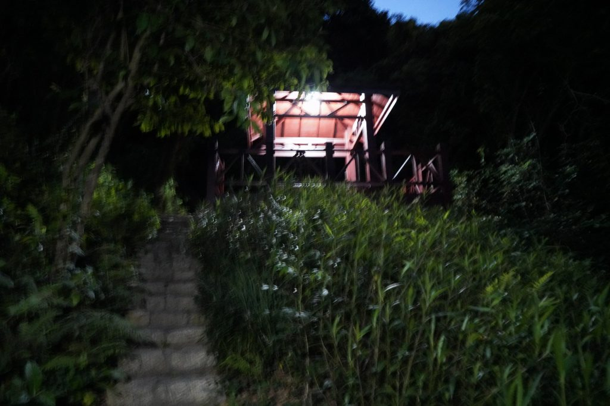

> 今天闲得无聊去了一趟笔架山。到山顶发现自己带了充电宝没带数据线，然后手机电量剩余百分之20。于是赶紧下山，跑进地铁站，进站时手机刚好没电关机。后面惊喜地发现手机关机也可以用NFC，于是愉快地进入了地铁，过了几个站发现自己坐反方向。

<!-- more -->

## 自动档

跟手机拍照一样，使用自动档时相机将自动设置曝光三要素、测光、色彩，这个时候你不能改变其它参数，也就是你把相机当成手机拍摄照片了。（虽然技术不咋地，但画质肯定还是比手机好的。不服？你手机的底有多大？）

好处是这样适合新手以及进行快速拍摄，但缺点也很明显：相机自行设置的参数可能你不喜欢。

## P档

又称程序曝光模式，是自动档的降级模式。在该档，你可以自行设置ISO和曝光补偿，甚至可以微调光圈大小以及快门。

好处和自动档一样，适合刚入门不久的新手以及抓拍。但缺点也很明显，一是你要准确调节ISO及EV，否则照片容易过曝或欠曝；二是自动设置的光圈或快门参数你又可能不喜欢。

## S档

S档又称为快门优先模式。这个时候你可以自行设置快门大小，将光圈、ISO交给相机进行控制（当然ISO可调）。EV也处于可调状态，简单来说这个时候你只要关注快门就可以了。

这个档位适合需要准确调节快门速度时，比如对高速运动的物体进行拍摄、或拍摄车流等慢门。但缺点也是特别明显，光圈你是不可自行调整的；并且如果你设置的快门速度超过了相机的承受能力，这时ISO会升高，然后享受被噪点支配的乐趣吧。

## A档

A档又称为光圈优先模式。这个是摄影师最常用的模式，适合对一般的物体、人像进行拍摄。这个时候相机会根据你设置的光圈值自动设置其它三要素，所以你只需要关心光圈大小。而光圈大小一般情况下控制着景深，所以你可以自行控制景深深浅。对于人像，一般使用大光圈拍摄；而对于日光下的景色，一般采用小光圈进行拍摄。与S档一样，你也可以自行调节ISO及EV，达到个性化的需求。

优点刚刚说了一大堆，因为这也是我最常用的模式（因为菜）。但缺点也很明显，在超弱光条件下相机设置的快门时间可能非常长。如果你手持拍摄，不用拍了，我不信你不会手抖。

例如下面这幅图：

笔架山小亭子 f4 1/4 ISO12800

这是我今晚下山时拍的。知道为啥拍虚了吧。这个真不是我肾虚，我是真的控制不了，控制不了...

## M档

M档是全手动模式，手机上一般称为专业模式，一般而言大师必会。这个模式下曝光三要素完全需要自行调整。这个模式适合拍摄悠闲的、静态的物品及风景。

好处很明显，毕竟越自由的东西大家都说好；缺点也很明显，比如你要拍鸟或田径运动员，你在慢悠悠地调参数？或者说你要拍模特，模特需要换个地方取景，你又要慢悠悠重新设置一遍参数。

## 总结

不管怎么样，适合的档位才能拍出最好的照片。有些人讽刺用自动档的人，说不定他们也不知道三要素的设置，只是自己想装装而已。真正的大师，不会听信他人的嘲讽，只用适合自己的东西，毕竟摄影是一个人享受美的过程。
