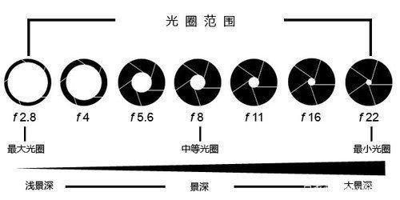
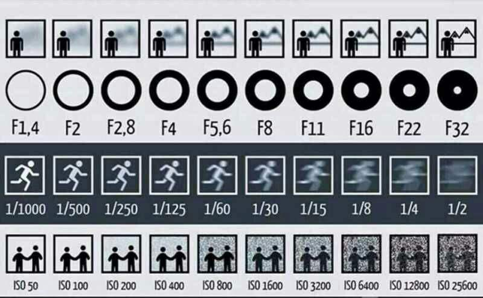

一切摄影都离不开曝光。不同的作品，为了凸显不同的主题，曝光方式往往不同。

<!-- more -->

**曝光三要素：光圈、快门、ISO**

## 光圈

光圈衡量镜头进入的光线，用F表示。不同大小的光圈可以控制在单位时间内，进入镜头光线的多少。

F值=镜头焦距/镜头光圈直径（通光口直径）

其中数值越大，光圈越小；相应地，数值越小，光圈越大。一般称F4以上的光圈为大光圈，F8以下的光圈为小光圈。

光圈可以影响景深大小。比如要拍人像，我们可以设置大焦距和小光圈，这样人像的背景就会更”虚“。如果拍风景，在明亮环境下可以设置小光圈，达到全局清晰的效果。

当然对于夜晚，大光圈是有必要的。通过增加进入镜头的光线，从而减小相应的ISO，提高画质。

光圈

## 快门

快门，指的是曝光时间，用秒表示。快门速度越快，曝光时间越短；快门速度越慢，曝光时间越长。不同的快门速度可以控制在相等光圈下，进入镜头光线的多少。

一般而言，对于拍摄快速物体，我们往往使用更快的快门速度；相应地，对于有意识拍摄慢速效果，比如星轨、车流轨迹、水面拉丝效果，一般使用更慢的“慢门”。

## ISO

这里的ISO可不是国标。ISO又被称为感光度，可以控制底片对光线的感应程度。一般而言，ISO越大，感应程度越强，画面越亮；ISO越弱，感应程度越弱，画面越暗。

但在高ISO的情况下，画面往往会出现较为多的、难以消去的噪点，越高的ISO往往意味着画质越差。一般而言，在光线较好的情况下，会使用低ISO进行拍摄（ISO<=200)；对于夜晚场景，如果要拍摄静态的物体，可以通过提高快门时间、光圈大小来降低ISO，以获得更好的拍摄画质。

当然对于索尼来说，噪点不算什么。

## 曝光互易律

对于M模式来说，摄影师需要在拍摄前控制三者。一般而言，控制的方式遵循曝光互易律，即：**曝光三要素光圈，快门，感光度，可以按正比互易而曝光量不变。**

通俗地说，就是指在固定某一参数下，一个参数增加了多少挡，另一个参数就要减少多少档。

例如 F2.8 1/1000 ISO100 = F2 1/2000 ISO100

曝光互易率

## 曝光补偿

**曝光补偿**(EV)是一种曝光控制方式，曝光补偿就是有意识地变更相机自动演算出的“合适”曝光参数，让照片更明亮或者更昏暗的拍摄手法。

一般来说，曝光补偿可以在确定曝光三要素的情况下，让画面人为地更“亮”、更“暗”，使其符合人的审美需求。

例如需要拍摄背光场景，如果我们想凸显楼背后的火烧云，我们可以通过降低EV，让楼变成“剪影”；但反过来，如果我们在背光环境拍摄人像，如果不调整EV值，人脸会显黑（如果拍女生会被打死23333）。这个时候可以增加EV，让人脸的曝光处于正常的位置。

曝光补偿口诀：白加黑减。

## 总结

当然如果你拥有一款宽容度爆棚的相机，那么这些来说对你没那么重要。毕竟“三分拍，七分修”，如果曝光不好，把RAW里的曝光拉一下不就行了嘛。但作为摄影，我们应该尽力保证前期照片的完美，减少后期修图不必要的操作。
